# 🎮 React Tic-Tac-Toe: Complete Revision Guide

> A comprehensive, standalone tutorial covering every React concept, pattern, and technique used in building this Tic-Tac-Toe game. **No need to open source files again!**

---

## 📑 Table of Contents

1. [Project Overview](#project-overview)
2. [Architecture & Component Structure](#architecture--component-structure)
3. [Theoretical Concepts](#theoretical-concepts)
   - [State Management Philosophy](#state-management-philosophy)
   - [Derived State vs. Stored State](#derived-state-vs-stored-state)
   - [Lifting State Up](#lifting-state-up)
   - [Immutability Principle](#immutability-principle)
   - [Two-Way Binding](#two-way-binding)
4. [Code & Patterns](#code--patterns)
   - [Entry Point & React 18 Rendering](#1-entry-point--react-18-rendering)
   - [State with useState Hook](#2-state-with-usestate-hook)
   - [Deriving Active Player](#3-deriving-active-player)
   - [Deep Copying 2D Arrays](#4-deep-copying-2d-arrays-immutability)
   - [Win Detection Algorithm](#5-win-detection-algorithm)
   - [Updating State with Previous State](#6-updating-state-based-on-previous-state)
   - [Dynamic Player Name Editing](#7-dynamic-player-name-editing-two-way-binding)
   - [Conditional Rendering](#8-conditional-rendering)
   - [Rendering Lists with Keys](#9-rendering-lists-with-keys)
   - [Component Composition](#10-component-composition)
5. [Visual Aids](#visual-aids)
   - [Application Data Flow](#application-data-flow)
   - [Component Hierarchy](#component-hierarchy)
   - [State Management Flow](#state-management-flow)
   - [Win Detection Logic](#win-detection-logic)
6. [Project File Structure](#project-file-structure)
7. [Summary & Key Takeaways](#summary--key-takeaways)

---

## Project Overview

This project is a **complete Tic-Tac-Toe game** built with React that demonstrates essential and advanced React concepts including:

| Feature | React Concept |
|---------|---------------|
| Turn alternation | Derived state |
| Editable player names | Two-way binding, conditional rendering |
| Game board | Component props, list rendering |
| Win/Draw detection | Computed values, external data |
| Game log | State-driven UI updates |
| Rematch functionality | State reset |

**Technologies Used:**
- **React 18** with functional components
- **Vite** as the build tool
- **ES6+** JavaScript features

---

## Architecture & Component Structure

```mermaid
%%{init: {'theme': 'dark', 'themeVariables': { 'primaryColor': '#fcd256', 'primaryTextColor': '#1a1a1a', 'primaryBorderColor': '#f6e35a', 'lineColor': '#e1dec7', 'secondaryColor': '#383624', 'tertiaryColor': '#282617', 'background': '#1a1a1a', 'mainBkg': '#383624', 'nodeBorder': '#f6e35a', 'clusterBkg': '#282617', 'edgeLabelBackground': '#282617'}}}%%
graph TD
    A[App.jsx<br/>📦 Main Container] --> B[Player.jsx<br/>👤 Player 1 - X]
    A --> C[Player.jsx<br/>👤 Player 2 - O]
    A --> D[GameBoard.jsx<br/>🎯 3x3 Grid]
    A --> E[GameOver.jsx<br/>🏆 Win/Draw Screen]
    A --> F[Log.jsx<br/>📜 Move History]
    
    G[winning-combinations.js<br/>📊 Win Conditions Data] -.-> A
    
    style A fill:#fcd256,stroke:#3f3b00,stroke-width:3px,color:#1a1a1a
    style B fill:#383624,stroke:#f6e35a,stroke-width:2px,color:#e1dec7
    style C fill:#383624,stroke:#f6e35a,stroke-width:2px,color:#e1dec7
    style D fill:#383624,stroke:#f6e35a,stroke-width:2px,color:#e1dec7
    style E fill:#383624,stroke:#f6e35a,stroke-width:2px,color:#e1dec7
    style F fill:#383624,stroke:#f6e35a,stroke-width:2px,color:#e1dec7
    style G fill:#282617,stroke:#aca788,stroke-width:2px,color:#e1dec7
```



---

## Theoretical Concepts

### State Management Philosophy

> **Core Principle:** In React, UI is a function of state. When state changes, React re-renders the component to reflect the new state.

In this Tic-Tac-Toe game, we use a **single source of truth** pattern:

- **`gameTurns`** is the ONLY stored state for game logic
- Everything else (active player, game board, winner, draw status) is **derived** from this single state

This approach provides several benefits:
1. **Consistency** - No possibility of state getting out of sync
2. **Simplicity** - Fewer state variables to manage and debug
3. **Predictability** - Given the same `gameTurns`, you always get the same derived values

---

### Derived State vs. Stored State

This is one of the **most important patterns** demonstrated in this project.

| Stored State | Derived State |
|--------------|---------------|
| Data that is explicitly stored in `useState` | Data calculated from stored state |
| Must be updated via setter functions | Recalculated automatically on each render |
| Example: `gameTurns`, `players` | Example: `activePlayer`, `gameBoard`, `winner` |

**Why derive instead of store?**

```
❌ BAD: Storing everything
const [gameTurns, setGameTurns] = useState([]);
const [activePlayer, setActivePlayer] = useState('X');  // Redundant!
const [gameBoard, setGameBoard] = useState(INITIAL);     // Redundant!
const [winner, setWinner] = useState(null);              // Redundant!

✅ GOOD: Deriving from single source
const [gameTurns, setGameTurns] = useState([]);
const activePlayer = deriveActivePlayer(gameTurns);      // Derived!
const gameBoard = deriveGameBoard(gameTurns);            // Derived!
const winner = deriveWinner(gameBoard, players);         // Derived!
```

**Key Insight:** If you can compute a value from existing state, **compute it** — don't store it. This eliminates bugs where different pieces of state get out of sync.

---

### Lifting State Up

When multiple components need access to the same state, **lift the state up** to their closest common ancestor.

```mermaid
%%{init: {'theme': 'dark', 'themeVariables': { 'primaryColor': '#fcd256', 'primaryTextColor': '#1a1a1a', 'lineColor': '#e1dec7', 'background': '#1a1a1a'}}}%%
graph TD
    A[App.jsx<br/>🎯 State Lives Here] --> |"props: activePlayer"| B[Player X]
    A --> |"props: activePlayer"| C[Player O]
    A --> |"props: board"| D[GameBoard]
    A --> |"props: winner"| E[GameOver]
    A --> |"props: turns"| F[Log]
    
    D --> |"callback: onSelectSquare"| A
    B --> |"callback: onChangeName"| A
    C --> |"callback: onChangeName"| A
    E --> |"callback: onRestart"| A
    
    style A fill:#fcd256,stroke:#3f3b00,stroke-width:3px,color:#1a1a1a
    style B fill:#383624,stroke:#f6e35a,color:#e1dec7
    style C fill:#383624,stroke:#f6e35a,color:#e1dec7
    style D fill:#383624,stroke:#f6e35a,color:#e1dec7
    style E fill:#383624,stroke:#f6e35a,color:#e1dec7
    style F fill:#383624,stroke:#f6e35a,color:#e1dec7
```



**Pattern:**
- State flows **down** via props
- Events flow **up** via callback functions

---

### Immutability Principle

**Never mutate state directly!** This is critical for React to detect changes and re-render.

```javascript
// ❌ WRONG: Direct mutation
const gameBoard = INITIAL_GAME_BOARD;
gameBoard[0][0] = 'X';  // Mutates original array!

// ✅ CORRECT: Create new copy then modify
const gameBoard = [...INITIAL_GAME_BOARD.map(array => [...array])];
gameBoard[0][0] = 'X';  // Modifies the copy
```

**Why immutability matters:**
1. React uses **reference comparison** to detect changes
2. Mutating the original doesn't change the reference
3. Without a new reference, React won't re-render
4. Enables easier debugging and time-travel features

---

### Two-Way Binding

Two-way binding connects a form input's value to state and vice versa:

```
          setState(newValue)
    ┌──────────────────────────┐
    │                          ▼
┌───┴───┐                ┌──────────┐
│ Input │ ◄───────────── │  State   │
└───────┘   value={state} └──────────┘
```

This is used in the `Player` component for editing names:

```jsx
<input 
  type="text" 
  value={playerName}           // State → Input (one direction)
  onChange={handleChange}      // Input → State (other direction)
/>
```

---

## Code & Patterns

### 1. Entry Point & React 18 Rendering

```jsx
// src/index.jsx
import ReactDOM from 'react-dom/client';
import App from './App.jsx';
import './index.css';

ReactDOM.createRoot(document.getElementById('root')).render(<App />);
```

**Key Insight:** React 18 introduced the new `createRoot` API which enables:
- Concurrent rendering features
- Automatic batching of state updates
- Better performance through prioritized rendering

**Syntax Highlight:**
- `createRoot()` replaces the legacy `ReactDOM.render()`
- The root is created once and can render/update multiple times

---

### 2. State with useState Hook

```jsx
// Storing the list of all player moves
const [gameTurns, setGameTurns] = useState([]);

// Storing player names (can be customized)
const [players, setPlayers] = useState({
  X: 'Player 1',
  O: 'Player 2'
});
```

**Key Insight:** 
- `useState` returns an array with exactly two elements
- Element 0: Current state value
- Element 1: Setter function to update state
- Array destructuring gives us convenient variable names

**State Initialization Options:**
```javascript
useState([])           // Empty array
useState({X: 'P1'})    // Object
useState(0)            // Number
useState(false)        // Boolean
useState(() => computeInitial())  // Lazy initialization
```

---

### 3. Deriving Active Player

```jsx
function deriveActivePlayer(gameTurns) {
  let currentPlayer = 'X';  // X always goes first

  // If there are turns AND the last turn was X, switch to O
  if (gameTurns.length > 0 && gameTurns[0].player === 'X') {
    currentPlayer = 'O';
  }

  return currentPlayer;
}
```

**Key Insight:** 
- New turns are added to the **beginning** of the array (using spread `[newTurn, ...prevTurns]`)
- So `gameTurns[0]` is always the **most recent** turn
- If the most recent player was 'X', next player is 'O'
- This is a **pure function** - same input always produces same output

**Visual Logic:**


---

### 4. Deep Copying 2D Arrays (Immutability)

```jsx
const INITIAL_GAME_BOARD = [
  [null, null, null],
  [null, null, null],
  [null, null, null],
];

function deriveGameBoard(gameTurns) {
  // Create a DEEP COPY - crucial for immutability!
  let gameBoard = [...INITIAL_GAME_BOARD.map((array) => [...array])];
    
  for (const turn of gameTurns) {
    const { square, player } = turn;
    const { row, col } = square;
    gameBoard[row][col] = player;
  }

  return gameBoard;
}
```

**Key Insight:** This is the **most important pattern** for working with nested arrays/objects in React!

**Why `[...array]` alone is NOT enough for 2D arrays:**

```javascript
// ❌ SHALLOW COPY - inner arrays are still references!
const shallow = [...INITIAL_GAME_BOARD];
shallow[0][0] = 'X';  // This ALSO modifies INITIAL_GAME_BOARD[0][0]!

// ✅ DEEP COPY - each inner array is also copied
const deep = [...INITIAL_GAME_BOARD.map(row => [...row])];
deep[0][0] = 'X';  // INITIAL_GAME_BOARD is untouched!
```

**Syntax Breakdown:**

```javascript
[...INITIAL_GAME_BOARD.map((array) => [...array])]
 │  │                  │              │
 │  │                  │              └─ Spread each inner array (deep copy)
 │  │                  └─ Transform each row
 │  └─ Spread the result into a new array
 └─ Create new outer array
```

---

### 5. Win Detection Algorithm

```jsx
// winning-combinations.js - All 8 possible winning lines
export const WINNING_COMBINATIONS = [
  // Rows
  [{ row: 0, column: 0 }, { row: 0, column: 1 }, { row: 0, column: 2 }],
  [{ row: 1, column: 0 }, { row: 1, column: 1 }, { row: 1, column: 2 }],
  [{ row: 2, column: 0 }, { row: 2, column: 1 }, { row: 2, column: 2 }],
  // Columns
  [{ row: 0, column: 0 }, { row: 1, column: 0 }, { row: 2, column: 0 }],
  [{ row: 0, column: 1 }, { row: 1, column: 1 }, { row: 2, column: 1 }],
  [{ row: 0, column: 2 }, { row: 1, column: 2 }, { row: 2, column: 2 }],
  // Diagonals
  [{ row: 0, column: 0 }, { row: 1, column: 1 }, { row: 2, column: 2 }],
  [{ row: 0, column: 2 }, { row: 1, column: 1 }, { row: 2, column: 0 }],
];
```

```jsx
function deriveWinner(gameBoard, players) {
  let winner;

  for (const combination of WINNING_COMBINATIONS) {
    const firstSquareSymbol = gameBoard[combination[0].row][combination[0].column];
    const secondSquareSymbol = gameBoard[combination[1].row][combination[1].column];
    const thirdSquareSymbol = gameBoard[combination[2].row][combination[2].column];

    if (
      firstSquareSymbol &&                           // Not null
      firstSquareSymbol === secondSquareSymbol &&    // All three match
      firstSquareSymbol === thirdSquareSymbol
    ) {
      winner = players[firstSquareSymbol];  // Get player name for symbol
    }
  }

  return winner;
}
```

**Key Insight:**
- We externalize the winning combinations as **data** rather than hardcoding logic
- This makes the code more maintainable and testable
- The check `firstSquareSymbol &&` ensures we don't match three `null` values!

**Visual: Win Combinations on Board**

```
Position Indices:        8 Winning Combinations:
┌─────┬─────┬─────┐      Row 0: [0,0][0,1][0,2]  ─
│ 0,0 │ 0,1 │ 0,2 │      Row 1: [1,0][1,1][1,2]  ─
├─────┼─────┼─────┤      Row 2: [2,0][2,1][2,2]  ─
│ 1,0 │ 1,1 │ 1,2 │      Col 0: [0,0][1,0][2,0]  │
├─────┼─────┼─────┤      Col 1: [0,1][1,1][2,1]  │
│ 2,0 │ 2,1 │ 2,2 │      Col 2: [0,2][1,2][2,2]  │
└─────┴─────┴─────┘      Diag:  [0,0][1,1][2,2]  ╲
                         Diag:  [0,2][1,1][2,0]  ╱
```

---

### 6. Updating State Based on Previous State

```jsx
function handleSelectSquare(rowIndex, colIndex) {
  setGameTurns((prevTurns) => {
    // Derive current player from PREVIOUS turns, not external state!
    const currentPlayer = deriveActivePlayer(prevTurns);

    const updatedTurns = [
      { square: { row: rowIndex, col: colIndex }, player: currentPlayer }, 
      ...prevTurns,  // Spread previous turns after new turn
    ];

    return updatedTurns;
  });
}
```

**Key Insight:** 
When new state depends on previous state, **always use the function form** of the setter!

```javascript
// ❌ WRONG - May use stale state due to batching
setCount(count + 1);
setCount(count + 1);  // Both may use same 'count' value!

// ✅ CORRECT - Always gets latest state
setCount(prev => prev + 1);
setCount(prev => prev + 1);  // Second update uses result of first!
```

**Why this matters:**
- React **batches** multiple state updates
- Outside the setter, `count` doesn't update until next render
- The function form guarantees you work with the **most recent** value

**Turn Data Structure:**

```javascript
{
  square: { row: 0, col: 1 },
  player: 'X'
}
```

---

### 7. Dynamic Player Name Editing (Two-Way Binding)

```jsx
// Player.jsx
import { useState } from "react";

export default function Player({initialName, symbol, isActive, onChangeName}) {
    const [playerName, setPlayerName] = useState(initialName);
    const [isEditing, setIsEditing] = useState(false);

    function handleEditClick() {
        // Toggle editing mode using function form
        setIsEditing((editing) => !editing);

        // If we WERE editing (about to save), notify parent
        if (isEditing) {
            onChangeName(symbol, playerName);
        }
    }

    function handleChange(event) {
        setPlayerName(event.target.value);  // Two-way binding
    }

    // Conditional element creation
    let editablePlayerName = <span className="player-name">{playerName}</span>;

    if (isEditing) {
        editablePlayerName = (
            <input 
                type="text" 
                required 
                value={playerName}      // Controlled by state
                onChange={handleChange} // Updates state
            />
        );
    }

    return (
        <li className={isActive ? 'active' : undefined}>
            <span className="player">
                {editablePlayerName}
                <span className="player-symbol">{symbol}</span>
            </span>
            <button onClick={handleEditClick}>
                {isEditing ? 'Save' : 'Edit'}
            </button>
        </li>
    );
}
```

**Key Insights:**

1. **Controlled Component:** The input's value is controlled by React state, not DOM
2. **Toggle Pattern:** `setIsEditing(editing => !editing)` cleanly toggles boolean state
3. **Lifting State Up:** `onChangeName` callback notifies parent of name changes
4. **Conditional Class:** `className={isActive ? 'active' : undefined}` - using `undefined` means no class is added

**Data Flow for Name Editing:**


---

### 8. Conditional Rendering

React offers multiple patterns for conditional rendering:

```jsx
// Pattern 1: Ternary Operator (inline)
<button>{isEditing ? 'Save' : 'Edit'}</button>

// Pattern 2: Logical AND (show or nothing)
{winner && <p>{winner} won!</p>}
{!winner && <p>It's a draw!</p>}

// Pattern 3: Combined conditions
{(winner || hasDraw) && <GameOver winner={winner} onRestart={handleRestart} />}

// Pattern 4: Variable assignment (complex logic)
let content = <span>{playerName}</span>;
if (isEditing) {
    content = <input value={playerName} onChange={handleChange} />;
}
return <div>{content}</div>;

// Pattern 5: Conditional class names
<li className={isActive ? 'active' : undefined}>
```

**Key Insight:** Choose the pattern based on complexity:
- **Simple toggle between two elements?** Use ternary
- **Show or hide single element?** Use `&&`
- **Complex logic with multiple conditions?** Use variable assignment

---

### 9. Rendering Lists with Keys

```jsx
// GameBoard.jsx - Nested list rendering
{board.map((row, rowIndex) => (
    <li key={rowIndex}>
        <ol>
            {row.map((playerSymbol, colIndex) => (
                <li key={colIndex}>
                    <button 
                        onClick={() => onSelectSquare(rowIndex, colIndex)}
                        disabled={playerSymbol !== null}
                    >
                        {playerSymbol}
                    </button>
                </li>
            ))}
        </ol>
    </li>
))}
```

```jsx
// Log.jsx - Unique composite key
{turns.map((turn) => 
    <li key={`${turn.square.row}${turn.square.col}`}>
        {turn.player} selected {turn.square.row},{turn.square.col}
    </li>
)}
```

**Key Insight:**

- **Keys help React identify which items changed, added, or removed**
- Keys must be **unique among siblings** (not globally)
- Using index as key is okay for static lists, but risky for dynamic ones
- Composite keys (e.g., `row+col`) work when no single unique field exists

**Why Keys Matter:**

```jsx
// Without proper keys, React may reuse wrong DOM elements:
// Before: ['A', 'B', 'C']
// After:  ['B', 'C']
// 
// ❌ Bad keys (index): React thinks A became B, B became C, C was removed
// ✅ Good keys (id): React correctly identifies A was removed
```

---

### 10. Component Composition

```jsx
// App.jsx - Composing the complete UI
return (
    <main>
        <div id="game-container">
            {/* Player list with shared state */}
            <ol id="players" className="highlight-player">
                <Player 
                    initialName={PLAYERS.X}
                    symbol="X" 
                    isActive={activePlayer === 'X'}
                    onChangeName={handlePlayerNameChange}
                />
                <Player 
                    initialName={PLAYERS.O}
                    symbol="O"
                    isActive={activePlayer === 'O'}
                    onChangeName={handlePlayerNameChange}
                />
            </ol>

            {/* Conditional overlay */}
            {(winner || hasDraw) && (
                <GameOver winner={winner} onRestart={handleRestart} />
            )}
            
            {/* Game board with callbacks */}
            <GameBoard 
                onSelectSquare={handleSelectSquare}
                board={gameBoard}
            />
        </div>

        {/* Move history */}
        <Log turns={gameTurns} />
    </main>
);
```

**Key Insight:** Each component has a **single responsibility:**

| Component | Responsibility |
|-----------|---------------|
| `App` | State management, game logic orchestration |
| `Player` | Display and edit player info |
| `GameBoard` | Render grid, handle square clicks |
| `GameOver` | Show result, provide rematch option |
| `Log` | Display move history |

---

## Visual Aids

### Application Data Flow


---

### Component Hierarchy

```mermaid
%%{init: {'theme': 'dark', 'themeVariables': { 'primaryColor': '#fcd256', 'primaryTextColor': '#1a1a1a', 'lineColor': '#e1dec7'}}}%%
graph TD
    subgraph Browser
        ROOT[index.html<br/>&lt;div id='root'&gt;]
    end
    
    ROOT --> IDX[index.jsx<br/>ReactDOM.createRoot]
    IDX --> APP[App.jsx<br/>🎯 Root Component]
    
    APP --> CONTAINER[game-container div]
    APP --> LOGCOMP[Log.jsx<br/>📜 Move list]
    
    CONTAINER --> PLAYERS[players ol]
    CONTAINER --> GAMEOVER[GameOver.jsx<br/>🏆 Conditional]
    CONTAINER --> BOARD[GameBoard.jsx<br/>🎮 Grid]
    
    PLAYERS --> P1[Player.jsx #1]
    PLAYERS --> P2[Player.jsx #2]
    
    BOARD --> ROWS[3 row li elements]
    ROWS --> CELLS[9 button elements]
    
    style APP fill:#fcd256,stroke:#3f3b00,color:#1a1a1a
    style BOARD fill:#383624,stroke:#f6e35a,color:#e1dec7
    style P1 fill:#383624,stroke:#f6e35a,color:#e1dec7
    style P2 fill:#383624,stroke:#f6e35a,color:#e1dec7
```



---

### State Management Flow


---

### Win Detection Logic


---

## Project File Structure

```
03-tic-tac-toe-starting-project/
├── public/
│   ├── bg-pattern-dark.png    # Background texture
│   ├── bg-pattern.png         # Background texture (light)
│   └── game-logo.png          # Header logo
│
├── src/
│   ├── assets/                # Additional assets
│   ├── components/
│   │   ├── GameBoard.jsx      # 3x3 grid with buttons
│   │   ├── GameOver.jsx       # Win/draw overlay
│   │   ├── Log.jsx            # Move history list
│   │   └── Player.jsx         # Player info + edit
│   │
│   ├── App.jsx                # Main component + state
│   ├── index.jsx              # React entry point
│   ├── index.css              # All styles + animations
│   └── winning-combinations.js # Win condition data
│
├── index.html                 # HTML template
├── package.json               # Dependencies
├── vite.config.js             # Vite configuration
└── README.md                  # This file!
```

---

## Summary & Key Takeaways

### 🎯 Core React Patterns Learned

| Pattern | Description | Usage in Project |
|---------|-------------|------------------|
| **Derived State** | Calculate values from state instead of storing them | `activePlayer`, `gameBoard`, `winner` |
| **Immutability** | Never mutate state, create copies | Deep copy with `.map()` spread |
| **Lifting State** | Move shared state to common ancestor | All state in `App.jsx` |
| **Two-Way Binding** | Input value controlled by state | Player name editing |
| **Functional Updates** | Use `prev => ...` when new state depends on old | `setGameTurns(prev => [...])` |

### 📝 Quick Reference Snippets

```jsx
// Deep copy 2D array
const copy = [...original.map(row => [...row])];

// Toggle boolean state
setIsEditing(prev => !prev);

// Conditional rendering
{condition && <Component />}
{condition ? <A /> : <B />}

// Controlled input
<input value={state} onChange={e => setState(e.target.value)} />

// Unique composite key
key={`${item.a}${item.b}`}

// Conditional class
className={condition ? 'active' : undefined}
```

### 🧠 Mental Model

```
┌─────────────────────────────────────────────────────┐
│                    USER ACTION                       │
│                  (click square)                      │
└─────────────────────┬───────────────────────────────┘
                      │
                      ▼
┌─────────────────────────────────────────────────────┐
│              UPDATE STORED STATE                     │
│         setGameTurns([newTurn, ...prev])            │
└─────────────────────┬───────────────────────────────┘
                      │
                      ▼
┌─────────────────────────────────────────────────────┐
│              REACT TRIGGERS RE-RENDER                │
│    All derive* functions run with new gameTurns     │
└─────────────────────┬───────────────────────────────┘
                      │
                      ▼
┌─────────────────────────────────────────────────────┐
│              UI UPDATES AUTOMATICALLY                │
│   New board state, player highlight, log entry      │
└─────────────────────────────────────────────────────┘
```

### ✅ Checklist for Building React Apps

- [ ] Identify what should be **stored state** vs **derived state**
- [ ] Use **function form** (`prev => ...`) when state depends on previous value
- [ ] **Deep copy** nested objects/arrays before modifying
- [ ] **Lift state** to the closest common ancestor that needs it
- [ ] Use **controlled components** for form inputs
- [ ] Assign **unique keys** when rendering lists
- [ ] Keep components **focused** on single responsibility

---

> **🚀 You're now equipped to build React applications using these patterns!**  
> Remember: React is about declaring *what* the UI should look like given the current state, not *how* to change it.

---

*Generated as a comprehensive revision guide for the Tic-Tac-Toe React project.*
