# 🎯 Refs & Portals — Complete Revision Guide

> **Project**: _The Almost Final Countdown_ — An interactive timer-challenge game built to teach every major Refs & Portals pattern in React.

---

## 📑 Table of Contents

1. [Theoretical Concepts](#1-theoretical-concepts)
   - [1.1 useRef Hook](#11-useref-hook)
   - [1.2 forwardRef()](#12-forwardref)
   - [1.3 useImperativeHandle()](#13-useimperativehandle)
   - [1.4 createPortal()](#14-createportal)
   - [1.5 HTML `<dialog>` Element](#15-html-dialog-element)
   - [1.6 Derived State](#16-derived-state)
2. [Architecture & Data Flow](#2-architecture--data-flow)
3. [Code & Patterns](#3-code--patterns)
   - [3.1 Player — Refs for DOM Access](#31-player--refs-for-dom-access)
   - [3.2 TimerChallenge — Refs for Non-Render Values](#32-timerchallenge--refs-for-non-render-values)
   - [3.3 ResultModal — forwardRef + useImperativeHandle + Portal](#33-resultmodal--forwardref--useimperativehandle--portal)
   - [3.4 File Picker Task — Programmatic Clicks](#34-file-picker-task--programmatic-clicks)
   - [3.5 Portal Target — index.html Setup](#35-portal-target--indexhtml-setup)
   - [3.6 App Component — Composition](#36-app-component--composition)
4. [Visual Aids](#4-visual-aids)
5. [Common Mistakes](#5-common-mistakes)
6. [Summary & Key Takeaways](#6-summary--key-takeaways)

---

## 1. Theoretical Concepts

### 1.1 `useRef` Hook

`useRef` creates a **mutable container** (`{ current: value }`) that persists for the entire lifetime of the component. Unlike `useState`, writing to `ref.current` **never triggers a re-render**.

| Feature                                        | `useState` | `useRef` |
| ---------------------------------------------- | ---------- | -------- |
| Triggers re-render on update                   | ✅ Yes     | ❌ No    |
| Value survives re-renders                      | ✅ Yes     | ✅ Yes   |
| Stored inside a `.current` wrapper             | ❌ No      | ✅ Yes   |
| Good for displaying values in UI               | ✅ Yes     | ❌ No    |
| Good for timer IDs, DOM nodes, previous values | ❌ No      | ✅ Yes   |

**When to reach for `useRef` instead of `useState`:**

- You need a value that **must persist** across renders but whose change is **invisible to the UI** (timer IDs, WebSocket connections, previous-value tracking).
- You need **direct DOM access** (measuring an element, focusing an input, triggering `.showModal()`).
- You want to **avoid unnecessary render cycles** — every `setState` call queues a re-render; `ref.current = x` does not.

```jsx
// Creating a ref
const timerRef = useRef(null); // initial value = null

// Writing — no re-render occurs
timerRef.current = setInterval(callback, 10);

// Reading
clearInterval(timerRef.current);
```

> **Rule of Thumb:** If the value is _shown_ to the user → `useState`. If the value is _used internally_ → `useRef`.

---

### 1.2 `forwardRef()`

By default, React **does not** let you attach a `ref` to a function component — if you write `<MyComponent ref={someRef} />`, `someRef` will stay `null`. The reason is that function components don't have instances the way class components do.

`forwardRef` solves this by forwarding the parent's `ref` into the child as a second argument:

```jsx
const MyComponent = forwardRef(function MyComponent(props, ref) {
  // `ref` is now available — attach it to a DOM node or use it with useImperativeHandle
  return <dialog ref={ref}>...</dialog>;
});
```

**How it works under the hood:**

1. Parent creates a ref: `const modalRef = useRef(null);`
2. Parent renders: `<MyComponent ref={modalRef} />`
3. React sees `forwardRef` wrapper → passes `modalRef` as the second argument.
4. Child attaches it to a DOM node, or customises it with `useImperativeHandle`.

---

### 1.3 `useImperativeHandle()`

Exposing the **raw DOM node** to a parent breaks encapsulation — the parent could call _any_ DOM method, change styles, or even remove the node. `useImperativeHandle` lets you craft a **custom public API** for your component's ref.

```jsx
useImperativeHandle(ref, () => ({
  open() {
    dialogRef.current?.showModal();
  },
  close() {
    dialogRef.current?.close();
  },
}));
```

Now the parent can only do `modalRef.current.open()` / `.close()` — nothing else. The internal `dialogRef` stays private.

**Why this matters:**

- **Encapsulation** — implementation details like `showModal()` vs `show()` are hidden.
- **Stability** — you can swap the underlying DOM or library without breaking the parent.
- **Readability** — `ref.current.open()` is self-documenting; `ref.current.showModal()` is not obvious to someone unfamiliar with `<dialog>`.

**The full triad pattern:**

```
forwardRef  →  receives the parent ref
    ↓
useImperativeHandle  →  customises what the parent sees
    ↓
useRef (internal)  →  holds the real DOM node privately
```

---

### 1.4 `createPortal()`

Normally, a component's JSX renders **inside its parent's DOM node**. `createPortal` breaks this rule — it renders the JSX into a **completely different DOM node** while keeping the component in the same **React tree** (so context, events, and state still work normally).

```jsx
import { createPortal } from "react-dom";

return createPortal(
  <dialog>...</dialog>, // WHAT to render
  document.getElementById("modal-root"), // WHERE in the DOM
);
```

**Five reasons to use Portals for modals:**

| #   | Reason              | Without Portal                             | With Portal                                   |
| --- | ------------------- | ------------------------------------------ | --------------------------------------------- |
| 1   | **Semantic HTML**   | `<dialog>` buried deep in the tree         | `<dialog>` at document root — clean structure |
| 2   | **Z-index**         | Inherits parent's stacking context         | Top-level — no conflicts                      |
| 3   | **Event handling**  | Parent `overflow: hidden` can block clicks | Backdrop & ESC always work                    |
| 4   | **Accessibility**   | Screen readers confused by deep nesting    | Proper modal semantics                        |
| 5   | **Visual layering** | Backdrop clipped by parent overflow        | Full-screen overlay works perfectly           |

> **Key insight:** Portal ≠ teleportation from React's perspective. Events still bubble through the _React tree_ (not the DOM tree). `<TimerChallenge>` can still catch events from a portaled `<ResultModal>`.

**Common Portal use cases:** Modals, Tooltips, Dropdowns, Notifications/Toasts, Popovers.

---

### 1.5 HTML `<dialog>` Element

The native `<dialog>` element provides a **built-in modal system** — no library required!

| Method / Property           | What it does                                                         |
| --------------------------- | -------------------------------------------------------------------- |
| `dialog.showModal()`        | Opens as a **modal** — adds backdrop, traps focus, centers on screen |
| `dialog.show()`             | Opens as a **non-modal** popup — no backdrop                         |
| `dialog.close()`            | Closes the dialog                                                    |
| `::backdrop` pseudo-element | Styles the semi-transparent overlay behind the modal                 |
| `onClose` event             | Fires when the dialog is closed (by ESC, `close()`, or form submit)  |

**Free accessibility features:**

- `ESC` key closes the modal automatically.
- Focus is trapped inside the dialog.
- Screen readers announce it correctly as a dialog.

**Closing via form:**

```html
<form method="dialog">
  <button>Close</button>
  <!-- Clicking this auto-closes the <dialog> -->
</form>
```

Setting `method="dialog"` on a `<form>` inside `<dialog>` tells the browser to close the dialog when the form is submitted — no JavaScript handler needed.

---

### 1.6 Derived State

Instead of storing **every** piece of data in `useState`, you can **derive** values from existing state during each render. This avoids keeping multiple state variables in sync.

```jsx
const [remainingTime, setRemainingTime] = useState(targetTime * 1000);

// DERIVED — computed every render, no extra state needed:
const timerActive = remainingTime > 0 && remainingTime < targetTime * 1000;
const timerExpired = remainingTime <= 0;
```

**Why this is powerful:**

- **Single source of truth** — only `remainingTime` is the source; `timerActive` and `timerExpired` are consequences.
- **Impossible to have bugs** like "timer is active AND expired" because both are derived from the same number.
- **No `useEffect` needed** to keep them in sync.

---

## 2. Architecture & Data Flow

### Component Tree

```mermaid
graph TD
    style App fill:#1a3a34,stroke:#4df8df,color:#e1eeeb
    style Player fill:#1a3a34,stroke:#54a399,color:#e1eeeb
    style TC1 fill:#1a3a34,stroke:#4df0f8,color:#e1eeeb
    style TC2 fill:#1a3a34,stroke:#4df0f8,color:#e1eeeb
    style TC3 fill:#1a3a34,stroke:#4df0f8,color:#e1eeeb
    style TC4 fill:#1a3a34,stroke:#4df0f8,color:#e1eeeb
    style RM fill:#1a3a34,stroke:#ffd700,color:#e1eeeb
    style ModalRoot fill:#053339,stroke:#ff6b6b,color:#e1eeeb

    App["App"]
    Player["Player"]
    TC1["TimerChallenge (Easy 2s)"]
    TC2["TimerChallenge (Medium 5s)"]
    TC3["TimerChallenge (Hard 8s)"]
    TC4["TimerChallenge (Insane 10s)"]
    RM["ResultModal (×4)"]
    ModalRoot["#modal-root in DOM"]

    App --> Player
    App --> TC1
    App --> TC2
    App --> TC3
    App --> TC4
    TC1 --> RM
    TC2 --> RM
    TC3 --> RM
    TC4 --> RM
    RM -- "createPortal()" --> ModalRoot
```



### Data Flow — Timer Challenge Lifecycle

```mermaid
sequenceDiagram
    participant U as User
    participant TC as TimerChallenge
    participant Ref as timerRef (useRef)
    participant S as remainingTime (state)
    participant RM as ResultModal (ref)
    participant DOM as #modal-root (DOM)

    U->>TC: Click "Start Challenge"
    TC->>Ref: Store interval ID
    loop Every 10ms
        Ref->>S: setRemainingTime(prev - 10)
        S->>TC: Re-render with new time
    end

    alt User clicks "Stop" in time
        U->>TC: Click "Stop Challenge"
        TC->>Ref: clearInterval(timerRef.current)
        TC->>RM: resultModalRef.current.open()
        RM->>DOM: createPortal renders dialog
    else Time expires (remainingTime ≤ 0)
        S->>TC: timerExpired = true
        TC->>Ref: clearInterval(timerRef.current)
        TC->>RM: resultModalRef.current.open()
        RM->>DOM: createPortal renders dialog
    end

    U->>RM: Click "Close" or press ESC
    RM->>TC: onClose callback fires
    TC->>S: handleReset → remainingTime = targetTime × 1000
```



### Ref Wiring Diagram


---

## 3. Code & Patterns

### 3.1 Player — Refs for DOM Access

This component demonstrates replacing controlled inputs (`useState` + `onChange`) with an **uncontrolled input** accessed through `useRef`.

```jsx
import { useState, useRef } from "react";

export default function Player() {
  const playerNameRef = useRef(); // ① Ref to the <input> DOM node
  const [submittedPlayerName, setSubmittedPlayerName] = useState("");

  function handleSubmit(event) {
    event.preventDefault();
    setSubmittedPlayerName(playerNameRef.current.value); // ② Read value directly from DOM
    playerNameRef.current.value = ""; // ③ Imperatively clear the input
  }

  return (
    <section id="player">
      <h2>Welcome {submittedPlayerName || "unknown entity"}</h2>
      <p>
        <input type="text" ref={playerNameRef} /> {/* ④ Attach ref */}
        <button onClick={handleSubmit}>Set Name</button>
      </p>
    </section>
  );
}
```

> **Key Insight:** We only use `useState` for `submittedPlayerName` because that value is _displayed_ in the UI (`<h2>`). The input's _current text_ doesn't need to trigger re-renders — we only care about it at the moment the user clicks "Set Name". This is the classic **uncontrolled input** pattern.

**Syntax Highlight:**

- `playerNameRef.current.value` — `.current` always points to the underlying DOM element.
- `playerNameRef.current.value = ''` — directly mutating the DOM is acceptable for simple resets, though not the "React way" (state-driven). It works because refs give you the actual DOM node.

---

### 3.2 TimerChallenge — Refs for Non-Render Values

This is the **heart of the game**. Two refs serve very different purposes:

```jsx
import { useState, useRef } from "react";
import ResultModal from "./ResultModal";

export const TimerChallenge = ({ title, targetTime }) => {
  // STATE — drives the UI countdown display
  const [remainingTime, setRemainingTime] = useState(targetTime * 1000);

  // REF #1 — holds the interval ID (doesn't need to cause re-renders)
  const timerRef = useRef(null);

  // REF #2 — imperative handle to the ResultModal
  const resultModalRef = useRef(null);

  // DERIVED STATE — computed from remainingTime, never stored separately
  const timerActive = remainingTime > 0 && remainingTime < targetTime * 1000;
  const timerExpired = remainingTime <= 0;

  const handleStartChallenge = () => {
    timerRef.current = setInterval(() => {
      setRemainingTime((prev) => {
        if (prev <= 0) {
          clearInterval(timerRef.current); // Stop when expired
          resultModalRef.current?.open(); // Show modal
          return 0;
        }
        return prev - 10; // Decrement every 10ms
      });
    }, 10);
  };

  function handleStopChallenge() {
    clearInterval(timerRef.current);
    resultModalRef.current?.open(); // Show result modal
  }

  function handleReset() {
    setRemainingTime(targetTime * 1000); // Reset to initial
  }

  const timeLeftInSeconds = (remainingTime / 1000).toFixed(2);

  return (
    <>
      <ResultModal
        ref={resultModalRef}
        result={timerExpired ? "lost" : "won"}
        targetTime={targetTime}
        remainingTime={remainingTime}
        timeLeft={timeLeftInSeconds}
        onClose={handleReset}
      />
      <section className="challenge">
        <h2>{title}</h2>
        {timerExpired && <p>You lost!</p>}
        <p className="challenge-time">
          {targetTime} second{targetTime > 1 ? "s" : ""}
        </p>
        <p>
          <button
            onClick={timerActive ? handleStopChallenge : handleStartChallenge}
          >
            {timerActive ? "Stop" : "Start"} Challenge
          </button>
        </p>
        <p className={timerActive ? "active" : undefined}>
          {timerActive ? "Time is running..." : "Timer inactive"}
        </p>
      </section>
    </>
  );
};
```

> **Key Insight — Why `useRef` for the timer ID?**
> If we used `useState` to store the interval ID, every `setTimerId(id)` call would trigger a re-render. Since the timer fires every 10ms, we'd get **100 extra re-renders per second** just to store a value the UI never displays. `useRef` lets us stash the ID silently.

> **Key Insight — Derived State:** `timerActive` and `timerExpired` are _calculated_ from `remainingTime` during each render. This guarantees they can never be out of sync — there's a single source of truth.

**Syntax Highlights:**

- `resultModalRef.current?.open()` — **optional chaining** (`?.`) safely handles the case where the ref hasn't been assigned yet.
- `setRemainingTime((prev) => prev - 10)` — **functional updater** ensures we always work with the latest state, even when `setInterval` captures a stale closure.

---

### 3.3 ResultModal — forwardRef + useImperativeHandle + Portal

This component combines **all three advanced patterns** — the crown jewel of this section:

```jsx
import React, { forwardRef, useImperativeHandle, useRef } from "react";
import { createPortal } from "react-dom";

const ResultModal = forwardRef(function ResultModal(
  { result, targetTime, remainingTime, timeLeft, onClose },
  ref, // ← forwarded from parent
) {
  const dialogRef = useRef(null); // Private — only this component touches the <dialog>

  // SCORE CALCULATION
  const targetTimeMs = targetTime * 1000;
  const elapsedTime = targetTimeMs - remainingTime;
  const scorePercentage = Math.round((elapsedTime / targetTimeMs) * 100);

  // PERFORMANCE RATING
  let performanceRating, performanceClass;

  if (result === "lost") {
    performanceRating = "💀 GAME OVER";
    performanceClass = "result-lost";
  } else if (scorePercentage >= 90) {
    performanceRating = "⭐ PERFECT!";
    performanceClass = "result-perfect";
  } else if (scorePercentage >= 75) {
    performanceRating = "✨ EXCELLENT";
    performanceClass = "result-excellent";
  } else if (scorePercentage >= 50) {
    performanceRating = "👍 GOOD";
    performanceClass = "result-good";
  } else {
    performanceRating = "😅 OK";
    performanceClass = "result-ok";
  }

  // ─── IMPERATIVE HANDLE ─── expose open/close to parent
  useImperativeHandle(ref, () => ({
    open() {
      dialogRef.current?.showModal();
    },
    close() {
      dialogRef.current?.close();
    },
  }));

  const handleCloseModal = () => {
    onClose?.();
  };

  // ─── PORTAL ─── render into #modal-root, NOT inside TimerChallenge
  return createPortal(
    <dialog className="result-modal" ref={dialogRef} onClose={handleCloseModal}>
      <h2>{performanceRating}</h2>
      <p>
        The target time was <strong>{targetTime} seconds</strong>
      </p>
      <p>
        You stopped the timer with <strong>{timeLeft || 0} seconds</strong> left
      </p>

      <div className="score-section">
        <p className="score-label">Your Score:</p>
        <div className={`score-bar ${performanceClass}`}>
          <div className="score-fill" style={{ width: `${scorePercentage}%` }}>
            <span className="score-text">{scorePercentage}%</span>
          </div>
        </div>
        <p className="score-details">
          {result === "lost"
            ? `⏱️ Time ran out! You needed to stop before ${targetTime}s`
            : `✅ You stopped at ${(elapsedTime / 1000).toFixed(2)}s of ${targetTime}s`}
        </p>
      </div>

      <form method="dialog">
        <button>Close</button>
      </form>
    </dialog>,
    document.getElementById("modal-root"),
  );
});

export default ResultModal;
```

> **Key Insight — The "Triad" Pattern:**
>
> 1. `forwardRef` lets the parent pass a ref in.
> 2. `useImperativeHandle` controls _what_ the parent sees through that ref.
> 3. `useRef` (internal `dialogRef`) keeps the actual DOM element private.
>
> This separation means the parent calls `modalRef.current.open()`, and the child decides internally whether that means `showModal()`, `show()`, or something else entirely. **Swapping the implementation never breaks the parent.**

> **Key Insight — Score Calculation:**
> `score = (elapsed / target) × 100`. A user who uses 90% of the target time scores 90 — _not_ the user who has 90% remaining. This rewards playing _close to the edge_.

**Syntax Highlights:**

- `<form method="dialog">` — The `dialog` method tells the browser to close the enclosing `<dialog>` on submit. No `onClick` handler needed.
- `createPortal(element, container)` — first arg is JSX, second arg is a **real DOM node** (not a React element).
- Template literal: ``className={`score-bar ${performanceClass}`}`` — dynamically composes class names.

---

### 3.4 File Picker Task — Programmatic Clicks

A mini exercise demonstrating `useRef` for **triggering native DOM actions**:

```jsx
import React from "react";

function App() {
  const filePicker = React.useRef();

  function handleStartPickImage() {
    filePicker.current.click(); // Programmatically opens the file dialog
  }

  return (
    <div id="app">
      <p>Please select an image</p>
      <p>
        <input type="file" accept="image/*" ref={filePicker} />
        <button onClick={handleStartPickImage}>Pick Image</button>
      </p>
    </div>
  );
}
```

> **Key Insight:** File inputs are notoriously hard to style. A common pattern is to **hide the `<input type="file">`** with CSS and use a styled `<button>` instead. When the button is clicked, `filePicker.current.click()` programmatically triggers the file dialog. This is only possible with refs — there's no React prop for "click this element."

---

### 3.5 Portal Target — index.html Setup

```html
<body>
  <!-- PORTAL TARGET: modals render here via React Portal -->
  <div id="modal-root"></div>

  <div id="content">
    <header>
      <h1>The <em>Almost</em> Final Countdown</h1>
      <p>Stop the timer once you estimate that time is (almost) up</p>
    </header>
    <div id="root"></div>
    <!-- Normal React app mounts here -->
  </div>

  <script type="module" src="/src/main.jsx"></script>
</body>
```

> **Key Insight:** `#modal-root` is placed **before** `#root` in the HTML. This is intentional — it's a sibling, not a child. React's portal renders `<dialog>` elements here, keeping them at the **top of the DOM hierarchy** and out of the component tree's overflow/stacking context.

---

### 3.6 App Component — Composition

```jsx
import Player from "./components/Player.jsx";
import { TimerChallenge } from "./components/TimerChallenge.jsx";

function App() {
  return (
    <>
      <Player />
      <div id="challenges">
        <TimerChallenge title="Easy" targetTime={2} />
        <TimerChallenge title="Medium" targetTime={5} />
        <TimerChallenge title="Hard" targetTime={8} />
        <TimerChallenge title="Insane" targetTime={10} />
      </div>
    </>
  );
}
```

> **Key Insight:** Each `TimerChallenge` is a self-contained unit — it manages its own state, timer, and modal. The App component is purely compositional: it sets difficulty levels via props and trusts each instance to handle everything else. This is the **inversion of control** principle in action.

---

## 4. Visual Aids

### Scoring System Decision Tree

```mermaid
flowchart TD
    style Start fill:#1a3a34,stroke:#4df8df,color:#e1eeeb
    style Lost fill:#1a3a34,stroke:#ff6b6b,color:#e1eeeb
    style Perf fill:#1a3a34,stroke:#4df0f8,color:#e1eeeb
    style Exc fill:#1a3a34,stroke:#56d4a3,color:#e1eeeb
    style Good fill:#1a3a34,stroke:#ffd700,color:#e1eeeb
    style Ok fill:#1a3a34,stroke:#ff9999,color:#e1eeeb
    style Check90 fill:#053339,stroke:#4df8df,color:#e1eeeb
    style Check75 fill:#053339,stroke:#4df8df,color:#e1eeeb
    style Check50 fill:#053339,stroke:#4df8df,color:#e1eeeb

    Start["Timer Stops"] --> Lost{"result === 'lost'?"}
    Lost -- Yes --> GO["💀 GAME OVER<br/>Score bar: 0%"]
    Lost -- No --> Check90{"score >= 90%?"}
    Check90 -- Yes --> Perf["⭐ PERFECT!<br/>Cyan gradient"]
    Check90 -- No --> Check75{"score >= 75%?"}
    Check75 -- Yes --> Exc["✨ EXCELLENT<br/>Green-Cyan gradient"]
    Check75 -- No --> Check50{"score >= 50%?"}
    Check50 -- Yes --> Good["👍 GOOD<br/>Gold-Orange gradient"]
    Check50 -- No --> Ok["😅 OK<br/>Red gradient"]
```



### Portal: React Tree vs DOM Tree


### useRef vs useState — Decision Flowchart


---

## 5. Common Mistakes

| ❌ Mistake                                   | ✅ Correct Approach                   | Why                                                                    |
| -------------------------------------------- | ------------------------------------- | ---------------------------------------------------------------------- |
| `useState` for timer ID                      | `useRef` for timer ID                 | Timer ID isn't rendered — `useState` causes 100 useless re-renders/sec |
| Rendering modal inside component tree        | `createPortal` to `#modal-root`       | Avoids z-index/overflow issues; semantic HTML                          |
| Exposing raw DOM via `forwardRef`            | `useImperativeHandle` with custom API | Encapsulates implementation; parent only gets `open()`/`close()`       |
| Forgetting `onClose` on `<dialog>`           | Always add `onClose` callback         | Needed to handle ESC key dismissal; resets component state             |
| Storing `isActive` and `isExpired` in state  | Derive them from `remainingTime`      | Single source of truth; impossible to have conflicting states          |
| Using `ref.current.showModal()` without `?.` | `ref.current?.showModal()`            | Optional chaining prevents crashes if ref isn't assigned yet           |

---

## 6. Summary & Key Takeaways

### Rapid Review Checklist

- **`useRef`** → Mutable container that survives re-renders but **never triggers** them. Use for timer IDs, DOM nodes, and any "invisible" bookkeeping.

- **`forwardRef`** → Wrapper that lets a **function component receive a `ref`** from its parent. Required because function components have no instances.

- **`useImperativeHandle`** → Customises **what the parent sees** when reading the forwarded ref. Expose a clean API (`open/close`), hide internals (`showModal`).

- **`createPortal`** → Renders JSX into a **different DOM node** while keeping it in the same React tree. Essential for modals, tooltips, and anything that needs to escape parent CSS.

- **HTML `<dialog>`** → Native modal with **free features**: backdrop, ESC close, focus trapping, `<form method="dialog">` auto-close. Prefer it over custom modal divs.

- **Derived State** → If a value can be **calculated** from existing state, don't store it — compute it during render. One source of truth, zero sync bugs.

- **The Full Pattern (Triad):** `forwardRef` → `useImperativeHandle` → internal `useRef`. Parent controls, child encapsulates.

### Patterns Reference Card

| Pattern                 | Hook / API            | Use Case in This Project                           |
| ----------------------- | --------------------- | -------------------------------------------------- |
| Ref for mutable value   | `useRef`              | Storing `setInterval` ID                           |
| Ref for DOM access      | `useRef`              | Reading input value, controlling `<dialog>`        |
| Ref forwarding          | `forwardRef`          | Letting `TimerChallenge` pass ref to `ResultModal` |
| Custom ref API          | `useImperativeHandle` | Exposing `open()` and `close()`                    |
| DOM teleportation       | `createPortal`        | Rendering `<dialog>` into `#modal-root`            |
| Child → Parent comm     | Callback props        | `onClose` callback from modal to timer             |
| Computed values         | Derived state         | `timerActive`, `timerExpired`, `scorePercentage`   |
| Programmatic DOM action | `useRef` + `.click()` | File picker button triggering hidden input         |

---

> **Author**: Aniket Pandey  
> **Last Updated**: February 2026  
> **Status**: ✅ Complete — all concepts implemented and documented
