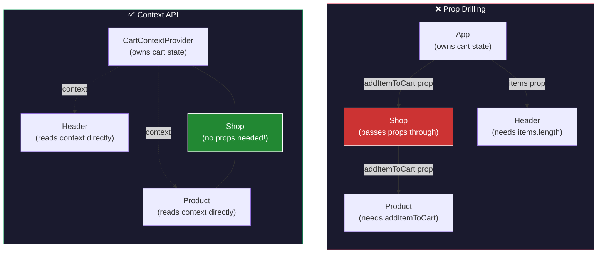
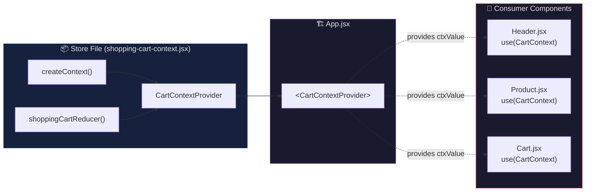
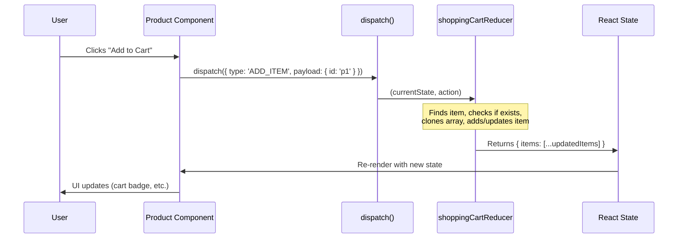
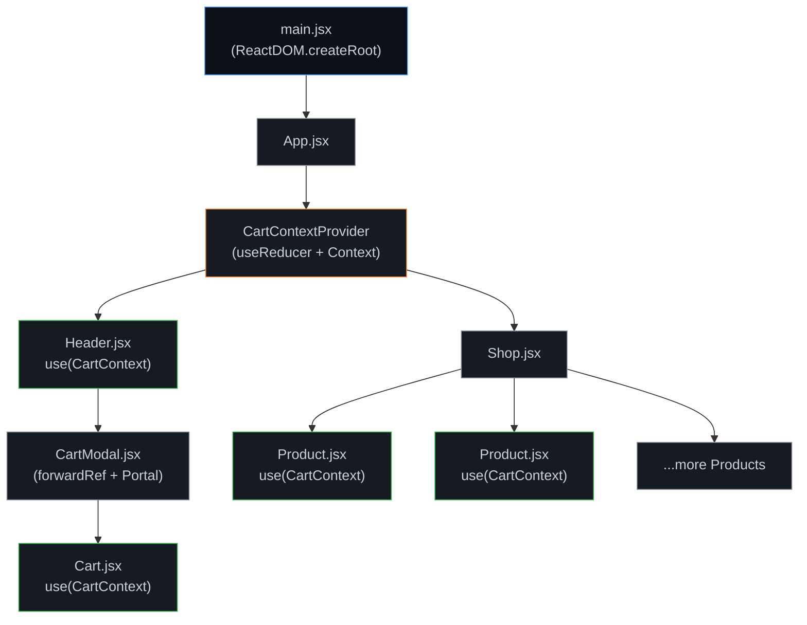

# 🛒 React Context API & `useReducer` Hook — Complete Revision Guide

> **Section 10** of the React course. This guide covers everything you need to understand **global state management** in React using the Context API and the `useReducer` hook — no need to open the source files again.

---

## 📑 Table of Contents

1. [The Problem: Prop Drilling](#1-the-problem-prop-drilling)
2. [Context API — Theory](#2-context-api--theory)
   - [What is Context?](#what-is-context)
   - [Three Steps to Use Context](#three-steps-to-use-context)
   - [`use()` vs `useContext()`](#use-vs-usecontext)
3. [`useReducer` Hook — Theory](#3-usereducer-hook--theory)
   - [What is a Reducer?](#what-is-a-reducer)
   - [`useReducer` Signature](#usereducer-signature)
   - [`useState` vs `useReducer`](#usestate-vs-usereducer)
4. [Code & Patterns](#4-code--patterns)
   - [Pattern 1: Basic `useReducer` Counter](#pattern-1-basic-usereducer-counter)
   - [Pattern 2: Creating & Providing Context](#pattern-2-creating--providing-context)
   - [Pattern 3: The Reducer Function (Shopping Cart)](#pattern-3-the-reducer-function-shopping-cart)
   - [Pattern 4: Consuming Context in Components](#pattern-4-consuming-context-in-components)
   - [Pattern 5: `useState` ➜ `useReducer` Migration](#pattern-5-usestate--usereducer-migration)
5. [Visual Aids (Mermaid Diagrams)](#5-visual-aids-mermaid-diagrams)
   - [Prop Drilling vs Context](#prop-drilling-vs-context)
   - [Context + Reducer Architecture](#context--reducer-architecture)
   - [`useReducer` Data Flow](#usereducer-data-flow)
   - [Full Application Component Tree](#full-application-component-tree)
6. [Summary & Key Takeaways](#6-summary--key-takeaways)

---

## 1. The Problem: Prop Drilling

Before Context API, the only way to share data between components was to **pass props down** through every intermediate component — even if those components didn't use the data themselves.

**Example:** If `App` has the shopping cart state but `Product` (a deeply nested child) needs to add items, you'd have to thread the `addItemToCart` function through `Shop` → `Product`:

```
App  →  props  →  Shop  →  props  →  Product
                    ↑
         (Shop doesn't even use the cart state,
          it just passes it through!)
```

**Problems with prop drilling:**

- Makes intermediate components unnecessarily complex
- Hard to refactor — changing the shape of data forces edits in every component in the chain
- Readability suffers as props get threaded through many levels
- Tight coupling between distant components

> **Context API solves this** by letting any component "reach into" a shared store without receiving data through props.

---

## 2. Context API — Theory

### What is Context?

Context provides a way to **share values between components** without explicitly passing props through every level of the tree. Think of it as a "broadcast channel" that any subscribed component can listen to.

**Core Idea:** You define a shared data store, wrap a part of your component tree with a _Provider_, and any descendant component can _consume_ the data directly.

**When to use Context:**

- Data needed by **many components** at different nesting levels (e.g., theme, locale, authenticated user, shopping cart)
- You want to avoid prop drilling through intermediate components that don't need the data

**When NOT to use Context:**

- For data used by only 1–2 closely related components (just pass props)
- For very frequently changing data (every context change re-renders all consumers)

### Three Steps to Use Context

| Step           | API                                                               | Where                                                           |
| -------------- | ----------------------------------------------------------------- | --------------------------------------------------------------- |
| **1. Create**  | `createContext(defaultValue)`                                     | A separate store file (e.g., `store/shopping-cart-context.jsx`) |
| **2. Provide** | `<MyContext.Provider value={...}>` or a custom Provider component | High up in the component tree (e.g., in `App.jsx`)              |
| **3. Consume** | `use(MyContext)` or `useContext(MyContext)`                       | Any descendant component that needs the data                    |

#### Step 1 — Create

```jsx
// store/shopping-cart-context.jsx

import { createContext } from "react";

// createContext() takes a DEFAULT value.
// This default is used ONLY when a component consumes the context
// WITHOUT a matching Provider above it in the tree.
// TIP: Defining the shape here gives you better IDE autocompletion.
export const CartContext = createContext({
  items: [], // default: empty array
  addItemToCart: () => {}, // default: no-op function
  updateItemQuantity: () => {}, // default: no-op function
});
```

> **Key Insight:** The default value in `createContext()` is **not** the initial state. It's a fallback for when there's no Provider. It also serves as a _documentation hint_ — you're declaring the "shape" of your context so that IDE autocompletion works.

#### Step 2 — Provide

```jsx
// App.jsx

import { CartContextProvider } from "./store/shopping-cart-context.jsx";
import Header from "./components/Header.jsx";
import Shop from "./components/Shop.jsx";

function App() {
  return (
    <>
      {/* CartContextProvider wraps the tree — all children can consume it */}
      <CartContextProvider>
        <Header />
        <Shop />
      </CartContextProvider>
    </>
  );
}
```

> **Key Insight:** Only components **inside** the Provider tags can consume the context. Components outside the Provider get the default value (which is usually just a placeholder).

#### Step 3 — Consume

```jsx
// components/Cart.jsx

import { use } from "react";
import { CartContext } from "../store/shopping-cart-context.jsx";

export default function Cart() {
  // Destructure the context value — pull out just what you need
  const { items, updateItemQuantity } = use(CartContext);
  // Now you have direct access to cart items and the update function
  // WITHOUT receiving them as props!
}
```

### `use()` vs `useContext()`

React 19 introduced the `use()` API, which replaces `useContext()` for consuming context.

| Feature                   | `useContext(MyContext)`     | `use(MyContext)`               |
| ------------------------- | --------------------------- | ------------------------------ |
| React version             | All versions                | **React 19+**                  |
| Can be used in `if`/loops | ❌ No (hook rules)          | ✅ Yes                         |
| Can read Promises         | ❌ No                       | ✅ Yes                         |
| Is a "hook"?              | ✅ Yes (follows hook rules) | ❌ No (new API, more flexible) |

```jsx
// React 18 and below:
import { useContext } from "react";
const value = useContext(CartContext);

// React 19+:
import { use } from "react";
const value = use(CartContext); // same result, more flexible
```

> **Key Insight:** `use()` is **not** technically a hook — it's a new React API. Unlike hooks, it can be called inside `if` statements, loops, and even after early returns. This makes conditional context consumption much cleaner.

---

## 3. `useReducer` Hook — Theory

### What is a Reducer?

A **reducer** is a pure function that takes the **current state** and an **action**, and returns **new state**. The name comes from the `Array.prototype.reduce()` method — it "reduces" multiple actions over time into a single state value.

**The Reducer Pattern:**

- All state update logic lives in **one function** (the reducer)
- Components don't directly mutate state — they **dispatch actions** (plain objects describing _what happened_)
- The reducer decides _how_ state changes based on the action type

**Why this matters:**

- **Centralized logic:** All state updates in one place (easy to debug, test, and reason about)
- **Predictable:** Given the same state + action, you always get the same result (pure function)
- **Scalable:** As state logic grows complex, the reducer pattern keeps it organized

### `useReducer` Signature

```jsx
const [state, dispatch] = useReducer(reducerFn, initialState);
```

| Part           | Description                                                     |
| -------------- | --------------------------------------------------------------- |
| `state`        | The current state value (like what `useState` gives you)        |
| `dispatch`     | A function to send actions to the reducer (replaces `setState`) |
| `reducerFn`    | A pure function: `(currentState, action) => newState`           |
| `initialState` | The starting state value (like the argument to `useState`)      |

**The Action Object:**

```jsx
// Actions are plain JS objects with a 'type' and optional 'payload'
dispatch({ type: "ADD_ITEM", payload: { id: "p1" } });
//         ↑ what happened      ↑ data needed for the update
```

- **`type`** — A string identifier describing the action (convention: UPPER_SNAKE_CASE)
- **`payload`** — Any additional data the reducer needs to perform the update

### `useState` vs `useReducer`

| Criteria           | `useState`                                 | `useReducer`                                                         |
| ------------------ | ------------------------------------------ | -------------------------------------------------------------------- |
| Best for           | Simple, independent state values           | Complex state with multiple sub-values or inter-dependent updates    |
| State updates      | Inline in event handlers                   | Centralized in a reducer function                                    |
| Action description | Implicit (you just call `setState`)        | Explicit (you dispatch named actions)                                |
| Debugging          | Harder to trace which handler changed what | Easier — every change goes through the reducer with a labeled action |
| Testing            | Test each handler separately               | Test the reducer as a pure function (easy!)                          |
| Boilerplate        | Less                                       | More (but pays off as complexity grows)                              |

**Rule of thumb:** Start with `useState`. Switch to `useReducer` when you find yourself writing complex `setState` callbacks with lots of derived logic or multiple related state updates.

---

## 4. Code & Patterns

### Pattern 1: Basic `useReducer` Counter

The simplest possible `useReducer` example — a counter with increment, decrement, and reset.

```jsx
import React from "react";

// 1. DEFINE THE REDUCER — a pure function, defined OUTSIDE the component
//    (no dependency on component scope = better performance, easier testing)
export function counterReducer(state, action) {
  // Each 'if' handles a different action type
  if (action.type === "INCREMENT") {
    return { count: state.count + 1 }; // return NEW state object (never mutate!)
  }
  if (action.type === "DECREMENT") {
    return { count: state.count - 1 };
  }
  if (action.type === "RESET") {
    return { count: 0 }; // reset to a fixed value
  }
  return state; // unknown action? return current state unchanged
}

function App() {
  // 2. INIT — pass reducer function + initial state to useReducer
  const [state, dispatch] = React.useReducer(counterReducer, { count: 0 });
  //     ↑ current state    ↑ dispatch function

  return (
    <div id="app">
      <h1>The (Final?) Counter</h1>
      <p id="actions">
        {/* 3. DISPATCH — send action objects to the reducer */}
        <button onClick={() => dispatch({ type: "INCREMENT" })}>
          Increment
        </button>
        <button onClick={() => dispatch({ type: "DECREMENT" })}>
          Decrement
        </button>
        <button onClick={() => dispatch({ type: "RESET" })}>Reset</button>
      </p>
      {/* 4. READ — access state.count from the reducer's state */}
      <p id="counter">{state.count}</p>
    </div>
  );
}

export default App;
```

> **Key Insight:** The reducer is defined **outside** the component. This is intentional — it keeps the reducer pure (no access to component closures), makes it independently testable, and avoids re-creating the function on every render.

**Syntax Tricks:**

- **Action types as strings:** `'INCREMENT'`, `'DECREMENT'`, etc. In larger apps, these are often extracted into constants to prevent typos.
- **Always return a new object:** `return { count: state.count + 1 }` — never do `state.count++; return state;` (mutation breaks React's change detection).

---

### Pattern 2: Creating & Providing Context

This is the **provider pattern** — a custom component that wraps `Context.Provider` and contains all the state logic.

```jsx
// store/shopping-cart-context.jsx

import { createContext, useReducer } from "react";
import { DUMMY_PRODUCTS } from "../dummy-products.js";

// STEP 1: Create Context with default shape
// This default is a "contract" — it tells consumers what props to expect
export const CartContext = createContext({
  items: [],
  addItemToCart: (item) => {}, // no-op placeholder
  updateItemQuantity: (itemId, quantity) => {},
});

// STEP 2: Define the reducer (handles all state mutations)
function shoppingCartReducer(state, action) {
  /* ... (see Pattern 3 below) ... */
}

// STEP 3: Create a Provider component that encapsulates ALL cart logic
export function CartContextProvider({ children }) {
  // useReducer replaces useState for complex state
  const [shoppingCartState, shoppingCartDispatch] = useReducer(
    shoppingCartReducer, // the reducer function
    { items: [] }, // initial state
  );

  // These handler functions translate user actions into dispatches
  function handleAddItemToCart(id) {
    shoppingCartDispatch({ type: "ADD_ITEM", payload: { id } });
  }

  function handleUpdateCartItemQuantity(productId, amount) {
    shoppingCartDispatch({
      type: "UPDATE_ITEM",
      payload: { id: productId, amount: amount },
    });
  }

  // Build the context value object
  // This is what ALL consumers receive
  const ctxValue = {
    items: shoppingCartState.items, // state from reducer
    addItemToCart: handleAddItemToCart, // dispatch wrapper
    updateItemQuantity: handleUpdateCartItemQuantity,
  };

  return (
    // Pass ctxValue to all descendants via the Provider
    <CartContext.Provider value={ctxValue}>{children}</CartContext.Provider>
  );
}
```

```jsx
// App.jsx — Using the custom Provider

import { CartContextProvider } from "./store/shopping-cart-context.jsx";
import Header from "./components/Header.jsx";
import Shop from "./components/Shop.jsx";

function App() {
  return (
    <>
      {/* Wrap the entire app (or the relevant subtree) */}
      <CartContextProvider>
        <Header /> {/* Can consume CartContext */}
        <Shop /> {/* Can consume CartContext */}
      </CartContextProvider>
    </>
  );
}
```

> **Key Insight:** By creating a **custom Provider component** (`CartContextProvider`), you encapsulate all state + logic in one file. The `App.jsx` stays clean — it doesn't know about `useReducer`, dispatching, or any state logic. It just wraps children with the provider.

> **Note (React 19+):** In React 19, you can use `<CartContext>` directly instead of `<CartContext.Provider>`. In earlier versions, the `.Provider` suffix is required.

---

### Pattern 3: The Reducer Function (Shopping Cart)

This is the **heart** of the state management — all update logic lives here.

```jsx
function shoppingCartReducer(state, action) {
  // ─── ACTION: ADD_ITEM ────────────────────────────────────
  if (action.type === "ADD_ITEM") {
    // 1. Clone the items array (never mutate the original!)
    const updatedItems = [...state.items];

    // 2. Check if the item already exists in the cart
    const existingCartItemIndex = updatedItems.findIndex(
      (cartItem) => cartItem.id === action.payload.id,
    );
    const existingCartItem = updatedItems[existingCartItemIndex];

    if (existingCartItem) {
      // 3a. Item exists → increase its quantity by 1
      const updatedItem = {
        ...existingCartItem, // copy all existing properties
        quantity: existingCartItem.quantity + 1, // bump quantity
      };
      updatedItems[existingCartItemIndex] = updatedItem; // replace in array
    } else {
      // 3b. Item is new → look it up in the products list and add it
      const product = DUMMY_PRODUCTS.find(
        (product) => product.id === action.payload.id,
      );
      updatedItems.push({
        id: action.payload.id,
        name: product.title,
        price: product.price,
        quantity: 1, // new item starts at quantity 1
      });
    }

    // 4. Return brand-new state object with updated items
    return { items: updatedItems };
  }

  // ─── ACTION: UPDATE_ITEM ─────────────────────────────────
  if (action.type === "UPDATE_ITEM") {
    const updatedItems = [...state.items];

    // Find the item to update
    const updatedItemIndex = updatedItems.findIndex(
      (item) => item.id === action.payload.id,
    );

    // Clone the item (immutability!)
    const updatedItem = { ...updatedItems[updatedItemIndex] };

    // Apply the quantity change (+1 or -1)
    updatedItem.quantity += action.payload.amount;

    if (updatedItem.quantity <= 0) {
      // If quantity drops to 0 or below → REMOVE item from cart
      updatedItems.splice(updatedItemIndex, 1);
    } else {
      // Otherwise, replace with updated item
      updatedItems[updatedItemIndex] = updatedItem;
    }

    return { items: updatedItems };
  }

  // ─── FALLBACK ────────────────────────────────────────────
  // Unknown action type → return state unchanged
  return state;
}
```

> **Key Insight:** Notice the **immutability pattern** used throughout:
>
> 1. Clone the array: `[...state.items]`
> 2. Clone individual objects: `{ ...existingCartItem }`
> 3. Return a **new** state object: `return { items: updatedItems }`
>
> React uses **reference equality** to detect changes. If you mutate the existing object, `oldState === newState` is `true`, and React won't re-render!

**Syntax Tricks:**

- **`splice(index, 1)`** — removes one element at `index` in-place (safe here because we're operating on a cloned array)
- **`findIndex()`** — returns `-1` if not found; the `existingCartItem` check handles this gracefully
- **`payload`** — a common Redux convention; you can name this anything, but `payload` is the standard

---

### Pattern 4: Consuming Context in Components

Different components consume context to get exactly what they need.

#### Header — Reading `items` for cart badge count

```jsx
// components/Header.jsx

import { useRef, use } from "react";
import CartModal from "./CartModal.jsx";
import { CartContext } from "../store/shopping-cart-context.jsx";

export default function Header() {
  const modal = useRef(); // ref for the cart modal dialog

  // Consume context — destructure only what Header needs
  const { items } = use(CartContext);
  const cartQuantity = items.length; // number of unique items in cart

  function handleOpenCartClick() {
    modal.current.open(); // imperatively open the modal
  }

  // Conditionally render Checkout button based on cart contents
  let modalActions = <button>Close</button>;
  if (cartQuantity > 0) {
    modalActions = (
      <>
        <button>Close</button>
        <button>Checkout</button> {/* only shown when cart has items */}
      </>
    );
  }

  return (
    <>
      <CartModal ref={modal} title="Your Cart" actions={modalActions} />
      <header id="main-header">
        <div id="main-title">
          
          <h1>Elegant Context</h1>
        </div>
        <p>
          {/* Cart badge shows number of items */}
          <button onClick={handleOpenCartClick}>Cart ({cartQuantity})</button>
        </p>
      </header>
    </>
  );
}
```

#### Product — Calling `addItemToCart` without prop drilling

```jsx
// components/Product.jsx

import { use } from "react";
import { CartContext } from "../store/shopping-cart-context.jsx";

export default function Product({ id, image, title, price, description }) {
  // Consume ONLY the function this component needs
  const { addItemToCart } = use(CartContext);

  return (
    <article className="product">
      
      <div className="product-content">
        <div>
          <h3>{title}</h3>
          <p className="product-price">${price}</p>
          <p>{description}</p>
        </div>
        <p className="product-actions">
          {/* Directly call context function — no props needed! */}
          <button onClick={() => addItemToCart(id)}>Add to Cart</button>
        </p>
      </div>
    </article>
  );
}
```

> **Key Insight:** `Product` gets the `addItemToCart` function **directly from context**. Without context, this function would have to be passed: `App → Shop → Product` (two levels of prop drilling). With context, `Product` just "reaches in" and grabs it.

#### Cart — Reading items + updating quantities

```jsx
// components/Cart.jsx

import { use } from "react";
import { CartContext } from "../store/shopping-cart-context.jsx";

export default function Cart() {
  // Destructure both items and the update function
  const { items, updateItemQuantity } = use(CartContext);

  // Calculate total price using Array.reduce()
  const totalPrice = items.reduce(
    (acc, item) => acc + item.price * item.quantity,
    0, // initial accumulator value
  );
  const formattedTotalPrice = `$${totalPrice.toFixed(2)}`;

  return (
    <div id="cart">
      {/* Conditional rendering: empty cart message vs item list */}
      {items.length === 0 && <p>No items in cart!</p>}
      {items.length > 0 && (
        <ul id="cart-items">
          {items.map((item) => {
            const formattedPrice = `$${item.price.toFixed(2)}`;
            return (
              <li key={item.id}>
                <div>
                  <span>{item.name}</span>
                  <span> ({formattedPrice})</span>
                </div>
                <div className="cart-item-actions">
                  {/* -1 decrements, +1 increments quantity */}
                  <button onClick={() => updateItemQuantity(item.id, -1)}>
                    -
                  </button>
                  <span>{item.quantity}</span>
                  <button onClick={() => updateItemQuantity(item.id, 1)}>
                    +
                  </button>
                </div>
              </li>
            );
          })}
        </ul>
      )}
      <p id="cart-total-price">
        Cart Total: <strong>{formattedTotalPrice}</strong>
      </p>
    </div>
  );
}
```

> **Key Insight:** `updateItemQuantity(item.id, -1)` and `updateItemQuantity(item.id, 1)` both trigger the same `UPDATE_ITEM` action in the reducer, but with different `amount` values. The reducer handles the logic of removing items when quantity hits zero — the component doesn't need to know about that edge case.

---

### Pattern 5: `useState` ➜ `useReducer` Migration

The codebase shows both approaches side-by-side (the `useState` version is commented out). Here's the comparison:

**BEFORE — `useState` approach:**

```jsx
export function CartContextProvider({ children }) {
  // State managed with useState
  const [shoppingCart, setShoppingCart] = useState({ items: [] });

  function handleAddItemToCart(id) {
    // All logic INSIDE the setState callback
    setShoppingCart((prevShoppingCart) => {
      const updatedItems = [...prevShoppingCart.items];
      const existingCartItemIndex = updatedItems.findIndex(
        (cartItem) => cartItem.id === id,
      );
      const existingCartItem = updatedItems[existingCartItemIndex];

      if (existingCartItem) {
        const updatedItem = {
          ...existingCartItem,
          quantity: existingCartItem.quantity + 1,
        };
        updatedItems[existingCartItemIndex] = updatedItem;
      } else {
        const product = DUMMY_PRODUCTS.find((p) => p.id === id);
        updatedItems.push({
          id,
          name: product.title,
          price: product.price,
          quantity: 1,
        });
      }
      return { items: updatedItems };
    });
  }

  // handleUpdateCartItemQuantity would be similarly bloated...

  const ctxValue = {
    items: shoppingCart.items, // from useState
    addItemToCart: handleAddItemToCart,
    updateItemQuantity: handleUpdateCartItemQuantity,
  };

  return (
    <CartContext.Provider value={ctxValue}>{children}</CartContext.Provider>
  );
}
```

**AFTER — `useReducer` approach:**

```jsx
export function CartContextProvider({ children }) {
  // State managed with useReducer — logic moved to reducer function
  const [shoppingCartState, shoppingCartDispatch] = useReducer(
    shoppingCartReducer, // all logic lives in this function
    { items: [] },
  );

  function handleAddItemToCart(id) {
    // Handler is now just ONE line — dispatch an action!
    shoppingCartDispatch({ type: "ADD_ITEM", payload: { id } });
  }

  function handleUpdateCartItemQuantity(productId, amount) {
    shoppingCartDispatch({
      type: "UPDATE_ITEM",
      payload: { id: productId, amount },
    });
  }

  const ctxValue = {
    items: shoppingCartState.items, // from useReducer
    addItemToCart: handleAddItemToCart,
    updateItemQuantity: handleUpdateCartItemQuantity,
  };

  return (
    <CartContext.Provider value={ctxValue}>{children}</CartContext.Provider>
  );
}
```

> **Key Insight:** The handler functions went from **15+ lines** of inline logic to **1 line** each. All that logic moved to the reducer — a single, testable, pure function. The Provider component now only handles "what to dispatch", not "how to update state."

---

## 5. Visual Aids (Mermaid Diagrams)

### Prop Drilling vs Context



### Context + Reducer Architecture



### `useReducer` Data Flow



### Full Application Component Tree



> **Legend:** 🟠 = provides context &nbsp; 🟢 = consumes context &nbsp; ⚫ = passes through

---

## 6. Summary & Key Takeaways

### Context API

- ✅ **Solves prop drilling** — share state across distant components without threading props
- ✅ **Three steps:** Create → Provide → Consume
- ✅ **`createContext(defaultValue)`** — the default is for fallback/IDE hints, NOT initial state
- ✅ **Custom Provider component** — encapsulate state logic + provide a clean API to consumers
- ✅ **React 19:** `use(Context)` replaces `useContext(Context)` with more flexibility

### `useReducer` Hook

- ✅ **Use when** state logic is complex (multiple actions, related sub-values)
- ✅ **Reducer = pure function** — `(state, action) => newState`
- ✅ **Dispatch actions** — plain objects with `type` and optional `payload`
- ✅ **Immutability is critical** — always return new objects/arrays, never mutate
- ✅ **Define reducer outside the component** — keeps it pure, testable, performant

### Context + `useReducer` Together

- ✅ **The power combo** — Context distributes state, `useReducer` manages it
- ✅ **Provider handles everything** — consumers just call functions, unaware of the reducer
- ✅ **Clean migration path** from `useState` → `useReducer` (just move logic into reducer, replace `setState` with `dispatch`)

### Quick Reference — When to Use What

| Scenario                                    | Tool                       |
| ------------------------------------------- | -------------------------- |
| Simple toggle, counter, form field          | `useState`                 |
| Complex object with multiple update actions | `useReducer`               |
| Data needed by 1–2 nearby components        | Props                      |
| Data needed by many/distant components      | Context API                |
| Complex state + many consumers              | **Context + `useReducer`** |

---

> 📂 **Source Project:** `01-starting-project/` — A Vite + React e-commerce demo ("Elegant Context") showcasing Context API + `useReducer` for shopping cart management.
