# 📘 Section 11 — Side Effects & `useEffect` in React

> **Project: PlacePicker** — A React application that lets users build a personal collection of places to visit, sorted by geolocation distance, with modal confirmation dialogs and auto-delete timers.

---

## 📑 Table of Contents

1. [What Are Side Effects?](#1--what-are-side-effects)
2. [Why Side Effects Are Problematic Inside Render](#2--why-side-effects-are-problematic-inside-render)
3. [The `useEffect` Hook — Deep Dive](#3--the-useeffect-hook--deep-dive)
4. [The Dependency Array — When Does the Effect Re-run?](#4--the-dependency-array--when-does-the-effect-re-run)
5. [Cleanup Functions — Preventing Memory Leaks](#5--cleanup-functions--preventing-memory-leaks)
6. [Not Every Side Effect Needs `useEffect`](#6--not-every-side-effect-needs-useeffect)
7. [Imperative vs Declarative State Management](#7--imperative-vs-declarative-state-management)
8. [`useCallback` — Stabilizing Function References](#8--usecallback--stabilizing-function-references)
9. [`useRef` for Instance Variables](#9--useref-for-instance-variables)
10. [`createPortal` — Rendering Outside the DOM Hierarchy](#10--createportal--rendering-outside-the-dom-hierarchy)
11. [Geolocation API as a Side Effect](#11--geolocation-api-as-a-side-effect)
12. [`localStorage` as a Side Effect](#12--localstorage-as-a-side-effect)
13. [ProgressBar — Timers Inside `useEffect`](#13--progressbar--timers-inside-useeffect)
14. [Architecture & Data Flow Diagrams](#14--architecture--data-flow-diagrams)
15. [Summary & Key Takeaways](#15--summary--key-takeaways)

---

## 1. 🧠 What Are Side Effects?

A **side effect** is any operation that reaches **outside the pure React rendering cycle**. React components are meant to be **pure functions** — given the same props and state, they should always return the same JSX. Anything that breaks this purity is a side effect.

### Examples of Side Effects

| Side Effect                                                | Why It's "Outside" React            |
| ---------------------------------------------------------- | ----------------------------------- |
| Fetching data from an API                                  | Involves the network — asynchronous |
| Accessing `localStorage`                                   | Interacts with browser storage      |
| Using `navigator.geolocation`                              | Calls a browser API                 |
| Setting up timers (`setTimeout`/`setInterval`)             | Schedules future work               |
| Directly manipulating the DOM (e.g., `dialog.showModal()`) | Bypasses React's virtual DOM        |
| Subscribing to WebSockets / event listeners                | Creates long-lived connections      |

### The Golden Rule

> **Pure rendering** = takes props + state → returns JSX. No external world interaction.
>
> **Side effect** = anything that talks to the outside world or produces effects beyond returning JSX.

---

## 2. ⚠️ Why Side Effects Are Problematic Inside Render

If you put a side effect directly in your component body (outside any hook or handler), **it runs on every single render**:

```jsx
// ❌ BAD — This runs every time the component renders
function App() {
  // This will fire on EVERY render — causing infinite loops if it triggers state updates
  navigator.geolocation.getCurrentPosition((pos) => {
    setSortedPlaces(sortByDistance(places, pos)); // setState → re-render → effect runs again → ∞
  });

  return <div>...</div>;
}
```

**Problems:**

- 🔄 **Infinite loops** — If the effect sets state, it triggers a re-render, which runs the effect again.
- 🐢 **Performance** — Unnecessary repeated work on every render.
- 🪲 **Race conditions** — Multiple async operations running simultaneously with unpredictable completion order.

---

## 3. 🪝 The `useEffect` Hook — Deep Dive

### What Is It?

`useEffect` lets you **synchronize your component with an external system** (browser APIs, servers, timers, etc.) in a way that is **safe** and **controlled**.

### Syntax

```jsx
useEffect(() => {
  // 👈 Effect function — runs AFTER the component renders to the DOM

  return () => {
    // 👈 Cleanup function (optional) — runs BEFORE the effect re-runs or when component unmounts
  };
}, [dependency1, dependency2]); // 👈 Dependency array — controls WHEN the effect re-runs
```

### Execution Timeline

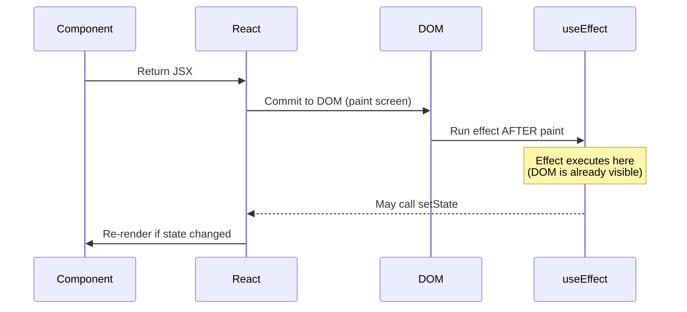

### Key Insight — Why "After Paint"?

React deliberately runs effects **after** the browser has painted pixels to the screen. This ensures:

1. The user sees the UI immediately (no blocking).
2. DOM refs (like `dialog.current`) are **already connected** to real DOM elements.
3. The effect can safely read layout info or manipulate the DOM.

---

## 4. 📦 The Dependency Array — When Does the Effect Re-run?

The dependency array is the **brain** of `useEffect`. It tells React: _"Only re-run this effect if one of these values has changed since the last render."_

### Three Configurations

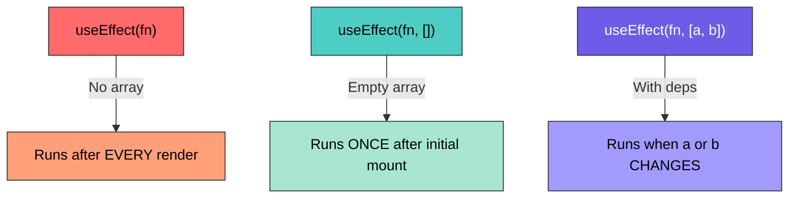

| Dependency Array                        | Behavior                     | Use Case                                          |
| --------------------------------------- | ---------------------------- | ------------------------------------------------- |
| **Omitted** `useEffect(fn)`             | Runs after every render      | Rarely used — can cause performance issues        |
| **Empty** `useEffect(fn, [])`           | Runs once on mount           | Fetching initial data, geolocation, subscriptions |
| **With values** `useEffect(fn, [a, b])` | Runs when `a` or `b` changes | Syncing with prop/state changes                   |

### Example from the Project — Modal Component

```jsx
import { useRef, useEffect } from "react";
import { createPortal } from "react-dom";

function Modal({ open, children, onClose }) {
  const dialog = useRef(); // 🔗 Create a ref to hold the <dialog> DOM element

  useEffect(() => {
    // ✅ This runs AFTER render — dialog.current is guaranteed to exist
    if (open) {
      dialog.current.showModal(); // Imperative DOM API — opens the native <dialog>
    } else {
      dialog.current.close(); // Closes the native <dialog>
    }
    // ⚠️ If this code were OUTSIDE useEffect, dialog.current would be null
    // because the ref isn't connected until React commits to the DOM
  }, [open]); // 👈 Re-run only when the `open` prop changes

  return createPortal(
    <dialog className="modal" ref={dialog} onClose={onClose}>
      {children}
    </dialog>,
    document.getElementById("modal"), // 🚪 Portal target — renders outside main React tree
  );
}
```

**Key Insight:**

- `dialog.current.showModal()` is an **imperative DOM call** — it directly talks to the browser's native `<dialog>` element.
- Without `useEffect`, the `ref` isn't yet attached to the DOM node, so `dialog.current` would be `null` → crash!
- The dependency `[open]` means: _"Re-run this effect whenever `open` changes from `true` to `false` or vice versa."_

---

## 5. 🧹 Cleanup Functions — Preventing Memory Leaks

### What Is a Cleanup Function?

The **return value** of your effect function. React calls it:

1. **Before re-running** the effect (when dependencies change).
2. **When the component unmounts** (is removed from the DOM).

### Why It Matters

If you start a timer or subscription in an effect but never clean it up, those timers/subscriptions **keep running even after the component is gone** — this is a **memory leak**.

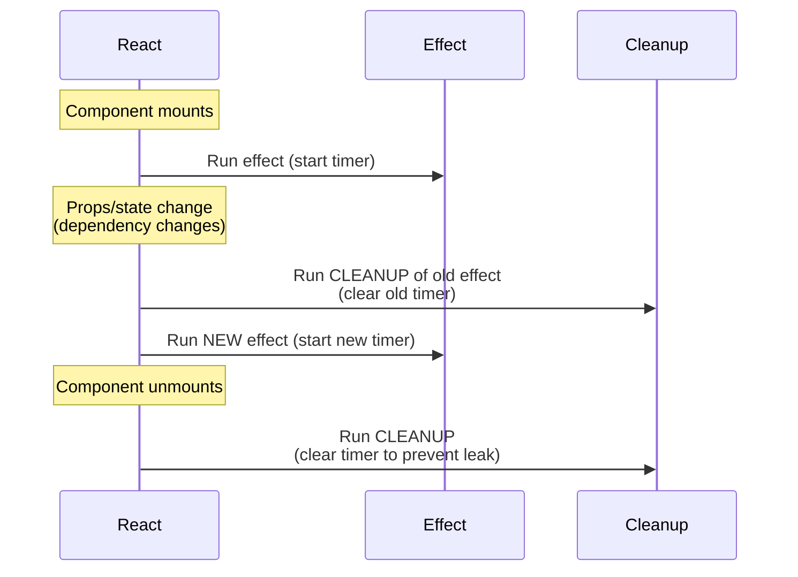

### Example from the Project — ProgressBar

```jsx
import { useEffect, useState } from "react";

export default function ProgressBar({ timer, open, onTimeout }) {
  const [remainingTime, setRemainingTime] = useState(timer);

  useEffect(() => {
    // 🛑 Guard clause — don't start timers if the modal isn't open
    if (!open) {
      return; // Early return = no effect to run, no cleanup needed
    }

    // 🔄 Reset the progress bar each time the modal opens
    setRemainingTime(timer);

    // ⏱️ Interval: updates the progress bar every 10ms for smooth animation
    const interval = setInterval(() => {
      setRemainingTime((prevTime) => {
        if (prevTime <= 10) {
          return 0; // Clamp to zero — don't go negative
        }
        return prevTime - 10; // Decrease by 10ms
      });
    }, 10);

    // ⏰ Timeout: auto-confirms deletion after `timer` milliseconds
    const timeout = setTimeout(() => {
      onTimeout(); // Calls the parent's confirm handler
    }, timer);

    // 🧹 CLEANUP: Clear BOTH timers when effect re-runs or component unmounts
    return () => {
      clearInterval(interval); // Stop the progress animation
      clearTimeout(timeout); // Cancel the auto-delete
    };
  }, [open, onTimeout, timer]); // 👈 Re-run when modal opens/closes, handler changes, or timer changes

  // 📊 Native HTML <progress> element — value decreases from `timer` to 0
  return <progress value={remainingTime} max={timer} />;
}
```

**Key Insight:**

- Two timers are created (`setInterval` + `setTimeout`). Both **must** be cleaned up.
- Without cleanup: closing the modal wouldn't stop the timer → the `onTimeout` callback would fire on a component that no longer exists → React warning + potential bugs.
- `onTimeout` is a dependency because if the parent recreates this function, the old timeout points to a stale reference.

---

## 6. 🚫 Not Every Side Effect Needs `useEffect`

This is one of the most important lessons. The React docs themselves say:

> _"You might not need an effect."_

### The Rule of Thumb

| Situation                                                           | Use `useEffect`?                                           | Why?                                                                             |
| ------------------------------------------------------------------- | ---------------------------------------------------------- | -------------------------------------------------------------------------------- |
| Side effect in response to **user action** (click, submit)          | ❌ No — put it in the **event handler**                    | The handler already runs at the right time                                       |
| Side effect that needs to run **on mount** or **when data changes** | ✅ Yes                                                     | No user event triggers it — it needs to synchronize with the component lifecycle |
| **Synchronous**, fast operation (like `localStorage.getItem`)       | ❌ No — put it **outside the component** or in the handler | No need to wait for render                                                       |

### Example from the Project — `localStorage` in an Event Handler

```jsx
function handleSelectPlace(id) {
  setPickedPlaces((prevPickedPlaces) => {
    if (prevPickedPlaces.some((place) => place.id === id)) {
      return prevPickedPlaces; // Already picked — no duplicate
    }
    const place = AVAILABLE_PLACES.find((place) => place.id === id);
    return [place, ...prevPickedPlaces]; // Add to front of list
  });

  // ✅ Side effect WITHOUT useEffect — runs in response to a user click
  // localStorage is synchronous and fast — no need for useEffect
  const storedIds = JSON.parse(localStorage.getItem("pickedPlaces")) || [];
  if (!storedIds.includes(id)) {
    localStorage.setItem("pickedPlaces", JSON.stringify([id, ...storedIds]));
  }
}
```

### Example — Initialization Outside the Component

```jsx
// ✅ This runs ONCE when the JavaScript module first loads
// No useEffect needed — it's not inside the component, so it doesn't re-run on renders
const storedIds = JSON.parse(localStorage.getItem("pickedPlaces")) || [];
const storedPlaces = storedIds
  .map((id) => AVAILABLE_PLACES.find((place) => place.id === id))
  .filter(Boolean); // Remove any undefined entries (if a place was deleted from data)

function App() {
  const [pickedPlaces, setPickedPlaces] = useState(storedPlaces); // Initialize from localStorage
  // ...
}
```

**Key Insight:**

- Code **outside** the component function runs **once per module load** — perfect for synchronous initialization.
- Code inside **event handlers** runs at the right time already — wrapping it in `useEffect` would be over-engineering.

---

## 7. 🔄 Imperative vs Declarative State Management

This project demonstrates the shift from **imperative** to **declarative** approaches for controlling the modal.

### Imperative Approach (What We Avoid)

```jsx
// ❌ Imperative: You tell React HOW to do it step by step
function App() {
  const dialog = useRef();

  function openModal() {
    dialog.current.showModal(); // 👈 Direct DOM manipulation — "DO THIS NOW"
  }

  function closeModal() {
    dialog.current.close(); // 👈 Direct DOM manipulation — "DO THIS NOW"
  }
}
```

**Problems with Imperative:**

- The UI state (is modal open?) is **not tracked by React** — it's hidden in the DOM.
- Hard to synchronize with other state (e.g., which place is being deleted).
- Breaks the React mental model of "state drives UI."

### Declarative Approach (What We Use) ✅

```jsx
// ✅ Declarative: You tell React WHAT the state should be, React figures out HOW
function App() {
  const [modalIsOpen, setModalIsOpen] = useState(false); // 👈 State DRIVES the UI

  function handleStartRemovePlace(id) {
    setModalIsOpen(true); // 👈 "The modal SHOULD be open" — React handles the rest
  }

  function handleStopRemovePlace() {
    setModalIsOpen(false); // 👈 "The modal SHOULD be closed"
  }

  return (
    <Modal open={modalIsOpen} onClose={handleStopRemovePlace}>
      {/* ... */}
    </Modal>
  );
}
```

Inside `Modal`, the `useEffect` **bridges** declarative state to imperative DOM:

```jsx
useEffect(() => {
  if (open) {
    dialog.current.showModal(); // Declarative state → Imperative DOM call
  } else {
    dialog.current.close();
  }
}, [open]);
```

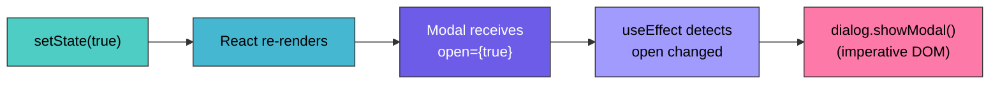

**Key Insight:**

- **Declarative = "What"** → `setModalIsOpen(true)` says _what_ should happen.
- **Imperative = "How"** → `dialog.current.showModal()` says _how_ to do it.
- React's paradigm is declarative. Use `useEffect` as a **bridge** when you need to call imperative browser APIs.

---

## 8. 🔒 `useCallback` — Stabilizing Function References

### The Problem

In JavaScript, **every render creates new function objects**. Even if the function body is identical, it's a **new reference** in memory:

```jsx
function App() {
  // ❌ This function is RECREATED on every render
  function handleRemovePlace() {
    /* ... */
  }

  return <DeleteConfirmation onConfirm={handleRemovePlace} />;
}
```

If `handleRemovePlace` is used as a **dependency in a `useEffect`** inside `DeleteConfirmation`, the effect would re-run on every render because the function reference changed.

### The Solution — `useCallback`

```jsx
// ✅ useCallback memoizes the function — same reference across renders
const handleRemovePlace = useCallback(() => {
  const removedId = selectedPlace.current;
  const removedPlace = pickedPlaces.find((place) => place.id === removedId);

  setPickedPlaces((prevPickedPlaces) =>
    prevPickedPlaces.filter((place) => place.id !== removedId),
  );

  if (removedPlace) {
    setAvailablePlaces((prevAvailablePlaces) => {
      return [...prevAvailablePlaces, removedPlace];
    });
  }

  setModelIsOpen(false);

  // Update localStorage
  const storedIds = JSON.parse(localStorage.getItem("pickedPlaces")) || [];
  localStorage.setItem(
    "pickedPlaces",
    JSON.stringify(storedIds.filter((storedId) => storedId !== removedId)),
  );
}, []); // 👈 Empty deps = function is created once and never recreated
```

### How It Connects to `ProgressBar`

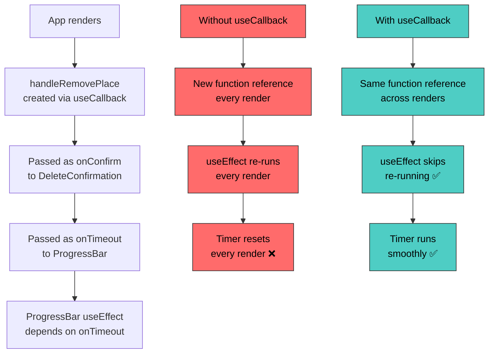

**Key Insight:**

- `useCallback` returns the **same function object** across re-renders (as long as deps don't change).
- This prevents `ProgressBar`'s `useEffect` from re-running unnecessarily, which would reset the timer.
- Without `useCallback`, the `ProgressBar` timer would restart on every keystroke or state change in `App`.

---

## 9. 📌 `useRef` for Instance Variables

### Beyond DOM Refs

`useRef` isn't just for accessing DOM elements — it's also perfect for storing **mutable values that persist across renders without triggering re-renders**.

```jsx
function App() {
  const selectedPlace = useRef(); // 👈 Stores the ID of the place being deleted

  function handleStartRemovePlace(id) {
    setModelIsOpen(true);
    selectedPlace.current = id; // 👈 Store without re-rendering
  }

  const handleRemovePlace = useCallback(() => {
    const removedId = selectedPlace.current; // 👈 Read the stored value
    // ... perform deletion
  }, []);
}
```

### `useRef` vs `useState` — When to Use Which?

| Feature                      | `useState`               | `useRef`                         |
| ---------------------------- | ------------------------ | -------------------------------- |
| Triggers re-render on change | ✅ Yes                   | ❌ No                            |
| Persists across renders      | ✅ Yes                   | ✅ Yes                           |
| Can be read during render    | ✅ Yes (use the value)   | ⚠️ Yes but value may be stale    |
| Best for                     | Data that affects the UI | Data that does NOT affect the UI |

**Key Insight:**

- `selectedPlace` doesn't need to trigger a re-render when it changes — we only read it later in `handleRemovePlace`. Using `useState` would cause an unnecessary re-render.
- Think of `useRef` as a **class instance variable** in functional components.

---

## 10. 🚪 `createPortal` — Rendering Outside the DOM Hierarchy

### The Problem

React renders all components inside a single root `<div id="root">`. But modals, tooltips, and toasts should visually **overlay** the entire page and not be constrained by parent CSS (z-index, overflow, etc.).

### The Solution

```jsx
import { createPortal } from "react-dom";

function Modal({ open, children, onClose }) {
  const dialog = useRef();

  return createPortal(
    // 👇 This JSX will be rendered here in the React tree...
    <dialog className="modal" ref={dialog} onClose={onClose}>
      {children}
    </dialog>,
    // 👇 ...but injected HERE in the actual DOM
    document.getElementById("modal"),
  );
}
```

In `index.html`:

```html
<body>
  <div id="modal"></div>
  <!-- 🚪 Portal destination for modals -->
  <div id="root"></div>
  <!-- 🌳 Main React app tree -->
</body>
```

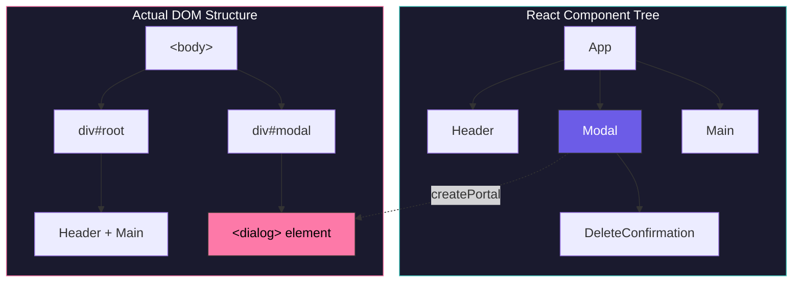

**Key Insight:**

- `createPortal` separates **where a component lives in React** from **where it lives in the DOM**.
- React events still bubble through the **React tree** (not the DOM tree), so `onClick` handlers on parents still work.

---

## 11. 🌍 Geolocation API as a Side Effect

The `navigator.geolocation.getCurrentPosition()` API is a classic side effect — it's **asynchronous**, **browser-specific**, and has **nothing to do with rendering JSX**.

```jsx
useEffect(() => {
  // 🌍 Ask the browser for the user's current position
  navigator.geolocation.getCurrentPosition((position) => {
    // ✅ This callback fires ASYNCHRONOUSLY once the browser gets the location
    const sortedPlaces = sortPlacesByDistance(
      AVAILABLE_PLACES,
      position.coords.latitude,
      position.coords.longitude,
    );

    // Filter out places the user has already picked
    const filteredPlaces = sortedPlaces.filter(
      (place) => !storedIds.includes(place.id),
    );

    setAvailablePlaces(filteredPlaces); // 🔄 Triggers re-render with sorted places
  });
}, []); // 👈 Empty array = only run once on mount
```

### The Distance Calculation (Haversine Formula)

```jsx
function toRad(value) {
  return (value * Math.PI) / 180; // Convert degrees to radians
}

function calculateDistance(lat1, lng1, lat2, lng2) {
  const R = 6371; // 🌍 Earth's radius in kilometers
  const dLat = toRad(lat2 - lat1);
  const dLon = toRad(lng2 - lng1);
  const l1 = toRad(lat1);
  const l2 = toRad(lat2);

  // Haversine formula — calculates great-circle distance between two points on a sphere
  const a =
    Math.sin(dLat / 2) * Math.sin(dLat / 2) +
    Math.sin(dLon / 2) * Math.sin(dLon / 2) * Math.cos(l1) * Math.cos(l2);
  const c = 2 * Math.atan2(Math.sqrt(a), Math.sqrt(1 - a));
  return R * c; // Distance in kilometers
}
```

**Key Insight:**

- Geolocation must go in `useEffect` because: (1) it's async, (2) it triggers a state update, (3) it should only run once — not on every render.
- The empty dependency array `[]` ensures we don't repeatedly ask for the user's location.

---

## 12. 💾 `localStorage` as a Side Effect

`localStorage` appears in **three places** in this project, each handled differently:

### 1. Module-Level Initialization (No `useEffect`)

```jsx
// Runs once when the module loads — synchronous and fast
const storedIds = JSON.parse(localStorage.getItem("pickedPlaces")) || [];
const storedPlaces = storedIds
  .map((id) => AVAILABLE_PLACES.find((place) => place.id === id))
  .filter(Boolean);
```

### 2. In the Select Handler (No `useEffect`)

```jsx
function handleSelectPlace(id) {
  // ... update state ...

  // Side effect in event handler — runs only when user clicks
  const storedIds = JSON.parse(localStorage.getItem("pickedPlaces")) || [];
  if (!storedIds.includes(id)) {
    localStorage.setItem("pickedPlaces", JSON.stringify([id, ...storedIds]));
  }
}
```

### 3. In the Remove Handler (No `useEffect`)

```jsx
const handleRemovePlace = useCallback(() => {
  // ... update state ...

  // Side effect in event handler — runs only when user confirms deletion
  const storedIds = JSON.parse(localStorage.getItem("pickedPlaces")) || [];
  localStorage.setItem(
    "pickedPlaces",
    JSON.stringify(storedIds.filter((storedId) => storedId !== removedId)),
  );
}, []);
```

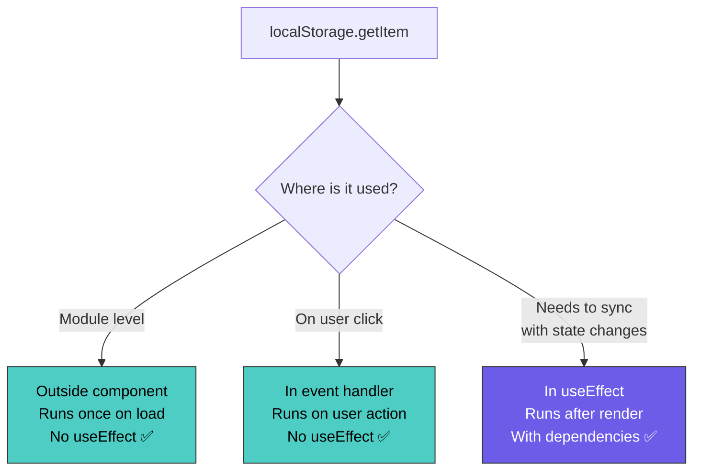

**Key Insight:**

- `localStorage` is **synchronous** — it doesn't need `useEffect` unless you need it to react to state/prop changes.
- Pattern: Read at module level, write in event handlers. Clean and simple.

---

## 13. ⏱️ ProgressBar — Timers Inside `useEffect`

The `ProgressBar` component is the most complex `useEffect` example in the project. It combines **two timers** with **cleanup**.

### Component Architecture

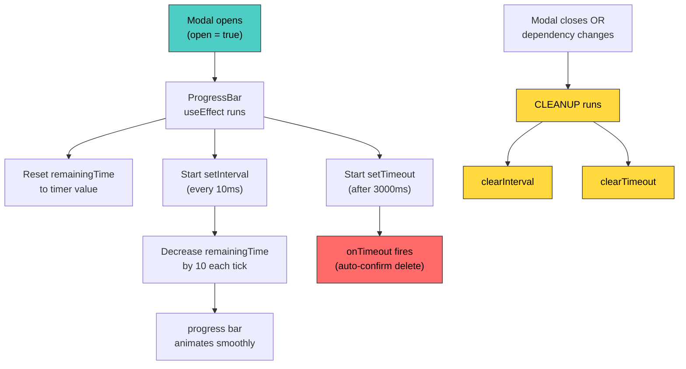

### Why Two Timers?

| Timer         | Purpose                                            | Interval     |
| ------------- | -------------------------------------------------- | ------------ |
| `setInterval` | **Visual** — smoothly animate the `<progress>` bar | Every 10ms   |
| `setTimeout`  | **Functional** — trigger the auto-confirm action   | After 3000ms |

- `setInterval` handles the **visual feedback** (progress bar draining).
- `setTimeout` handles the **actual action** (confirming the deletion).
- They are independent: the visual timer runs at 10ms resolution for smoothness, while the action timer fires once at exactly 3 seconds.

---

## 14. 🏗️ Architecture & Data Flow Diagrams

### Complete Component Hierarchy

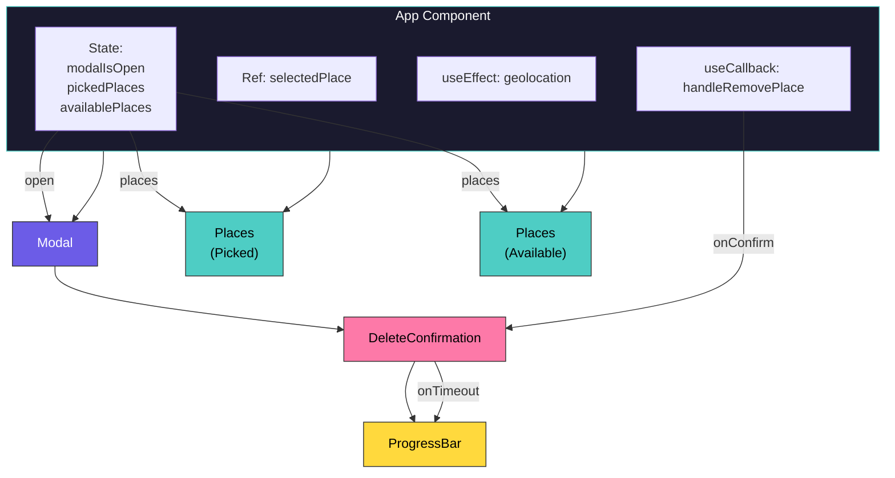

### Data Persistence Flow

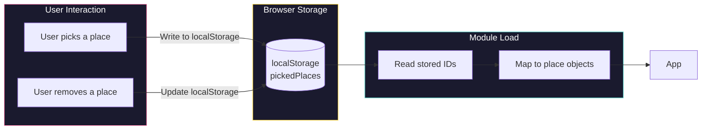

---

## 15. 📋 Summary & Key Takeaways

### The Big Ideas

| #   | Concept                              | One-Liner                                                                  |
| --- | ------------------------------------ | -------------------------------------------------------------------------- |
| 1   | **Side Effects**                     | Any operation that reaches outside React's rendering cycle                 |
| 2   | **`useEffect`**                      | Runs code after render — for syncing with the outside world                |
| 3   | **Dependency Array**                 | Controls when the effect re-runs: `[]` = once, `[x]` = when `x` changes    |
| 4   | **Cleanup Functions**                | Return a function from `useEffect` to teardown timers, subscriptions, etc. |
| 5   | **Not all effects need `useEffect`** | Event handlers and module-level code are often better choices              |
| 6   | **Declarative > Imperative**         | Use state to drive UI; use `useEffect` to bridge to imperative APIs        |
| 7   | **`useCallback`**                    | Stabilizes function references to prevent unnecessary effect re-runs       |
| 8   | **`useRef`**                         | Stores mutable values that persist across renders without re-rendering     |
| 9   | **`createPortal`**                   | Renders React components in a different DOM location (great for modals)    |

### Decision Flowchart — Do I Need `useEffect`?

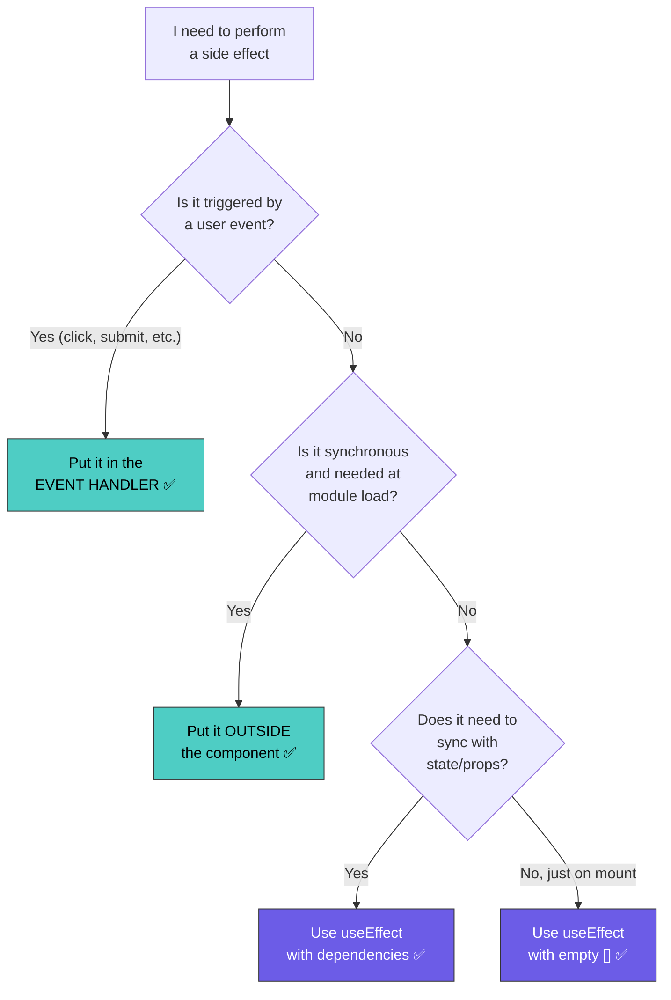

### Common Mistakes to Avoid

| ❌ Mistake                                          | ✅ Fix                                 |
| --------------------------------------------------- | -------------------------------------- |
| Putting side effects directly in the component body | Use `useEffect` or event handlers      |
| Omitting the dependency array                       | Always specify dependencies explicitly |
| Forgetting cleanup for timers/subscriptions         | Return a cleanup function              |
| Using `useState` for values that don't affect UI    | Use `useRef` instead                   |
| Passing unstable functions as effect dependencies   | Wrap with `useCallback`                |
| Using `useEffect` for event-driven logic            | Use event handlers directly            |

---

> **🎯 Remember:** `useEffect` is not a lifecycle method — it's a **synchronization mechanism**. You're synchronizing your component's state with an external system. Think "sync", not "lifecycle".
