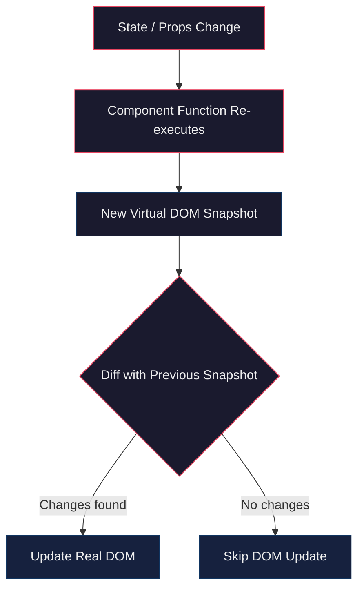
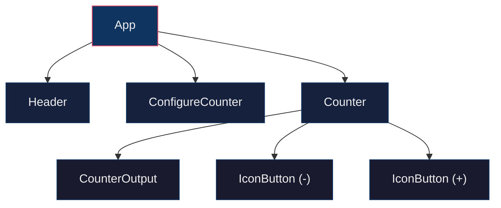
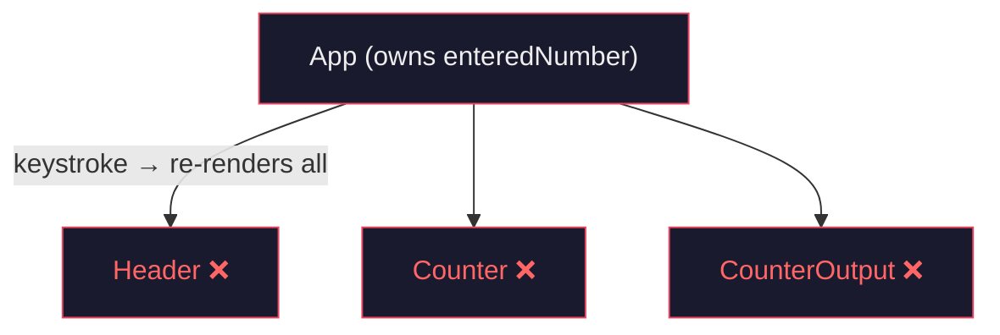
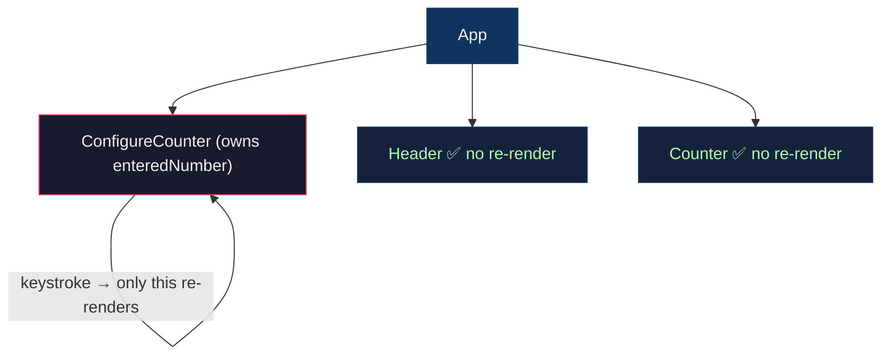
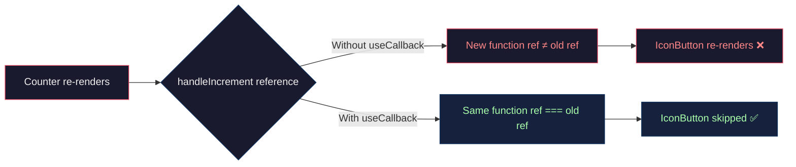
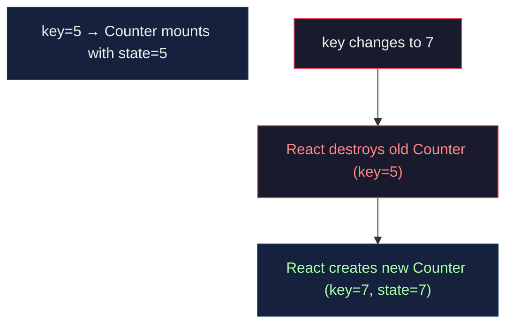
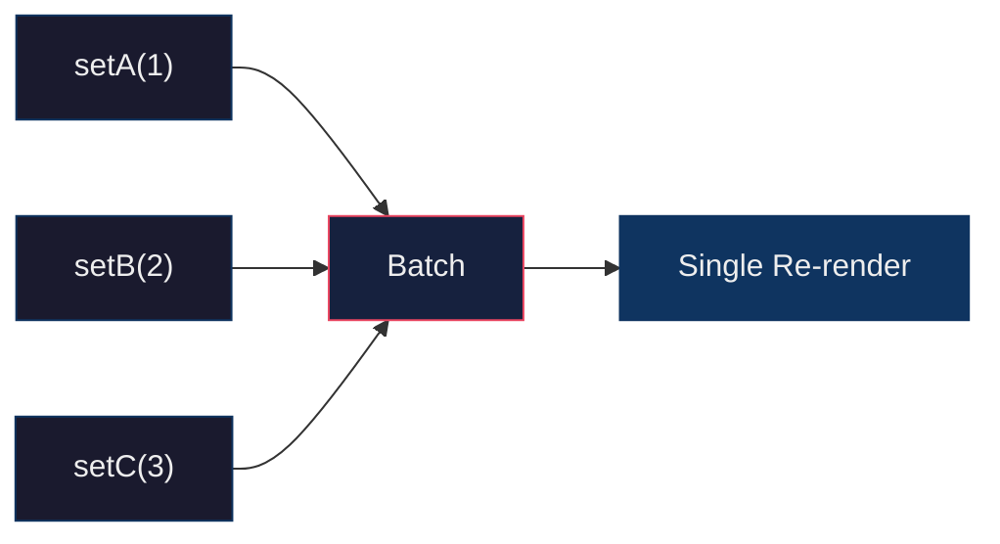
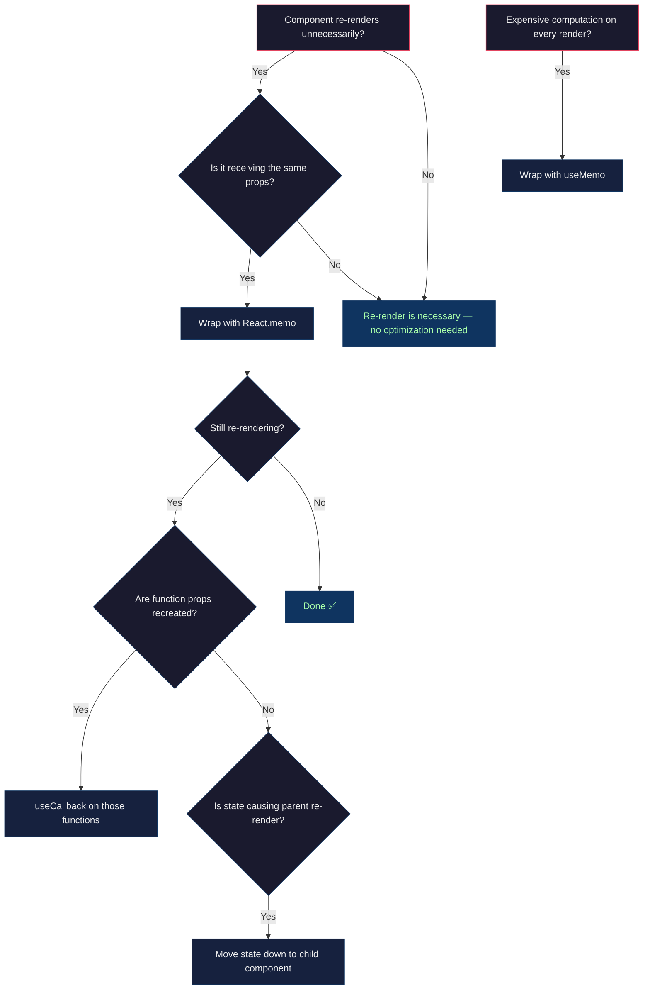

# React Optimization Techniques — Complete Revision Guide

> **Section 13** of the React course. This document covers every concept, pattern, and optimization explored in the "Behind the Scenes" project — a counter app used as a playground to understand React rendering, memoization, and state scheduling.

---

## Table of Contents

- [1. How React Renders — The Big Picture](#1-how-react-renders--the-big-picture)
- [2. Component Tree & Re-Rendering Rules](#2-component-tree--re-rendering-rules)
- [3. React.memo — Preventing Unnecessary Re-Renders](#3-reactmemo--preventing-unnecessary-re-renders)
- [4. Moving State Down — Isolating Re-Renders](#4-moving-state-down--isolating-re-renders)
- [5. useCallback — Stabilising Function References](#5-usecallback--stabilising-function-references)
- [6. useMemo — Caching Expensive Computations](#6-usememo--caching-expensive-computations)
- [7. Keys — Identity, Position & Resetting State](#7-keys--identity-position--resetting-state)
- [8. State Scheduling & Batching](#8-state-scheduling--batching)
- [9. Project Architecture](#9-project-architecture)
- [10. Key Takeaways](#10-key-takeaways)

---

## 1. How React Renders — The Big Picture

React maintains a **Virtual DOM** — a lightweight JavaScript representation of the actual DOM. On every state or prop change:

1. React **re-executes** the component function (and all its children).
2. It builds a new Virtual DOM snapshot.
3. It **diffs** the new snapshot against the previous one.
4. Only the **differences** are applied to the real DOM.

> **Key Insight:** Re-rendering a component does **not** mean the real DOM is updated. It means the component *function* runs again. React is smart enough to only touch the DOM where actual changes exist.



### Profiling

Use **React DevTools → Profiler** tab to visualize which components rendered and how long each took. This is how we identified unnecessary re-renders in this project.

---

## 2. Component Tree & Re-Rendering Rules

React builds a tree starting from `<App />`. When a component's state changes:

- **That component** re-renders.
- **All its children** re-render (by default).
- **Parent components do NOT re-render** because a child's state changed.



**Each Counter instance has its own independent state.** This is what makes components reusable — state is scoped to the instance, not shared across them.

---

## 3. React.memo — Preventing Unnecessary Re-Renders

### The Problem

When `App` re-renders (e.g., `chosenCount` changes), `Counter` re-renders even if `initialCount` hasn't changed.

### The Solution

Wrap the component in `memo()`. React will **skip re-rendering** if all props are the same (shallow comparison).

```jsx
import { memo } from 'react';

// memo wraps the component — React compares previous props with new props
// and skips re-render if they are shallowly equal.
const Counter = memo(({ initialCount }) => {
  // This function body only runs if initialCount actually changed
  const [counter, setCounter] = useState(initialCount);
  // ...
});

export default Counter;
```

**Same pattern applied to `IconButton`:**

```jsx
import { memo } from 'react';

// Without memo, IconButton re-renders every time Counter re-renders,
// even though icon, children, and onClick haven't changed.
const IconButton = memo(function IconButton({ children, icon, ...props }) {
  const Icon = icon;
  return (
    <button {...props} className="button">
      <Icon className="button-icon" />
      <span className="button-text">{children}</span>
    </button>
  );
});
```

> **Key Insight:** `memo` only does a **shallow comparison** of props. If a prop is a function that gets recreated every render (like `onClick`), `memo` will think props changed even though the function does the same thing. This is where `useCallback` comes in.

### When NOT to use memo

- On components that **always** receive different props.
- On very lightweight components — the comparison cost may outweigh the render cost.

---

## 4. Moving State Down — Isolating Re-Renders

### The Problem

Originally, `enteredNumber` state lived in `App`. Every keystroke in the input caused `App` to re-render, which cascaded to `Counter`, `Header`, and everything else.

### The Solution

Move `enteredNumber` into a dedicated `ConfigureCounter` component. Now keystrokes only re-render that one component.

**Before (state in App):**



**After (state in ConfigureCounter):**



```jsx
// configure-counter.jsx — owns its own input state
export default function ConfigureCounter({ onSetCount }) {
  const [enteredNumber, setEnteredNumber] = useState(0);

  function handleChange(event) {
    setEnteredNumber(+event.target.value); // + converts string to number
  }

  function handleSetClick() {
    onSetCount(enteredNumber); // notify parent only when "Set" is clicked
    setEnteredNumber(0);       // reset input
  }

  return (
    <section id="configure-counter">
      <h2>Set Counter</h2>
      <input type="number" onChange={handleChange} value={enteredNumber} />
      <button onClick={handleSetClick}>Set</button>
    </section>
  );
}
```

```jsx
// App.jsx — clean, only holds chosenCount
function App() {
  const [chosenCount, setChosenCount] = useState(0);

  function handleSetCount(newCount) {
    setChosenCount(newCount);
  }

  return (
    <>
      <Header />
      <main>
        <ConfigureCounter onSetCount={handleSetCount} />
        <Counter initialCount={chosenCount} />
      </main>
    </>
  );
}
```

> **Key Insight:** Child component state changes **never** trigger parent re-renders. By pushing state down to the component that actually needs it, we eliminate unnecessary re-renders higher up the tree.

---

## 5. useCallback — Stabilising Function References

### The Problem

`memo` on `IconButton` didn't work because `handleIncrement` and `handleDecrement` were recreated on every `Counter` render. Each render produced a **new function reference**, so `memo`'s shallow comparison saw them as "changed props".

### The Solution

Wrap handlers in `useCallback` to preserve the same reference across renders.

```jsx
// Without useCallback: new function created every render → memo fails
function handleIncrement() {
  setCounter((prev) => prev + 1);
}

// With useCallback: same reference preserved → memo works
const handleIncrement = useCallback(function handleIncrement() {
  setCounter((prev) => prev + 1);
}, []);
// Empty dependency array [] — this function never needs to change
// because it uses the functional updater form of setCounter
```



> **Key Insight:** `useCallback` doesn't make functions faster. It makes sure the **same function object** is reused across renders, so `memo` comparisons work correctly.

---

## 6. useMemo — Caching Expensive Computations

### The Problem

`isPrime(initialCount)` is computationally expensive (loops up to √n). It ran on **every** Counter re-render, even when `initialCount` hadn't changed (e.g., user just clicked increment).

### The Solution

Wrap the computation in `useMemo` so it only re-runs when `initialCount` changes.

```jsx
// Without useMemo: isPrime runs every render, even for increment/decrement clicks
const initialCountIsPrime = isPrime(initialCount);

// With useMemo: isPrime only runs when initialCount changes
const initialCountIsPrime = useMemo(
  () => isPrime(initialCount),
  [initialCount]  // dependency — recalculate only when this value changes
);
```

### useMemo vs useCallback

| Hook | Memoizes | Use Case |
|------|----------|----------|
| `useMemo` | A **computed value** | Expensive calculations, derived data |
| `useCallback` | A **function reference** | Stabilising callbacks passed as props |

> `useCallback(fn, deps)` is essentially `useMemo(() => fn, deps)`

---

## 7. Keys — Identity, Position & Resetting State

React tracks components by **type + position** in the tree.

### The Position Problem (CounterHistory)

When tracking increment/decrement history as an array, new items inserted at the top cause React to mismatch items by position:

```jsx
// Using index as key — BAD
{history.map((count, index) => (
  <HistoryItem key={index} count={count} />
))}
```

If a `HistoryItem` at index 1 was selected (highlighted), and a new item is inserted at the top, the **new** item at index 1 gets the old highlight — because React matched by position, not by identity.

### The Fix

Use a **stable, unique key** tied to the data identity:

```jsx
// Using unique ID as key — GOOD
{history.map((item) => (
  <HistoryItem key={item.id} count={item.count} />
))}
```

### Using Keys to Reset Components

When `key` changes on a component, React **destroys** it and creates a new instance from scratch (state is reset):

```jsx
// Changing key forces Counter to remount with fresh state
<Counter key={chosenCount} initialCount={chosenCount} />
```

This is an alternative to using `useEffect` to reset internal state when a prop changes.



---

## 8. State Scheduling & Batching

### State Updates Are Scheduled

When you call `setState`, the new value is **not** available on the very next line:

```jsx
setCounter(5);
console.log(counter); // still the OLD value, not 5
```

React schedules the update, then re-renders the component later with the new value.

### Batching

Multiple `setState` calls in the same synchronous block are **batched** into a single re-render:

```jsx
function handleClick() {
  setA(1);   // scheduled
  setB(2);   // scheduled
  setC(3);   // scheduled
  // React batches all three → ONE re-render, not three
}
```



> **Key Insight:** Always use the **functional updater form** (`setCounter(prev => prev + 1)`) when the new state depends on the previous state. This guarantees correctness even with batched/scheduled updates.

---

## 9. Project Architecture

```
13-react-and-optimization-techniques/
└── 01-starting-project/
    └── src/
        ├── App.jsx                          # Root — holds chosenCount
        ├── log.js                           # Utility for styled console logs
        ├── main.jsx                         # Entry point
        ├── index.css                        # Global styles
        └── components/
            ├── Header.jsx                   # Static header
            ├── configure-counter.jsx        # Input + Set button (owns enteredNumber)
            ├── Counter/
            │   ├── Counter.jsx              # memo + useCallback + useMemo
            │   ├── CounterOutput.jsx         # Displays counter value
            │   └── CounterHistory.jsx        # History list (key demo)
            └── UI/
                ├── IconButton.jsx            # memo-wrapped button
                └── Icons/
                    ├── PlusIcon.jsx
                    ├── MinusIcon.jsx
                    └── ArrowRightIcon.jsx
```

### The `log()` Utility

Every component calls `log()` when it renders. This prints styled console messages that make it easy to **see exactly which components re-rendered** and in what order:

```jsx
export function log(message, level = 0, type = 'component') {
  // level controls indentation to show tree depth
  // type switches colour: 'component' = blue, 'other' = purple
  const indent = '- '.repeat(level);
  console.log('%c' + indent + message, styling);
}
```

---

## 10. Key Takeaways

| Concept | What It Does | When To Use |
|---------|-------------|-------------|
| **Virtual DOM diffing** | Compares snapshots, patches only changes | Always (automatic) |
| **React.memo** | Skips re-render if props unchanged | Components that re-render with same props |
| **useCallback** | Preserves function reference across renders | Functions passed as props to memoized children |
| **useMemo** | Caches expensive computation result | Heavy calculations dependent on specific values |
| **Moving state down** | Isolates re-renders to the component that needs the state | When parent re-renders cascade unnecessarily |
| **Keys** | Give React stable identity for list items / force remount | Lists, and resetting component state |
| **State batching** | Merges multiple setState calls into one re-render | Automatic in React 18+ |
| **Functional updater** | `setState(prev => ...)` for safe state-based-on-state | Whenever new state depends on old state |

### The Optimization Decision Flowchart



### Quick Recall

1. **Re-render ≠ DOM update.** React diffs virtually first.
2. **memo** blocks re-render when props are shallowly equal.
3. **useCallback** makes function props shallowly equal across renders.
4. **useMemo** caches a value so it's not recalculated every render.
5. **State lives where it's needed.** Push it down; children don't re-render parents.
6. **Keys give identity.** Use stable keys in lists; change key to reset a component.
7. **State updates are batched and scheduled.** Use `prev =>` for safe updates.
8. Use **React DevTools Profiler** to identify what actually needs optimizing — don't optimize blindly.
