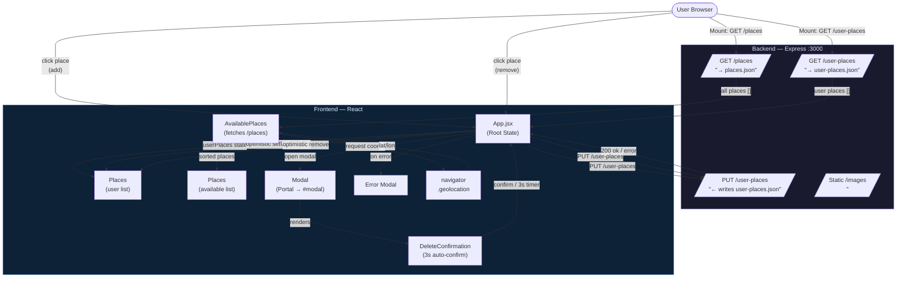
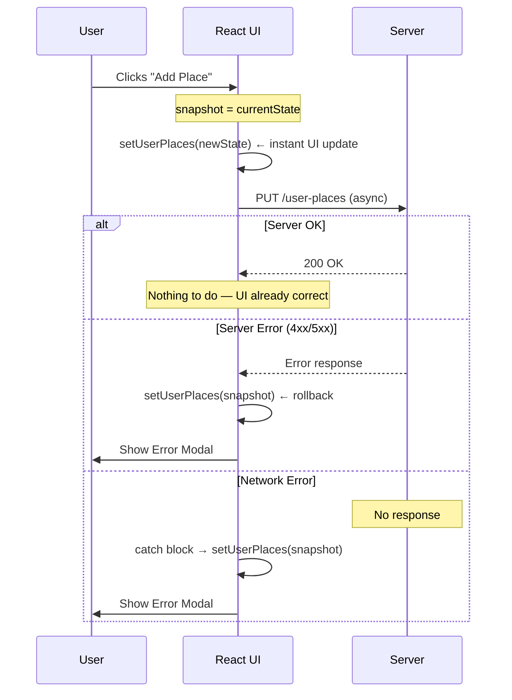
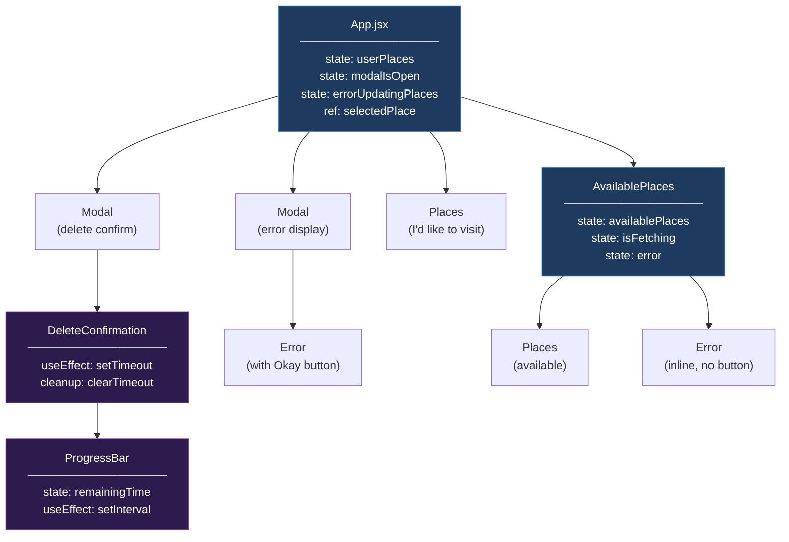
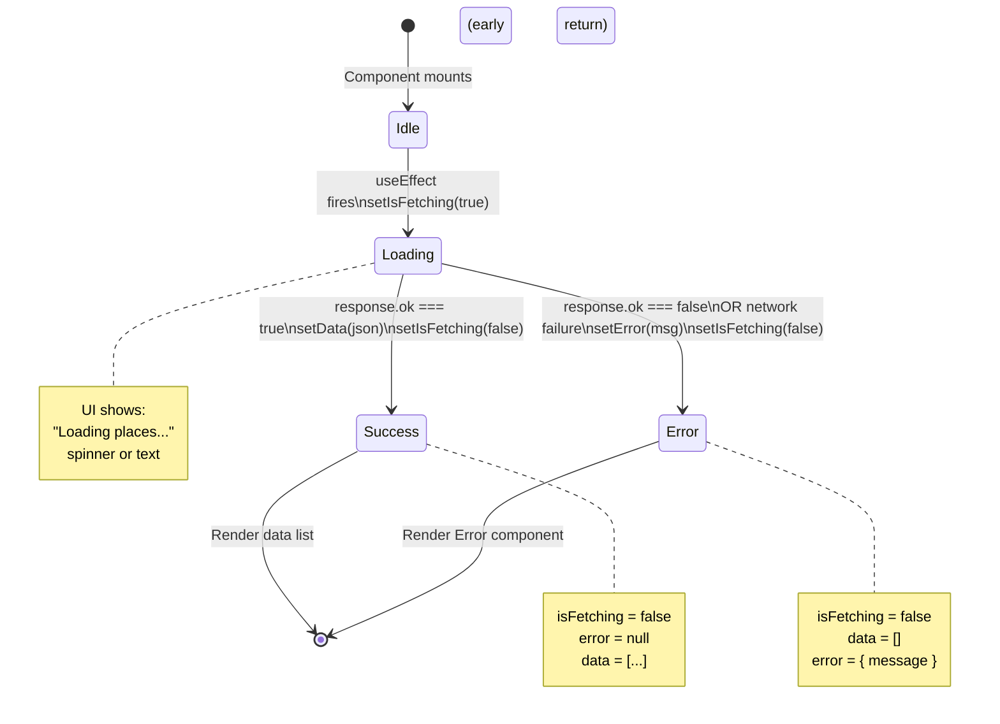

# Section 15 — Sending HTTP Requests in React

> **Standalone Revision Guide** · PlacePicker Project · React + Fetch API + Express Backend

---

## Table of Contents

1. [Project Overview](#1-project-overview)
2. [Theoretical Concepts](#2-theoretical-concepts)
   - 2.1 [Why You Can't Fetch in Render](#21-why-you-cant-fetch-directly-in-render)
   - 2.2 [useEffect for Side Effects](#22-useeffect-for-data-fetching)
   - 2.3 [Loading State](#23-loading-state)
   - 2.4 [Error Handling Strategy](#24-error-handling-strategy)
   - 2.5 [Optimistic Updating](#25-optimistic-updating)
   - 2.6 [Preventing Duplicate Entries](#26-preventing-duplicate-entries)
   - 2.7 [State Persistence via API](#27-state-persistence-via-api)
   - 2.8 [Geolocation API](#28-geolocation-api)
   - 2.9 [React Portals + Modal Pattern](#29-react-portals--modal-pattern)
   - 2.10 [Auto-Confirm Timer with Cleanup](#210-auto-confirm-timer-with-cleanup)
3. [Code & Patterns](#3-code--patterns)
   - 3.1 [Fetching Data on Mount (GET)](#31-fetching-data-on-mount-get)
   - 3.2 [Fetching with Loading & Error State](#32-fetching-with-loading--error-state)
   - 3.3 [Geolocation + Sort After Fetch](#33-geolocation--sort-after-fetch)
   - 3.4 [Optimistic Add with Rollback](#34-optimistic-add-with-rollback)
   - 3.5 [Optimistic Remove with Rollback](#35-optimistic-remove-with-rollback)
   - 3.6 [Modal via React Portal](#36-modal-via-react-portal)
   - 3.7 [Auto-Dismiss Timer + Progress Bar](#37-auto-dismiss-timer--progress-bar)
   - 3.8 [Reusable Places Component](#38-reusable-places-component)
   - 3.9 [Error Component](#39-error-component)
   - 3.10 [Backend: Express REST API](#310-backend-express-rest-api)
   - 3.11 [Haversine Distance Sort](#311-haversine-distance-sort)
4. [Visual Aids — Data Flow Diagrams](#4-visual-aids--data-flow-diagrams)
   - 4.1 [Full App Data Flow](#41-full-app-data-flow)
   - 4.2 [Optimistic Update Lifecycle](#42-optimistic-update-lifecycle)
   - 4.3 [Component Tree](#43-component-tree)
   - 4.4 [Fetch Lifecycle State Machine](#44-fetch-lifecycle-state-machine)
5. [Summary / Key Takeaways](#5-summary--key-takeaways)

---

## 1. Project Overview

**PlacePicker** is a full-stack React application where a user can:

- Browse a list of **available places** fetched from a backend API (sorted by geographic proximity using the Geolocation API).
- **Select places** they want to visit — persisted to the server.
- **Remove places** with a confirmation dialog that auto-confirms after 3 seconds.
- All state changes are done **optimistically** — the UI updates instantly, and rolls back automatically if the server returns an error.

### Tech Stack

| Layer       | Technology                      |
| ----------- | ------------------------------- |
| Frontend    | React 18 + Vite                 |
| HTTP        | Native `fetch` API              |
| Backend     | Node.js + Express               |
| Persistence | JSON file on disk               |
| Location    | Browser `navigator.geolocation` |

---

## 2. Theoretical Concepts

### 2.1 Why You Can't Fetch Directly in Render

In React, the component function runs **on every render**. If you call `fetch()` directly inside the function body (not inside a hook), you get an **infinite loop**:

```
render → fetch → setState → re-render → fetch → setState → ...
```

The fix is `useEffect`, which lets you say: _"run this side-effect **after** the DOM is painted, not during render."_

> **Rule:** Side effects (HTTP requests, timers, subscriptions) always belong inside `useEffect` or event handlers — never in the bare render body.

---

### 2.2 `useEffect` for Data Fetching

```
useEffect(callback, dependencyArray)
```

- `[]` (empty array) → runs **once**, after the first render. Perfect for initial data loads.
- `[someValue]` → runs after first render **and** every time `someValue` changes.
- No array → runs after **every** render (almost always wrong for fetching).

You **cannot** mark the `useEffect` callback itself as `async`. Instead, define an `async` function _inside_ it and call it immediately:

```js
useEffect(() => {
  // ✅ define async function inside
  async function load() { ... }
  load(); // ✅ call it
}, []);
```

---

### 2.3 Loading State

Fetching is asynchronous. Between "request sent" and "data received", your UI should communicate that work is in progress. The pattern is:

1. Initialize a `isFetching` state to `false`.
2. Set it to `true` **before** the fetch starts.
3. Set it back to `false` **in both** the success path and the error path (use `finally` or set it manually in each branch).

This ensures the loading indicator is always dismissed, even if the request fails.

---

### 2.4 Error Handling Strategy

There are two categories of fetch errors you must handle:

| Type              | When It Happens              | How to catch         |
| ----------------- | ---------------------------- | -------------------- |
| **Network error** | No internet, server down     | `catch(error)` block |
| **HTTP error**    | Server responds with 4xx/5xx | Check `response.ok`  |

`fetch()` **does NOT throw** on HTTP errors (like 404 or 500). It only throws if there is no network connection at all. You must manually check `response.ok` and throw yourself:

```js
if (!response.ok) {
  throw new Error("Failed to fetch");
}
```

---

### 2.5 Optimistic Updating

**Definition:** Update the UI _immediately_ as if the operation succeeded, then sync with the server. If the server fails, _roll back_ to the previous state.

**Why use it?**

- Makes the app feel instant — no waiting for a network round-trip for every interaction.
- Users don't notice a ~50–200ms delay on a good connection.

**The pattern in 3 steps:**

1. Snapshot current state → `const previousState = state`
2. Set new state immediately (the "optimistic" update)
3. In the `catch` block, restore → `setState(previousState)`

```
User clicks → UI updates instantly → request sent
                                    ↓
                              success? → nothing to do
                              failure? → rollback to previousState
```

---

### 2.6 Preventing Duplicate Entries

Before adding a new item to a list, check if it already exists. The idiomatic React way is to check _before_ setting state, especially when paired with optimistic updates:

```js
// Early return if duplicate — nothing updates, no request sent
if (list.some((item) => item.id === newItem.id)) return;
```

Doing this check **before** the state setter is important — doing it _inside_ the setState callback means you'd still send the network request.

---

### 2.7 State Persistence via API

React state is **in-memory only** — it resets on every page reload. To persist data:

1. On **user action** → PUT the new state to the server.
2. On **app mount** → GET the current state from the server and hydrate React state.

This project uses a simple `user-places.json` file as a database, written/read by Express.

```
Mount → GET /user-places → setUserPlaces(data)
Click → setUserPlaces(optimistic) → PUT /user-places
```

---

### 2.8 Geolocation API

`navigator.geolocation.getCurrentPosition(successCallback, errorCallback)` is a **browser API** that asynchronously fetches the user's physical coordinates. It is callback-based (not Promise-based), so it integrates with Promise-based fetch like this:

1. Fetch places from the server first (async/await).
2. Once places are available, _then_ call `getCurrentPosition`.
3. Inside the geolocation success callback, sort the already-fetched places by distance and set state.

This sequential approach ensures you don't sort before you have the data.

---

### 2.9 React Portals + Modal Pattern

A React **Portal** renders a component's DOM output _outside_ its parent DOM hierarchy — typically into a `<div id="modal">` at the root of `index.html`.

**Why?** `<dialog>` HTML elements can have z-index and stacking context issues if nested deep in the DOM. Portals solve this by mounting them at the top level.

The `<dialog>` element has native browser methods:

- `.showModal()` → opens with backdrop
- `.close()` → closes

These are imperative DOM APIs, so a `useRef` + `useEffect` bridge is used to call them reactively in response to the `open` prop.

---

### 2.10 Auto-Confirm Timer with Cleanup

The `DeleteConfirmation` component auto-confirms deletion after 3 seconds using `setTimeout`. The `useEffect` **cleanup function** (`return () => clearTimeout(timer)`) is critical here.

**Why cleanup matters:** If the user manually cancels (closes the modal) before the 3 seconds are up, the component unmounts. Without cleanup, the timer would still fire and call `onConfirm()` on an already-dismissed modal — causing a stale state update bug.

> **Rule:** Any `setTimeout` or `setInterval` created in `useEffect` **must** be cleared in the cleanup function.

---

## 3. Code & Patterns

### 3.1 Fetching Data on Mount (GET)

**File:** `src/App.jsx`

```jsx
// Fetch the user's saved places when the app first loads
// so selections survive a page reload.
useEffect(() => {
  async function fetchUserPlaces() {
    const response = await fetch("http://localhost:3000/user-places");
    if (response.ok) {
      const data = await response.json();
      setUserPlaces(data.places); // Hydrate React state from server
    }
  }

  fetchUserPlaces(); // Call the async function immediately
}, []); // Empty [] = run once on mount only
```

**Key Insight:** `useEffect` with `[]` is the React equivalent of "on component mount". The inner async function pattern lets you use `await` without making the effect callback itself async (which React does not support).

---

### 3.2 Fetching with Loading & Error State

**File:** `src/components/AvailablePlaces.jsx`

```jsx
const [availablePlaces, setAvailablePlaces] = useState([]);
const [isFetching, setIsFetching] = useState(false);
const [error, setError] = useState(null);

useEffect(() => {
  async function fetchAvailablePlaces() {
    setIsFetching(true); // ← Show loading indicator BEFORE request
    try {
      const response = await fetch("http://localhost:3000/places");
      const json = await response.json();

      // fetch() does NOT throw on 4xx/5xx — you must check manually
      if (!response.ok) {
        throw new Error("Failed to fetch places");
      }

      setAvailablePlaces(json.places);
    } catch (error) {
      // Catches both network errors AND our manually thrown HTTP errors
      setError({
        message:
          error.message || "Could not fetch places, please try again later.",
      });
    } finally {
      setIsFetching(false); // ← ALWAYS hide loading, success or failure
    }
  }
  fetchAvailablePlaces();
}, []);

// Early return pattern: show error UI instead of normal UI
if (error) {
  return <Error title="An error occurred!" message={error.message} />;
}
```

**Key Insight:** The "early return on error" pattern keeps JSX clean. Instead of conditionally rendering inside a big return, you bail out early and render only the error state. The `finally` block guarantees `isFetching` is always reset.

**Syntax trick:** `error.message || 'fallback'` provides a user-friendly message even if the Error object has no `.message` property.

---

### 3.3 Geolocation + Sort After Fetch

**File:** `src/components/AvailablePlaces.jsx`

```jsx
// After fetching places from the server:
navigator.geolocation.getCurrentPosition(
  // ✅ Success callback: user allowed location
  (position) => {
    const sortedPlaces = sortPlacesByDistance(
      json.places,
      position.coords.latitude,
      position.coords.longitude,
    );
    setAvailablePlaces(sortedPlaces); // Show places nearest to user first
    setIsFetching(false);
  },
  // ❌ Error callback: user denied location permission
  () => {
    setAvailablePlaces(json.places); // Show unsorted — graceful degradation
    setIsFetching(false);
  },
);
```

**Key Insight:** This is sequential async logic — fetch must complete before geolocation starts, because the sort function needs the places data. The geolocation API is callback-based, so `isFetching` is set to `false` _inside both callbacks_, not in a `finally` block.

**Graceful degradation:** If the user denies location, the app still works — it just shows unsorted places. Never assume the happy path.

---

### 3.4 Optimistic Add with Rollback

**File:** `src/App.jsx`

```jsx
async function handleSelectPlace(selectedPlace) {
  // Guard: silently ignore if place is already selected
  if (userPlaces.some((place) => place.id === selectedPlace.id)) {
    return;
  }

  const previousPlaces = userPlaces; // 1. Snapshot for rollback
  const updatedPlaces = [selectedPlace, ...previousPlaces];

  setUserPlaces(updatedPlaces); // 2. Optimistic UI update — instant!

  try {
    const response = await fetch("http://localhost:3000/user-places", {
      method: "PUT",
      headers: { "Content-Type": "application/json" },
      body: JSON.stringify({ places: updatedPlaces }), // 3. Sync with server
    });

    if (!response.ok) {
      setUserPlaces(previousPlaces); // 4a. Rollback on HTTP error
      throw new Error("Failed to add place");
    }
  } catch (error) {
    setUserPlaces(previousPlaces); // 4b. Rollback on network error
    setErrorUpdatingPlaces({
      title: "Failed to add place",
      message: error.message,
    });
  }
}
```

**Key Insight:** The snapshot `const previousPlaces = userPlaces` captures state at the moment of the click (not inside setState, which would be async). This enables reliable rollback. Notice `updatedPlaces` is computed **once** and reused for both the state setter and the API body — ensuring they are always in sync.

---

### 3.5 Optimistic Remove with Rollback

**File:** `src/App.jsx`

```jsx
// useCallback memoizes the function — avoids recreating it on every render
// Required because it's passed as a prop and used in a useEffect dependency array
const handleRemovePlace = useCallback(
  async function handleRemovePlace() {
    const previousPlaces = userPlaces;
    // Compute the new list by filtering out the selected place
    const updatedPlaces = userPlaces.filter(
      (place) => place.id !== selectedPlace.current.id,
      //                      ↑ .current accesses the ref value
    );

    setUserPlaces(updatedPlaces); // Optimistic: remove from UI immediately

    try {
      const response = await fetch("http://localhost:3000/user-places", {
        method: "PUT",
        headers: { "Content-Type": "application/json" },
        body: JSON.stringify({ places: updatedPlaces }),
      });

      if (!response.ok) {
        setUserPlaces(previousPlaces); // Rollback
        throw new Error("Failed to remove place");
      }

      setModalIsOpen(false); // Only close modal on confirmed success
    } catch (error) {
      setUserPlaces(previousPlaces);
      setErrorUpdatingPlaces({
        title: "Failed to remove place",
        message: error.message,
      });
    }
  },
  [userPlaces],
); // userPlaces in deps so the closure always uses fresh state
```

**Key Insight:** `useRef` is used to store the "selected place" without triggering a re-render (unlike `useState`). A ref value persists across renders and is mutable — perfect for "which item did the user click?" that doesn't need to drive UI output.

**`useCallback` trick:** Without it, a new function reference is created on every render, which would cause `DeleteConfirmation`'s `useEffect` (where `onConfirm` is a dependency) to rerun on every parent re-render, resetting the auto-confirm timer every time.

---

### 3.6 Modal via React Portal

**File:** `src/components/Modal.jsx`

```jsx
import { useRef, useEffect } from "react";
import { createPortal } from "react-dom";

function Modal({ open, children, onClose }) {
  const dialog = useRef(); // Reference to the <dialog> DOM element

  useEffect(() => {
    // Bridge between React's declarative `open` prop
    // and the imperative DOM methods .showModal() / .close()
    if (open) {
      dialog.current.showModal(); // Opens with native backdrop
    } else {
      dialog.current.close();
    }
  }, [open]); // Rerun whenever `open` changes

  // createPortal(jsx, domNode) renders jsx INTO domNode,
  // which is outside this component's DOM parent.
  return createPortal(
    <dialog className="modal" ref={dialog} onClose={onClose}>
      {open ? children : null} {/* Don't render children when closed */}
    </dialog>,
    document.getElementById("modal"), // Target in index.html
  );
}
```

**Key Insight:** This is a clean "declarative wrapper over imperative API" — a core React pattern. The consumer just passes `open={true/false}` and React handles calling the right DOM method. `{open ? children : null}` prevents stale content from rendering inside a closed dialog.

---

### 3.7 Auto-Dismiss Timer + Progress Bar

**File:** `src/components/DeleteConfirmation.jsx` + `src/components/ProgressBar.jsx`

```jsx
// DeleteConfirmation.jsx
const TIMER = 3000; // 3 seconds

export default function DeleteConfirmation({ onConfirm, onCancel }) {
  useEffect(() => {
    const timer = setTimeout(() => {
      onConfirm(); // Auto-confirm after 3s
    }, TIMER);

    // CLEANUP: If the user closes the modal before 3s,
    // this component unmounts and cleanup runs → timer is cancelled.
    // Without this, onConfirm() would fire on a dead modal.
    return () => {
      clearTimeout(timer);
    };
  }, [onConfirm]); // onConfirm in deps (must be stable → useCallback in parent)

  return (
    <div id="delete-confirmation">
      <h2>Are you sure?</h2>
      <ProgressBar timer={TIMER} />
    </div>
  );
}
```

```jsx
// ProgressBar.jsx — counts DOWN from timer to 0
export default function ProgressBar({ timer }) {
  const [remainingTime, setRemainingTime] = useState(timer); // Start full

  useEffect(() => {
    // setInterval fires every 10ms, decrementing by 10
    const interval = setInterval(() => {
      setRemainingTime((prevTime) => prevTime - 10);
    }, 10);

    return () => clearInterval(interval); // Always clear intervals on unmount!
  }, []); // [] = setup once, cleanup on unmount

  // <progress> is a native HTML element.
  // value/max gives a percentage fill automatically.
  return <progress value={remainingTime} max={timer} />;
}
```

**Key Insight:** `ProgressBar` is a dedicated component purely for visual countdown feedback. Separating it keeps `DeleteConfirmation` clean. The interval runs every 10ms for smooth animation — if you ran it every 1000ms, the bar would jump in 1-second steps.

---

### 3.8 Reusable Places Component

**File:** `src/components/Places.jsx`

```jsx
// One component handles BOTH "selected places" and "available places" lists.
// The parent controls what data and handlers it receives.
export default function Places({
  title,
  places,
  fallbackText,
  onSelectPlace,
  isLoading,
  LoadingText,
}) {
  return (
    <section className="places-category">
      <h2>{title}</h2>
      {/* Priority render order: loading → empty → list */}
      {isLoading && <p className="fallback-text">{LoadingText}</p>}
      {!isLoading && places.length === 0 && (
        <p className="fallback-text">{fallbackText}</p>
      )}
      {!isLoading && places.length > 0 && (
        <ul className="places">
          {places.map((place) => (
            <li key={place.id} className="place-item">
              <button onClick={() => onSelectPlace(place)}>
                
                <h3>{place.title}</h3>
              </button>
            </li>
          ))}
        </ul>
      )}
    </section>
  );
}
```

**Key Insight:** This is the **presenter/dumb component** pattern. `Places` just renders data — it has zero business logic. All the "what happens when you click" logic lives in the parent. This makes `Places` maximally reusable and easy to test.

---

### 3.9 Error Component

**File:** `src/components/Error.jsx`

```jsx
// Flexible error display: works with or without a confirm button.
// Used in two contexts:
// 1. Inline (replacing the available places list on fetch error)
// 2. Inside a Modal (for update failures, with an Okay button)
export default function Error({ title, message, onConfirm }) {
  return (
    <div className="error">
      <h2>{title}</h2>
      <p>{message}</p>
      {/* Conditionally render button — only if handler is provided */}
      {onConfirm && (
        <div id="confirmation-actions">
          <button onClick={onConfirm} className="button">
            Okay
          </button>
        </div>
      )}
    </div>
  );
}
```

**Key Insight:** The `{onConfirm && <button>}` pattern is conditional rendering based on a prop. When used without `onConfirm`, the component acts as a static error banner. With `onConfirm`, it becomes an interactive error dialog. One component, two use cases.

---

### 3.10 Backend: Express REST API

**File:** `backend/app.js`

```js
import fs from "node:fs/promises"; // Node built-in: async file system
import express from "express";
import bodyParser from "body-parser";

const app = express();
app.use(express.static("images")); // Serve images folder as static files
app.use(bodyParser.json()); // Parse JSON request bodies

// CORS headers — allow the React dev server (different origin) to call this API
app.use((req, res, next) => {
  res.setHeader("Access-Control-Allow-Origin", "*");
  res.setHeader("Access-Control-Allow-Methods", "GET, PUT");
  res.setHeader("Access-Control-Allow-Headers", "Content-Type");
  next(); // Must call next() to pass to the next middleware
});

// GET all available places (static data)
app.get("/places", async (req, res) => {
  const fileContent = await fs.readFile("./data/places.json");
  const placesData = JSON.parse(fileContent);
  res.status(200).json({ places: placesData });
});

// GET user's saved places
app.get("/user-places", async (req, res) => {
  const fileContent = await fs.readFile("./data/user-places.json");
  const places = JSON.parse(fileContent);
  res.status(200).json({ places });
});

// PUT (replace entirely) the user's saved places
// This is idempotent — sending the same request twice produces the same result
app.put("/user-places", async (req, res) => {
  const places = req.body.places; // Extracted by bodyParser.json()
  await fs.writeFile("./data/user-places.json", JSON.stringify(places));
  res.status(200).json({ message: "User places updated!" });
});

app.listen(3000);
```

**Key Insight:** The app uses `PUT` (not `POST`) for both adding and removing places because it always sends the **entire** new list, not a delta. PUT is the correct HTTP verb when you're replacing a whole resource. POST would be used if you were appending a single new item.

---

### 3.11 Haversine Distance Sort

**File:** `src/loc.js`

```js
// Converts degrees to radians (required for trig functions)
function toRad(value) {
  return (value * Math.PI) / 180;
}

// Haversine formula: calculates great-circle distance between two coordinates
// Returns distance in kilometers
function calculateDistance(lat1, lng1, lat2, lng2) {
  const R = 6371; // Earth's radius in km
  const dLat = toRad(lat2 - lat1);
  const dLon = toRad(lng2 - lng1);

  const a =
    Math.sin(dLat / 2) * Math.sin(dLat / 2) +
    Math.sin(dLon / 2) *
      Math.sin(dLon / 2) *
      Math.cos(toRad(lat1)) *
      Math.cos(toRad(lat2));

  const c = 2 * Math.atan2(Math.sqrt(a), Math.sqrt(1 - a));
  return R * c;
}

export function sortPlacesByDistance(places, lat, lon) {
  const sortedPlaces = [...places]; // Clone — never mutate original state!
  sortedPlaces.sort((a, b) => {
    const distanceA = calculateDistance(lat, lon, a.lat, a.lon);
    const distanceB = calculateDistance(lat, lon, b.lat, b.lon);
    return distanceA - distanceB; // Ascending: nearest first
  });
  return sortedPlaces;
}
```

**Key Insight:** `[...places]` creates a **shallow copy** before sorting. Array `.sort()` sorts in-place — mutating the original state array directly would be a React anti-pattern that could cause silent bugs. Always clone before sorting or mutating.

---

## 4. Visual Aids — Data Flow Diagrams

### 4.1 Full App Data Flow



---

### 4.2 Optimistic Update Lifecycle



---

### 4.3 Component Tree



---

### 4.4 Fetch Lifecycle State Machine



---

## 5. Summary / Key Takeaways

### The 5 Core Rules of HTTP in React

| #   | Rule                                                                                    |
| --- | --------------------------------------------------------------------------------------- |
| 1   | **Never fetch in render body** — always inside `useEffect` or event handlers            |
| 2   | **`fetch()` does not throw on 4xx/5xx** — always check `response.ok` manually           |
| 3   | **Define `async` inside `useEffect`**, don't make the effect callback itself async      |
| 4   | **Always clean up** timers and intervals in `useEffect`'s return function               |
| 5   | **Use `finally`** (or set loading state in both branches) to guarantee loading is reset |

---

### Optimistic Updating Checklist

```
✅ Snapshot current state:    const prev = state
✅ Optimistic state update:   setState(newValue)
✅ Send request:              await fetch(...)
✅ Handle HTTP error:         if (!response.ok) { setState(prev); throw... }
✅ Handle network error:      catch(e) { setState(prev); showError }
✅ Deduplicate:               if (list.some(x => x.id === id)) return
```

---

### Key React Patterns Used

| Pattern                                      | Used In                                  | Purpose                                           |
| -------------------------------------------- | ---------------------------------------- | ------------------------------------------------- |
| `useEffect(() => { async fn(); fn(); }, [])` | `App.jsx`, `AvailablePlaces.jsx`         | Fetch on mount                                    |
| `useRef` for non-state values                | `App.jsx` (selectedPlace)                | Store mutable value without triggering re-render  |
| `useCallback`                                | `handleRemovePlace`                      | Stable function reference for effect dependencies |
| `createPortal`                               | `Modal.jsx`                              | Render outside DOM hierarchy                      |
| Early return on error                        | `AvailablePlaces.jsx`                    | Clean conditional rendering                       |
| Optimistic update + rollback                 | `handleSelectPlace`, `handleRemovePlace` | Instant UI, safe persistence                      |
| Cleanup function                             | `DeleteConfirmation`, `ProgressBar`      | Prevent stale timers/intervals                    |
| Conditional prop render                      | `Error.jsx` (`onConfirm &&`)             | Flexible, reusable component                      |

---

### HTTP Verbs Used and Why

| Verb  | Endpoint       | Why This Verb?                                             |
| ----- | -------------- | ---------------------------------------------------------- |
| `GET` | `/places`      | Read-only, no side effects                                 |
| `GET` | `/user-places` | Read saved user selections                                 |
| `PUT` | `/user-places` | Replace the **entire** user list (idempotent full-replace) |

> `PUT` vs `POST`: Use `PUT` when you're sending the complete new state of a resource. Use `POST` when appending a single new item. This app always syncs the full array → `PUT`.

---

_Generated as a revision guide for Section 15 of the JS-React course. All diagrams use dark backgrounds for readability._
