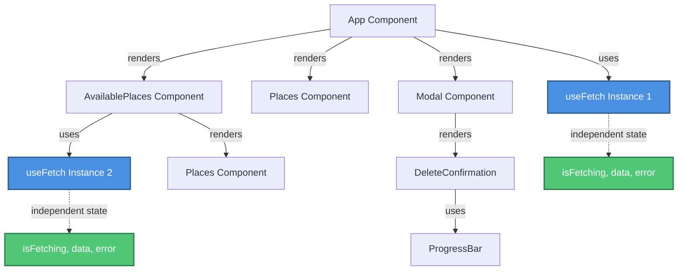
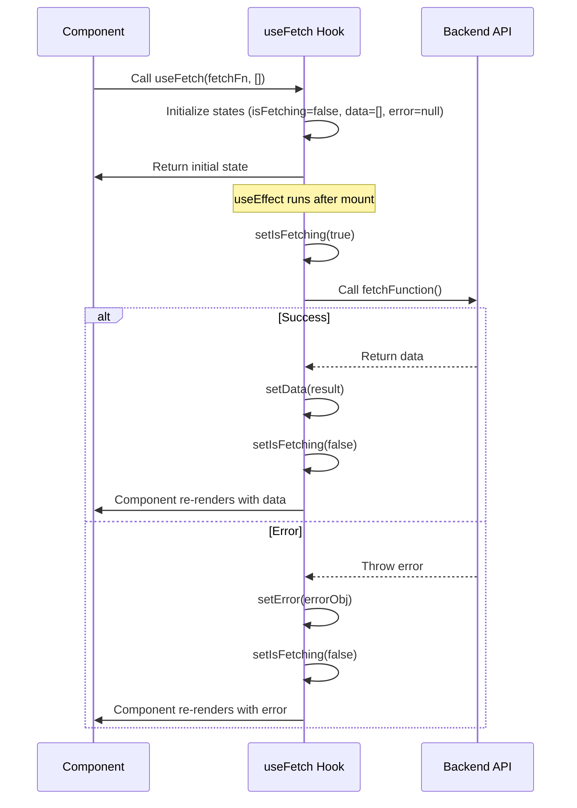
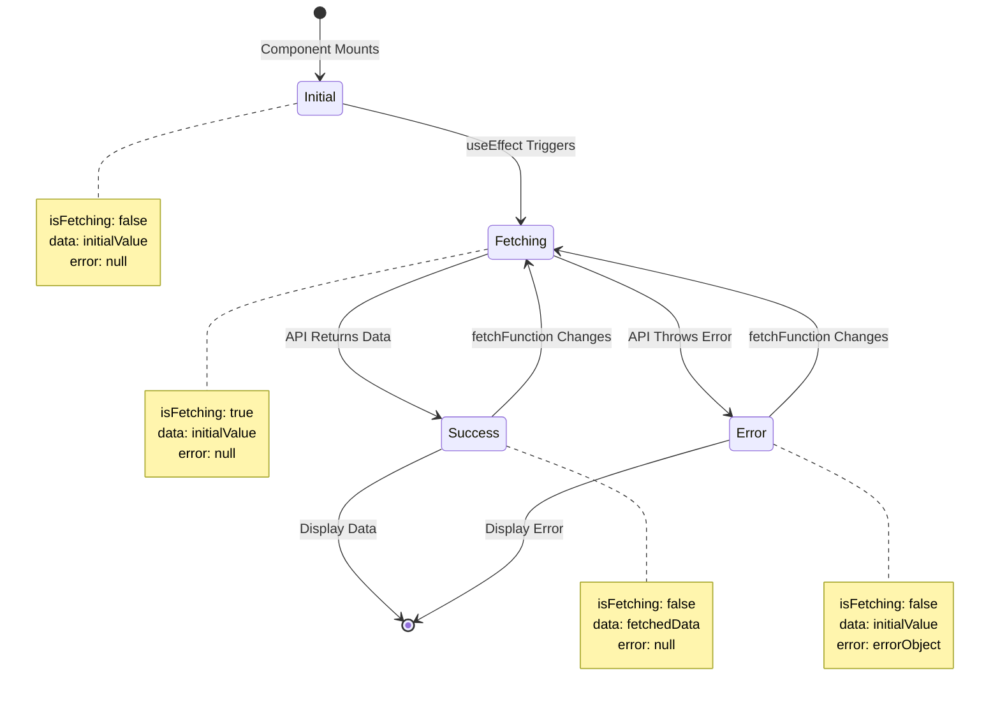
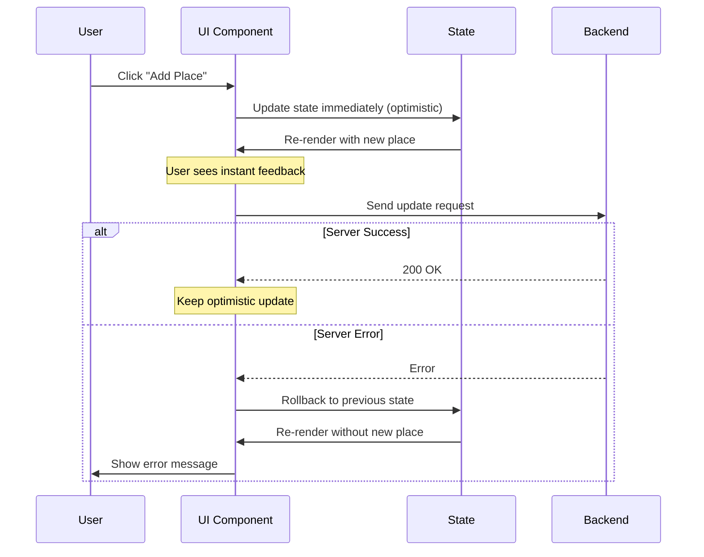

# Custom React Hooks - Complete Revision Guide

> A comprehensive guide to understanding and building custom React hooks through a practical PlacePicker application.

---

## Table of Contents

1. [Project Overview](#project-overview)
2. [What Are Custom Hooks?](#what-are-custom-hooks)
3. [Core Theoretical Concepts](#core-theoretical-concepts)
4. [The useFetch Custom Hook](#the-usefetch-custom-hook)
5. [Code Patterns & Examples](#code-patterns--examples)
6. [Key Insights & Best Practices](#key-insights--best-practices)
7. [Visual Architecture](#visual-architecture)
8. [Common Pitfalls & Solutions](#common-pitfalls--solutions)
9. [Summary & Key Takeaways](#summary--key-takeaways)

---

## Project Overview

This project demonstrates custom React hooks through a **PlacePicker** application where users can:
- View available places to visit
- Add places to their personal collection
- Remove places from their collection
- See places sorted by distance from their location

**Tech Stack:**
- React 19.0.0
- Vite (build tool)
- Backend API (Node.js/Express)

---

## What Are Custom Hooks?


### Definition

**Custom hooks are JavaScript functions that:**
- Start with the prefix `use` (e.g., `useFetch`, `useLocalStorage`)
- Can use other React hooks inside them (useState, useEffect, etc.)
- Allow you to extract and reuse stateful logic across multiple components
- Return values (state, functions, or objects) that components can use

### Why Custom Hooks?

**Problem:** You have the same logic repeated in multiple components (e.g., fetching data, managing forms, handling timers).

**Solution:** Extract that logic into a custom hook that can be reused anywhere.

**Benefits:**
- **Code Reusability:** Write once, use everywhere
- **Separation of Concerns:** Keep components focused on UI, move logic to hooks
- **Easier Testing:** Test logic independently from components
- **Cleaner Components:** Less clutter, more readable code
- **Maintainability:** Update logic in one place

---

## Core Theoretical Concepts

### 1. Hook Rules (Must Follow!)


```javascript
// ✅ CORRECT: Call hooks at the top level
function MyComponent() {
  const [state, setState] = useState(0);
  const data = useFetch(fetchFunction);
  // ... rest of component
}

// ❌ WRONG: Don't call hooks inside conditions
function MyComponent() {
  if (condition) {
    const [state, setState] = useState(0); // ERROR!
  }
}

// ❌ WRONG: Don't call hooks inside loops
function MyComponent() {
  for (let i = 0; i < 10; i++) {
    const data = useFetch(fetchFunction); // ERROR!
  }
}
```

**Why?** React relies on the order of hook calls to maintain state correctly between renders.

### 2. State Independence in Custom Hooks

**Critical Concept:** Each time you call a custom hook, it creates a **completely independent instance** of that hook's state.

```javascript
// In App.jsx
const { data: userPlaces } = useFetch(fetchUserPlaces, []);

// In AvailablePlaces.jsx
const { data: availablePlaces } = useFetch(fetchAvailablePlaces, []);
```


These two `useFetch` calls are **completely separate**:
- They have their own `isFetching` state
- They have their own `data` state
- They have their own `error` state
- Changes in one don't affect the other

### 3. Dependency Arrays & Reference Equality

**Key Understanding:** React uses `Object.is()` (similar to `===`) to compare dependencies.

```javascript
// For primitives (numbers, strings, booleans)
useEffect(() => {
  // runs when count changes
}, [count]); // React compares: 5 === 6 → different, run effect

// For objects and functions
useEffect(() => {
  // runs when fetchFunction reference changes
}, [fetchFunction]); // React compares: func1 === func2 → different references!
```

**Problem with Functions:**
```javascript
function ParentComponent() {
  // This creates a NEW function on every render!
  const fetchData = async () => { /* ... */ };
  
  return <ChildWithEffect fetchFn={fetchData} />;
  // Effect will run on EVERY render because fetchData is a new reference each time
}
```


**Solution with useCallback:**
```javascript
function ParentComponent() {
  // useCallback memoizes the function - same reference across renders
  const fetchData = useCallback(async () => { /* ... */ }, []);
  
  return <ChildWithEffect fetchFn={fetchData} />;
  // Effect only runs when dependencies in useCallback change
}
```

### 4. Async Operations in useEffect

**Important Pattern:**
```javascript
useEffect(() => {
  // ❌ WRONG: Can't make useEffect callback async directly
  // useEffect(async () => { ... }, []);
  
  // ✅ CORRECT: Define async function inside, then call it
  async function fetchData() {
    const result = await fetch(url);
    // ... handle result
  }
  
  fetchData();
}, []);
```

**Why?** useEffect expects either nothing or a cleanup function to be returned. Async functions return Promises, which would confuse React.

---

## The useFetch Custom Hook


### Complete Implementation

```javascript
import { useEffect, useState } from 'react';

function useFetch(fetchFunction, initialValue) {
    // State 1: Track if we're currently fetching data
    const [isFetching, setIsFetching] = useState(false);
    
    // State 2: Store the fetched data (starts with initialValue)
    const [data, setData] = useState(initialValue);
    
    // State 3: Store any errors that occur
    const [error, setError] = useState(null);

    useEffect(() => {
        // Define async function inside useEffect (can't make useEffect itself async)
        async function fetchData() {
            setIsFetching(true); // Show loading state
            
            try {
                // Call the provided fetch function (could be any async operation)
                const places = await fetchFunction();
                setData(places); // Store successful result
            } catch (error) {
                // Catch and store any errors
                setError({ message: error.message || 'Failed to fetch data.' });
            }

            setIsFetching(false); // Hide loading state (runs whether success or error)
        }

        fetchData(); // Execute the fetch
    }, [fetchFunction]); 
    // Re-run effect when fetchFunction reference changes
    // This is why parent should wrap fetchFunction in useCallback!

    // Return an object with all the state and setters
    return { isFetching, data, error, setData };
}

export default useFetch;
```


### Key Insights

**1. Generic & Reusable Design**
- Accepts any `fetchFunction` as a parameter (not hardcoded to specific API)
- Works with any data type through `initialValue`
- Can be used for fetching users, places, products, etc.

**2. Complete State Management**
- Handles loading state (`isFetching`)
- Handles success state (`data`)
- Handles error state (`error`)
- Provides `setData` for manual updates (optimistic UI updates)

**3. Automatic Execution**
- Fetches data immediately when component mounts
- Re-fetches if `fetchFunction` reference changes

**4. Error Handling Built-in**
- Try-catch ensures errors don't crash the app
- Provides error object to component for display

---

## Code Patterns & Examples

### Pattern 1: Using useFetch in Components

**Example: Fetching User Places**

```javascript
import useFetch from './hooks/useFetch.js';
import { fetchUserPlaces } from './http.js';

function App() {
  // Destructure the returned object from useFetch
  // Rename 'data' to 'userPlaces' for clarity
  const { 
    isFetching,           // Boolean: true while loading
    data: userPlaces,     // Array: the fetched places
    error,                // Object: error info if fetch failed
    setData: setUserPlaces // Function: manually update data
  } = useFetch(fetchUserPlaces, []); // [] is initial value (empty array)

  // Use the states in your JSX
  return (
    <>
      {error && <Error message={error.message} />}
      {!error && (
        <Places
          places={userPlaces}
          isLoading={isFetching}
          loadingText="Fetching your places..."
        />
      )}
    </>
  );
}
```


**Key Points:**
- `fetchUserPlaces` is a function reference (not called with `()`)
- Initial value `[]` ensures `userPlaces` is always an array
- Destructuring with renaming: `data: userPlaces` makes code more readable
- `setUserPlaces` allows optimistic UI updates (update UI before server confirms)

### Pattern 2: Multiple Independent useFetch Calls

```javascript
// In App.jsx
function App() {
  const { data: userPlaces } = useFetch(fetchUserPlaces, []);
  // ... rest of component
}

// In AvailablePlaces.jsx (different component)
function AvailablePlaces() {
  const { data: availablePlaces } = useFetch(fetchAvailablePlaces, []);
  // ... rest of component
}
```

**What Happens:**
- Two completely separate instances of useFetch
- Each has its own state (isFetching, data, error)
- They fetch different data from different endpoints
- No shared state between them

### Pattern 3: Optimistic UI Updates

**Scenario:** Update UI immediately, then sync with server

```javascript
async function handleSelectPlace(selectedPlace) {
  // 1. OPTIMISTIC UPDATE: Update UI immediately (before server responds)
  setUserPlaces((prevPickedPlaces) => {
    if (!prevPickedPlaces) {
      prevPickedPlaces = [];
    }
    // Don't add duplicates
    if (prevPickedPlaces.some((place) => place.id === selectedPlace.id)) {
      return prevPickedPlaces;
    }
    return [selectedPlace, ...prevPickedPlaces]; // Add to beginning
  });

  // 2. SERVER SYNC: Send update to server
  try {
    await updateUserPlaces([selectedPlace, ...userPlaces]);
  } catch (error) {
    // 3. ROLLBACK: If server fails, revert to old state
    setUserPlaces(userPlaces); // Restore previous state
    setErrorUpdatingPlaces({
      message: error.message || 'Failed to update places.',
    });
  }
}
```


**Why This Pattern?**
- **Better UX:** User sees instant feedback (no waiting for server)
- **Resilient:** If server fails, we can rollback
- **Honest:** Show error if something goes wrong

### Pattern 4: Combining useFetch with useEffect

**Example: Sorting Places by User Location**

```javascript
function AvailablePlaces({ onSelectPlace }) {
  // 1. Fetch places from server
  const {
    isFetching,
    data: availablePlaces,
    error,
  } = useFetch(fetchAvailablePlaces, []);
  
  // 2. Local state for sorted places
  const [sortedPlaces, setSortedPlaces] = useState([]);

  // 3. Sort places when data arrives
  useEffect(() => {
    // Guard: Don't run if no data yet
    if (!availablePlaces || availablePlaces.length === 0) {
      return;
    }

    // Get user's location (browser API)
    navigator.geolocation.getCurrentPosition((position) => {
      const placesSortedByDistance = sortPlacesByDistance(
        availablePlaces,
        position.coords.latitude,
        position.coords.longitude
      );
      setSortedPlaces(placesSortedByDistance);
    });
  }, [availablePlaces]); // Re-sort when availablePlaces changes

  // 4. Display sorted places if available, otherwise show unsorted
  return (
    <Places
      places={sortedPlaces.length > 0 ? sortedPlaces : availablePlaces}
      isLoading={isFetching}
    />
  );
}
```


**Flow:**
1. Component mounts → useFetch fetches data
2. Data arrives → useEffect detects change in `availablePlaces`
3. Get user location → Sort places by distance
4. Update `sortedPlaces` state → Component re-renders with sorted data

### Pattern 5: HTTP Request Functions

**Centralized API calls in `http.js`:**

```javascript
// GET request - Fetch available places
export async function fetchAvailablePlaces() {
  const response = await fetch('http://localhost:3000/places');
  const resData = await response.json();

  // Check if request was successful
  if (!response.ok) {
    throw new Error('Failed to fetch places');
  }

  return resData.places; // Return just the data we need
}

// PUT request - Update user's places
export async function updateUserPlaces(places) {
  const response = await fetch('http://localhost:3000/user-places', {
    method: 'PUT',
    body: JSON.stringify({ places }), // Convert to JSON string
    headers: {
      'Content-Type': 'application/json', // Tell server we're sending JSON
    },
  });

  const resData = await response.json();

  if (!response.ok) {
    throw new Error('Failed to update user data.');
  }

  return resData.message;
}
```

**Benefits:**
- Centralized: All API logic in one place
- Reusable: Import and use anywhere
- Error handling: Throws errors that can be caught
- Type-safe: Returns consistent data structures

---

## Key Insights & Best Practices


### 1. When to Create a Custom Hook

**Create a custom hook when:**
- ✅ You have the same logic in 2+ components
- ✅ Logic involves React hooks (useState, useEffect, etc.)
- ✅ Logic is complex and clutters your component
- ✅ You want to test logic separately from UI

**Don't create a custom hook when:**
- ❌ Logic is used in only one place
- ❌ Logic is just a simple utility function (no hooks needed)
- ❌ It's just wrapping a single hook with no added logic

### 2. Naming Conventions

```javascript
// ✅ GOOD: Descriptive, starts with 'use'
useFetch()
useLocalStorage()
useDebounce()
useWindowSize()
useAuth()

// ❌ BAD: Doesn't start with 'use'
fetchData()  // React won't recognize this as a hook
getData()    // Won't enforce hook rules
```

### 3. Return Values

**Option A: Return Object (Flexible)**
```javascript
function useFetch() {
  return { isFetching, data, error, setData };
}

// Usage: Can destructure in any order, rename easily
const { data: users, error } = useFetch(fetchUsers);
```

**Option B: Return Array (Positional)**
```javascript
function useToggle() {
  return [isOn, toggle];
}

// Usage: Can name variables anything
const [isOpen, toggleOpen] = useToggle();
const [isVisible, toggleVisible] = useToggle();
```

**When to use which?**
- Object: When returning 3+ values or when order doesn't matter
- Array: When returning 2 values (like useState pattern)


### 4. Dependency Management

**Problem: Infinite Loop**
```javascript
function useFetch(url) {
  const [data, setData] = useState(null);
  
  useEffect(() => {
    fetch(url).then(res => res.json()).then(setData);
  }, [url, setData]); // ❌ setData causes infinite loop!
  
  return data;
}
```

**Why?** `setData` is a new function reference on every render (even though React guarantees it's stable, including it is unnecessary).

**Solution:**
```javascript
function useFetch(url) {
  const [data, setData] = useState(null);
  
  useEffect(() => {
    fetch(url).then(res => res.json()).then(setData);
  }, [url]); // ✅ Only depend on url
  
  return data;
}
```

**Rule:** setState functions from useState are stable and don't need to be in dependencies.

### 5. Cleanup Functions

**When you need cleanup:**
- Timers (setTimeout, setInterval)
- Subscriptions (WebSocket, event listeners)
- Async operations that might complete after unmount

```javascript
function useTimer(callback, delay) {
  useEffect(() => {
    const timer = setTimeout(callback, delay);
    
    // Cleanup: Clear timer if component unmounts
    return () => {
      clearTimeout(timer);
    };
  }, [callback, delay]);
}
```

**Example from DeleteConfirmation:**
```javascript
useEffect(() => {
  const timer = setTimeout(() => {
    onConfirm(); // Auto-confirm after 3 seconds
  }, 3000);

  // If user clicks "No" and modal closes, clear the timer
  return () => {
    clearTimeout(timer);
  };
}, [onConfirm]);
```

---

## Visual Architecture


### Component Architecture



### useFetch Hook Flow




### State Management Flow



### Optimistic Update Pattern



---

## Common Pitfalls & Solutions


### Pitfall 1: Infinite Loop with Function Dependencies

**Problem:**
```javascript
function MyComponent() {
  // This function is recreated on every render!
  const fetchData = async () => {
    const res = await fetch('/api/data');
    return res.json();
  };
  
  // This will cause infinite loop!
  const { data } = useFetch(fetchData, []);
  // fetchData changes → useEffect runs → state updates → 
  // component re-renders → new fetchData → useEffect runs → ...
}
```

**Solution 1: useCallback**
```javascript
function MyComponent() {
  // Memoize the function - same reference across renders
  const fetchData = useCallback(async () => {
    const res = await fetch('/api/data');
    return res.json();
  }, []); // Empty deps = function never changes
  
  const { data } = useFetch(fetchData, []); // ✅ Works!
}
```

**Solution 2: Define Outside Component**
```javascript
// Define once, outside component
async function fetchData() {
  const res = await fetch('/api/data');
  return res.json();
}

function MyComponent() {
  const { data } = useFetch(fetchData, []); // ✅ Works!
}
```

### Pitfall 2: Stale Closure in useEffect

**Problem:**
```javascript
function Counter() {
  const [count, setCount] = useState(0);
  
  useEffect(() => {
    const interval = setInterval(() => {
      console.log(count); // Always logs 0!
      setCount(count + 1); // Always sets to 1!
    }, 1000);
    
    return () => clearInterval(interval);
  }, []); // Empty deps = closure captures initial count (0)
}
```


**Solution: Use Functional Update**
```javascript
function Counter() {
  const [count, setCount] = useState(0);
  
  useEffect(() => {
    const interval = setInterval(() => {
      // Use function form - always gets latest state
      setCount(prevCount => prevCount + 1); // ✅ Works!
    }, 1000);
    
    return () => clearInterval(interval);
  }, []); // Can keep empty deps
}
```

### Pitfall 3: Not Handling Loading State

**Problem:**
```javascript
function MyComponent() {
  const { data } = useFetch(fetchUsers, []);
  
  return (
    <ul>
      {data.map(user => <li>{user.name}</li>)} {/* Crashes if data is null! */}
    </ul>
  );
}
```

**Solution:**
```javascript
function MyComponent() {
  const { isFetching, data, error } = useFetch(fetchUsers, []);
  
  if (error) return <Error message={error.message} />;
  if (isFetching) return <p>Loading...</p>;
  if (!data || data.length === 0) return <p>No users found</p>;
  
  return (
    <ul>
      {data.map(user => <li key={user.id}>{user.name}</li>)}
    </ul>
  );
}
```

### Pitfall 4: Forgetting Cleanup

**Problem:**
```javascript
function SearchComponent() {
  const [results, setResults] = useState([]);
  
  useEffect(() => {
    // If user types fast, multiple requests fire
    fetch(`/api/search?q=${searchTerm}`)
      .then(res => res.json())
      .then(setResults); // Old requests might finish after new ones!
  }, [searchTerm]);
}
```


**Solution: Abort Controller**
```javascript
function SearchComponent() {
  const [results, setResults] = useState([]);
  
  useEffect(() => {
    const controller = new AbortController();
    
    fetch(`/api/search?q=${searchTerm}`, {
      signal: controller.signal // Link request to controller
    })
      .then(res => res.json())
      .then(setResults)
      .catch(err => {
        if (err.name === 'AbortError') {
          // Request was cancelled, ignore
        }
      });
    
    // Cleanup: Cancel request if searchTerm changes
    return () => controller.abort();
  }, [searchTerm]);
}
```

### Pitfall 5: Mutating State Directly

**Problem:**
```javascript
function TodoList() {
  const [todos, setTodos] = useState([]);
  
  function addTodo(text) {
    todos.push({ id: Date.now(), text }); // ❌ Mutating state!
    setTodos(todos); // React won't detect change (same reference)
  }
}
```

**Solution:**
```javascript
function TodoList() {
  const [todos, setTodos] = useState([]);
  
  function addTodo(text) {
    // Create new array (new reference)
    setTodos([...todos, { id: Date.now(), text }]); // ✅ Correct!
    
    // Or use functional update
    setTodos(prevTodos => [...prevTodos, { id: Date.now(), text }]);
  }
}
```

---

## Summary & Key Takeaways


### Core Concepts Recap

1. **Custom Hooks = Reusable Logic**
   - Extract stateful logic into functions starting with `use`
   - Can use other hooks inside them
   - Each call creates independent state instances

2. **useFetch Pattern**
   - Manages loading, data, and error states
   - Accepts any fetch function (generic & reusable)
   - Returns object with state and setters

3. **Dependency Arrays Matter**
   - React uses `Object.is()` for comparison
   - Functions need `useCallback` to maintain stable references
   - setState functions don't need to be in dependencies

4. **Async in useEffect**
   - Can't make useEffect callback async directly
   - Define async function inside, then call it
   - Always handle cleanup for ongoing operations

5. **State Independence**
   - Each hook call = separate state instance
   - No shared state between different useFetch calls
   - Perfect for component isolation

### Quick Reference: When to Use What

| Scenario | Solution |
|----------|----------|
| Reuse stateful logic | Create custom hook |
| Fetch data on mount | useFetch or useEffect |
| Prevent infinite loops | useCallback for functions |
| Update based on previous state | Functional setState |
| Async operations | Define async function in useEffect |
| Cleanup needed | Return cleanup function from useEffect |
| Instant UI feedback | Optimistic updates with rollback |


### Mental Models

**Think of Custom Hooks as:**
- 🏭 **Factories**: Each call produces a new, independent product (state instance)
- 📦 **Packages**: Bundle related logic together for easy transport
- 🔌 **Plugins**: Plug functionality into any component that needs it

**Think of useEffect Dependencies as:**
- 👀 **Watchers**: React watches these values and re-runs effect when they change
- 🔑 **Keys**: Like cache keys - different values = different effect execution
- 📸 **Snapshots**: Effect captures values at time of creation (closure)

### Practice Exercises

To solidify your understanding, try building these custom hooks:

1. **useLocalStorage**
   - Sync state with localStorage
   - Return [value, setValue] like useState
   - Handle JSON serialization

2. **useDebounce**
   - Delay updating a value until user stops typing
   - Useful for search inputs
   - Use setTimeout and cleanup

3. **useWindowSize**
   - Track window width and height
   - Listen to resize events
   - Clean up event listener

4. **useToggle**
   - Boolean state with toggle function
   - Return [isOn, toggle, setIsOn]
   - Simpler than useState for booleans

### Additional Resources

**Official React Docs:**
- [Building Your Own Hooks](https://react.dev/learn/reusing-logic-with-custom-hooks)
- [useEffect Hook](https://react.dev/reference/react/useEffect)
- [useCallback Hook](https://react.dev/reference/react/useCallback)

**Common Custom Hooks Libraries:**
- [usehooks-ts](https://usehooks-ts.com/) - TypeScript-ready hooks
- [react-use](https://github.com/streamich/react-use) - Large collection
- [ahooks](https://ahooks.js.org/) - High-quality hooks

---


## Project Structure Reference

```
16-custom-react-hooks/
├── 01-starting-project/
│   ├── backend/                 # Node.js API server
│   │   ├── app.js              # Express server setup
│   │   ├── data/               # JSON data files
│   │   └── images/             # Place images
│   │
│   ├── src/
│   │   ├── components/
│   │   │   ├── AvailablePlaces.jsx    # Shows all places (uses useFetch)
│   │   │   ├── DeleteConfirmation.jsx # Modal with auto-confirm timer
│   │   │   ├── Error.jsx              # Error display component
│   │   │   ├── Modal.jsx              # Reusable modal with portal
│   │   │   ├── Places.jsx             # Generic places list display
│   │   │   └── ProgressBar.jsx        # Animated progress bar
│   │   │
│   │   ├── hooks/
│   │   │   └── useFetch.js            # ⭐ Custom hook for data fetching
│   │   │
│   │   ├── App.jsx              # Main app component (uses useFetch)
│   │   ├── http.js              # API request functions
│   │   ├── loc.js               # Geolocation utilities
│   │   ├── main.jsx             # React entry point
│   │   └── index.css            # Global styles
│   │
│   ├── package.json             # Dependencies (React 19, Vite)
│   └── vite.config.js           # Vite configuration
│
└── README.md                    # 📚 This comprehensive guide
```

---

## Final Thoughts

Custom hooks are one of React's most powerful features. They allow you to:
- Write cleaner, more maintainable code
- Share logic across your application
- Build your own abstractions on top of React primitives
- Create a library of reusable utilities

The `useFetch` hook demonstrated here is just the beginning. As you build more applications, you'll discover patterns that repeat across projects. Each time you do, consider extracting that logic into a custom hook.

**Remember:** The best custom hooks are:
- ✅ Simple and focused (do one thing well)
- ✅ Well-named (clear what they do)
- ✅ Properly documented (explain parameters and return values)
- ✅ Tested independently (unit tests for logic)

Happy coding! 🚀

---

*Last Updated: March 2026*
*React Version: 19.0.0*
