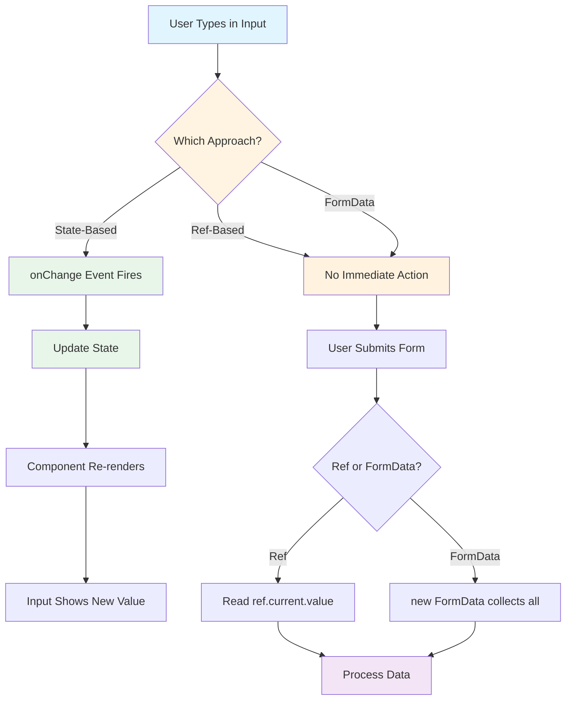
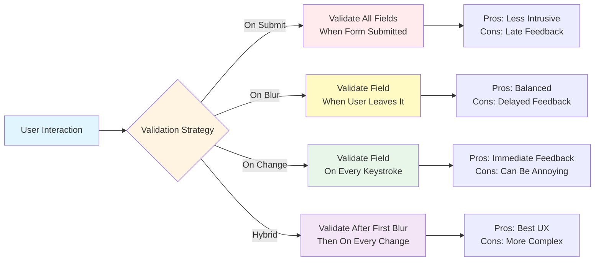
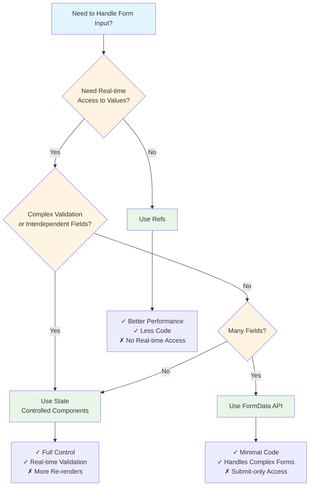
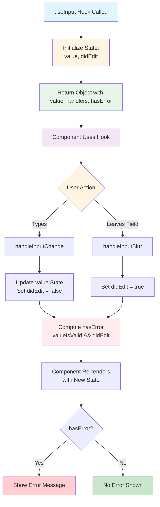
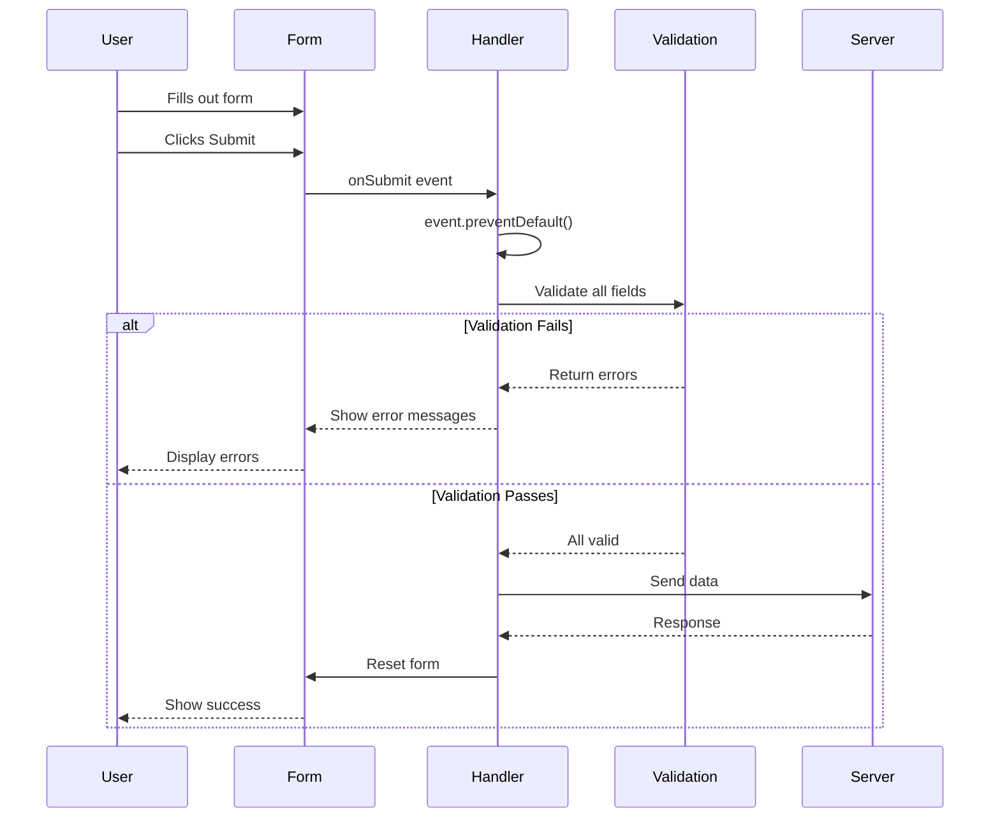

# React Forms and User Input - Complete Revision Guide

## Table of Contents
1. [Introduction](#introduction)
2. [Theoretical Concepts](#theoretical-concepts)
   - [Form Handling Approaches](#form-handling-approaches)
   - [Validation Strategies](#validation-strategies)
   - [State Management in Forms](#state-management-in-forms)
3. [Code Patterns & Examples](#code-patterns--examples)
   - [State-Based Form Handling](#state-based-form-handling)
   - [Ref-Based Form Handling](#ref-based-form-handling)
   - [FormData API](#formdata-api)
   - [Custom Hooks for Forms](#custom-hooks-for-forms)
4. [Visual Diagrams](#visual-diagrams)
5. [Key Takeaways](#key-takeaways)

---

## Introduction

This guide covers everything you need to know about handling forms and user input in React applications. Forms are one of the most common ways users interact with web applications, and React provides multiple approaches to manage form state, validation, and submission.

---

## Theoretical Concepts

### Form Handling Approaches

React offers three primary approaches to handle forms:

#### 1. **State-Based Approach (Controlled Components)**
- Form inputs are controlled by React state
- Every keystroke updates the state
- State is the "single source of truth"
- Provides real-time access to input values
- Best for: Real-time validation, dynamic forms, complex form logic

**Pros:**
- Immediate access to values
- Easy to implement validation on every keystroke
- Can easily reset or manipulate values programmatically
- Great for complex forms with interdependent fields

**Cons:**
- More re-renders (performance consideration for large forms)
- More boilerplate code
- State updates on every keystroke

#### 2. **Ref-Based Approach (Uncontrolled Components)**
- Uses `useRef` to access DOM elements directly
- Values are read only when needed (typically on submit)
- Less React state management
- Best for: Simple forms, read-once scenarios, performance-critical forms

**Pros:**
- Fewer re-renders (better performance)
- Less code
- Direct DOM access when needed
- Good for simple forms

**Cons:**
- No real-time access to values
- Harder to implement keystroke-level validation
- Less "React-like" approach
- Cannot easily manipulate values programmatically

#### 3. **FormData API Approach**
- Browser-native API for form handling
- Automatically collects all form data
- Works with form's native `name` attributes
- Best for: Complex forms with many fields, file uploads, traditional form submissions

**Pros:**
- Minimal React code
- Handles complex forms easily
- Built-in support for files and multiple values
- No need to manage individual field states

**Cons:**
- Values only available on submit
- Requires proper `name` attributes on all inputs
- Less control over individual fields

---

### Validation Strategies

#### **When to Validate**

1. **On Submit (Lazy Validation)**
   - Validate when user submits the form
   - Less intrusive user experience
   - Good for simple forms
   ```javascript
   // Validation happens only on form submission
   function handleSubmit(event) {
     event.preventDefault();
     if (!isValid(formData)) {
       setError('Invalid data');
       return;
     }
     // Process form
   }
   ```

2. **On Blur (Lost Focus Validation)**
   - Validate when user leaves a field
   - Balanced approach
   - Doesn't interrupt typing
   ```javascript
   // Validation happens when user moves to next field
   function handleBlur() {
     setDidEdit(true); // Mark field as "touched"
     // Validation logic runs
   }
   ```

3. **On Change (Eager Validation)**
   - Validate on every keystroke
   - Immediate feedback
   - Can be annoying if done wrong
   ```javascript
   // Validation happens on every character typed
   function handleChange(event) {
     setValue(event.target.value);
     // Validation runs immediately
   }
   ```

4. **Hybrid Approach (Best Practice)**
   - Show errors only after user has interacted with field
   - Combine `onChange` + `onBlur` + "touched" state
   - Provides best user experience

---

### State Management in Forms

#### **Single State Object vs Multiple States**

**Single State Object (Recommended for related fields):**
```javascript
const [formData, setFormData] = useState({
  email: '',
  password: '',
  confirmPassword: ''
});
```

**Multiple States (For independent fields):**
```javascript
const [email, setEmail] = useState('');
const [password, setPassword] = useState('');
```

#### **Derived State**
- Don't store validation results in state if they can be computed
- Compute validation on-the-fly from existing state
```javascript
// ❌ Bad: Storing derived state
const [emailIsValid, setEmailIsValid] = useState(false);

// ✅ Good: Computing derived state
const emailIsValid = email.includes('@');
```

---

## Code Patterns & Examples

### State-Based Form Handling

This is the most common React pattern for forms where you control every input through state.

```jsx
import { useState } from 'react';

export default function Login() {
  // State holds all form data
  const [formData, setFormData] = useState({
    email: '',
    password: ''
  });
  
  // Handle form submission
  function handleSubmit(event) {
    event.preventDefault(); // Prevent default browser form submission
    console.log("Form submitted with:", formData);
    // Here you would typically send data to a server
  }
  
  // Handle input changes - updates state on every keystroke
  function handleChange(event) {
    const { name, value } = event.target; // Destructure name and value from input
    
    // Update state immutably using spread operator
    setFormData((prevData) => ({
      ...prevData,        // Keep all existing data
      [name]: value       // Update only the changed field (computed property name)
    }));
  }

  return (
    <form onSubmit={handleSubmit}>
      <h2>Login</h2>

      <div className="control-row">
        <div className="control no-margin">
          <label htmlFor="email">Email</label>
          {/* htmlFor links label to input (same as 'for' in HTML) */}
          <input 
            id="email" 
            type="email" 
            name="email"           // Name is crucial for handleChange
            onChange={handleChange} // Updates state on every keystroke
            value={formData.email}  // Controlled input - value from state
          />
        </div>

        <div className="control no-margin">
          <label htmlFor="password">Password</label>
          <input 
            id="password" 
            type="password" 
            name="password" 
            onChange={handleChange} 
            value={formData.password} 
          />
        </div>
      </div>

      <p className="form-actions">
        <button className="button button-flat" type="button">Reset</button>
        {/* Default button type in form is "submit" */}
        <button className="button">Login</button>
      </p>
    </form>
  );
}
```

**Key Insights:**
- **Controlled Components**: Input values are controlled by React state
- **Computed Property Names**: `[name]: value` allows dynamic property updates
- **Immutable Updates**: Always use spread operator to maintain immutability
- **event.preventDefault()**: Stops browser's default form submission behavior
- **Two-Way Binding**: `value` prop + `onChange` creates two-way data binding

**Syntax Tricks:**
- `const { name, value } = event.target` - Destructuring for cleaner code
- `[name]: value` - Computed property name (ES6 feature)
- `...prevData` - Spread operator for immutable state updates

---

### Ref-Based Form Handling

Using refs to access form values without managing state for every keystroke.

```jsx
import { useRef, useState } from 'react';

export default function LoginWithRef() {
  // State only for validation errors (not for input values)
  const [formIsInvalid, setFormIsInvalid] = useState(false);
  
  // Refs to access DOM elements directly
  const emailRef = useRef();      // Creates a ref object
  const passwordRef = useRef();

  function handleSubmit(event) {
    event.preventDefault();

    // Access input values via refs (only when needed)
    // Optional chaining (?.) prevents errors if ref is null
    // Nullish coalescing (??) provides default value
    const enteredEmail = emailRef.current?.value ?? '';
    const enteredPassword = passwordRef.current?.value ?? '';

    // Validation logic
    const emailIsValid = enteredEmail.includes('@');
    
    if (!emailIsValid) {
      setFormIsInvalid(true);  // Show error
      return;                   // Stop submission
    }
    
    console.log('submitted', { 
      email: enteredEmail, 
      password: enteredPassword 
    });
    
    setFormIsInvalid(false);  // Clear error on successful validation
  }

  return (
    <form onSubmit={handleSubmit}>
      <h2>Login</h2>

      <div className="control-row">
        <div className="control no-margin">
          <label htmlFor="email">Email</label>
          <input
            id="email"
            type="email"
            name="email"
            ref={emailRef}  // Attach ref to input
          />
          {/* Conditional error message */}
          <p className="control-error">
            {formIsInvalid && 'Please enter a valid email address.'}
          </p>
        </div>

        <div className="control no-margin">
          <label htmlFor="password">Password</label>
          <input
            id="password"
            type="password"
            name="password"
            ref={passwordRef}  // Attach ref to input
          />
        </div>
      </div>

      <p className="form-actions">
        {/* type="reset" clears all form inputs */}
        <button className="button button-flat" type="reset">
          Reset
        </button>
        <button className="button">Login</button>
      </p>
    </form>
  );
}
```

**Key Insights:**
- **useRef Hook**: Creates a mutable ref object that persists across renders
- **ref.current**: Accesses the actual DOM element
- **ref.current.value**: Gets the current value of the input
- **No Re-renders**: Changing ref values doesn't trigger re-renders
- **Read-Once Pattern**: Values are read only when needed (on submit)

**Syntax Tricks:**
- `emailRef.current?.value` - Optional chaining prevents errors
- `?? ''` - Nullish coalescing provides fallback value
- `{condition && <element>}` - Conditional rendering shorthand

---

### FormData API

Browser-native API for collecting form data without managing individual states.

```jsx
export default function Signup() {
  function handleSubmit(event) {
    event.preventDefault();
    
    // FormData automatically collects all form inputs with 'name' attributes
    const fd = new FormData(event.target);
    
    // Handle multiple values (checkboxes with same name)
    const acquisitionChannels = fd.getAll("acquisition");
    
    // Convert FormData to plain object
    const data = Object.fromEntries(fd.entries());
    
    // Add the multiple values back to the object
    data.acquisition = acquisitionChannels;
    
    console.log(data);

    // Reset form to initial state
    event.target.reset();
    
    // Focus on first input after reset
    event.target.elements.email.focus();
  }

  return (
    <form onSubmit={handleSubmit}>
      <h2>Welcome on board!</h2>
      <p>We just need a little bit of data from you to get you started 🚀</p>

      {/* Text Input */}
      <div className="control">
        <label htmlFor="email">Email</label>
        <input id="email" type="email" name="email" />
      </div>

      {/* Multiple Inputs in Row */}
      <div className="control-row">
        <div className="control">
          <label htmlFor="password">Password</label>
          <input id="password" type="password" name="password" />
        </div>

        <div className="control">
          <label htmlFor="confirm-password">Confirm Password</label>
          <input
            id="confirm-password"
            type="password"
            name="confirm-password"
          />
        </div>
      </div>

      <hr />

      {/* Select Dropdown */}
      <div className="control">
        <label htmlFor="role">What best describes your role?</label>
        <select id="role" name="role">
          <option value="student">Student</option>
          <option value="teacher">Teacher</option>
          <option value="employee">Employee</option>
          <option value="founder">Founder</option>
          <option value="other">Other</option>
        </select>
      </div>

      {/* Checkboxes with Same Name (Multiple Values) */}
      <fieldset>
        <legend>How did you find us?</legend>
        <div className="control">
          <input
            type="checkbox"
            id="google"
            name="acquisition"  // Same name for all checkboxes
            value="google"
          />
          <label htmlFor="google">Google</label>
        </div>

        <div className="control">
          <input
            type="checkbox"
            id="friend"
            name="acquisition"  // Same name
            value="friend"
          />
          <label htmlFor="friend">Referred by friend</label>
        </div>

        <div className="control">
          <input 
            type="checkbox" 
            id="other" 
            name="acquisition"  // Same name
            value="other" 
          />
          <label htmlFor="other">Other</label>
        </div>
      </fieldset>

      {/* Single Checkbox */}
      <div className="control">
        <label htmlFor="terms-and-conditions">
          <input 
            type="checkbox" 
            id="terms-and-conditions" 
            name="terms" 
          />
          I agree to the terms and conditions
        </label>
      </div>

      <p className="form-actions">
        <button type="reset" className="button button-flat">
          Reset
        </button>
        <button type="submit" className="button">
          Sign up
        </button>
      </p>
    </form>
  );
}
```

**Key Insights:**
- **FormData Constructor**: `new FormData(event.target)` collects all form data
- **name Attribute**: Essential for FormData to identify fields
- **fd.entries()**: Returns iterator of [name, value] pairs
- **Object.fromEntries()**: Converts entries to plain object
- **fd.getAll()**: Gets all values for inputs with same name (checkboxes)
- **event.target.reset()**: Resets form to initial values
- **event.target.elements**: Access form elements by name

**Syntax Tricks:**
- `Object.fromEntries(fd.entries())` - Convert FormData to object
- `fd.getAll("name")` - Get array of all values for a name
- `event.target.elements.email` - Direct access to form elements

---

### Custom Hooks for Forms

Reusable logic for form input handling with validation.

```javascript
import { useState } from 'react';

/**
 * Custom hook for managing form input state and validation
 * @param {*} defaultValue - Initial value for the input
 * @param {Function} validationFunction - Function to validate the input
 * @returns {Object} - Object with value, handlers, and error state
 */
export function useInput(defaultValue, validationFunction) {
  // State for the input value
  const [enteredValue, setEnteredValue] = useState(defaultValue);
  
  // State to track if user has interacted with the field
  const [didEdit, setDidEdit] = useState(false);
  
  // Compute validation result (derived state)
  const valueIsValid = validationFunction(enteredValue);
  
  // Show error only if invalid AND user has edited the field
  const hasError = !valueIsValid && didEdit;
  
  // Handle input change (on every keystroke)
  function handleInputChange(event) {
    setEnteredValue(event.target.value);
    setDidEdit(false);  // Reset edit state while typing
  }

  // Handle input blur (when user leaves the field)
  function handleInputBlur() {
    setDidEdit(true);  // Mark field as "touched"
  }

  // Return object with all necessary values and handlers
  return {
    value: enteredValue,
    handleInputChange,
    handleInputBlur,
    hasError
  };
}
```

**Using the Custom Hook:**

```jsx
import { useInput } from '../hooks/useInput';
import { isEmail, hasMinLength } from '../util/validation';

export default function StateLogin() {
  // Use custom hook for each input
  const email = useInput('', isEmail);
  const password = useInput('', (value) => hasMinLength(value, 6));

  function handleSubmit(event) {
    event.preventDefault();
    
    // Check if form is valid
    if (email.hasError || password.hasError) {
      return;  // Don't submit if there are errors
    }
    
    console.log('Form submitted:', {
      email: email.value,
      password: password.value
    });
  }

  return (
    <form onSubmit={handleSubmit}>
      <h2>Login</h2>

      <div className="control-row">
        <div className="control no-margin">
          <label htmlFor="email">Email</label>
          <input
            id="email"
            type="email"
            name="email"
            onChange={email.handleInputChange}  // From custom hook
            onBlur={email.handleInputBlur}      // From custom hook
            value={email.value}                 // From custom hook
          />
          {/* Show error message if hasError is true */}
          {email.hasError && (
            <p className="control-error">Please enter a valid email</p>
          )}
        </div>

        <div className="control no-margin">
          <label htmlFor="password">Password</label>
          <input
            id="password"
            type="password"
            name="password"
            onChange={password.handleInputChange}
            onBlur={password.handleInputBlur}
            value={password.value}
          />
          {password.hasError && (
            <p className="control-error">Password must be at least 6 characters</p>
          )}
        </div>
      </div>

      <p className="form-actions">
        <button className="button button-flat" type="reset">Reset</button>
        <button className="button">Login</button>
      </p>
    </form>
  );
}
```

**Validation Utility Functions:**

```javascript
// util/validation.js

// Check if value contains @ symbol
export function isEmail(value) {
  return value.includes('@');
}

// Check if value is not empty (after trimming whitespace)
export function isNotEmpty(value) {
  return value.trim() !== '';
}

// Check if value meets minimum length requirement
export function hasMinLength(value, minLength) {
  return value.length >= minLength;
}

// Check if two values are equal (useful for password confirmation)
export function isEqualsToOtherValue(value, otherValue) {
  return value === otherValue;
}
```

**Key Insights:**
- **Custom Hooks**: Encapsulate reusable logic
- **Separation of Concerns**: Validation logic separate from component
- **Derived State**: `hasError` is computed, not stored
- **Touched State**: `didEdit` tracks user interaction
- **Flexible Validation**: Pass validation function as parameter
- **Clean Component Code**: Hook handles all complexity

**Syntax Tricks:**
- Arrow function in hook call: `(value) => hasMinLength(value, 6)`
- Object destructuring: `const { value, hasError } = useInput(...)`
- Conditional rendering: `{email.hasError && <p>Error</p>}`

---

## Visual Diagrams

### Form Handling Flow



### Validation Timing Strategies



### State vs Refs Decision Tree



### Custom Hook Data Flow



### Form Submission Flow



---

## Key Takeaways

### Essential Concepts

1. **Three Main Approaches**
   - State-based (controlled components) for real-time control
   - Ref-based (uncontrolled components) for simple forms
   - FormData API for complex forms with many fields

2. **Validation Best Practices**
   - Validate on blur for better UX
   - Show errors only after user interaction
   - Use derived state for validation results
   - Separate validation logic into utility functions

3. **Performance Considerations**
   - State updates cause re-renders
   - Refs don't trigger re-renders
   - Use refs for performance-critical forms
   - Use state when you need real-time updates

4. **Code Organization**
   - Extract validation logic to separate files
   - Create custom hooks for reusable form logic
   - Keep components clean and focused
   - Use meaningful variable names

### Common Patterns

```javascript
// ✅ Good: Controlled component with proper state management
const [email, setEmail] = useState('');
<input value={email} onChange={(e) => setEmail(e.target.value)} />

// ✅ Good: Ref for simple read-once scenario
const emailRef = useRef();
<input ref={emailRef} />
const email = emailRef.current.value;

// ✅ Good: FormData for complex forms
const fd = new FormData(event.target);
const data = Object.fromEntries(fd.entries());

// ✅ Good: Custom hook for reusable logic
const email = useInput('', isEmail);
<input {...email} />

// ❌ Bad: Mixing controlled and uncontrolled
<input value={email} ref={emailRef} />  // Don't do this!

// ❌ Bad: Storing derived state
const [isValid, setIsValid] = useState(false);  // Compute instead!
const isValid = email.includes('@');  // Better!
```

### Quick Reference

| Scenario | Best Approach | Why |
|----------|---------------|-----|
| Simple login form | Refs | Less code, good performance |
| Real-time validation | State | Need immediate access to values |
| Large signup form | FormData | Handles many fields easily |
| Reusable form logic | Custom Hook | DRY principle |
| Password confirmation | State | Need to compare two fields |
| File upload | FormData | Native file handling |
| Search input | State | Need real-time filtering |

### Remember

- **event.preventDefault()** - Always prevent default form submission
- **htmlFor** - Use instead of `for` in JSX
- **name attribute** - Essential for FormData API
- **Controlled vs Uncontrolled** - Choose based on requirements
- **Validation timing** - Balance between UX and feedback
- **Custom hooks** - Extract reusable logic
- **Derived state** - Compute, don't store
- **Immutability** - Always use spread operator for state updates

---

## Additional Resources

### Form Input Types
- `text` - Single-line text
- `email` - Email with basic validation
- `password` - Hidden text
- `number` - Numeric input
- `checkbox` - Boolean or multiple selection
- `radio` - Single selection from group
- `select` - Dropdown selection
- `textarea` - Multi-line text
- `file` - File upload

### Event Handlers
- `onChange` - Fires on every change
- `onBlur` - Fires when input loses focus
- `onFocus` - Fires when input gains focus
- `onSubmit` - Fires when form is submitted
- `onInput` - Similar to onChange (use onChange in React)

### Form Methods
- `event.target.reset()` - Reset form to initial values
- `event.target.elements` - Access form elements
- `form.checkValidity()` - Check HTML5 validation
- `input.focus()` - Programmatically focus input

---

**End of Revision Guide**

This document contains everything you need to understand and implement forms in React. Practice these patterns, understand the trade-offs, and choose the right approach for your specific use case.
