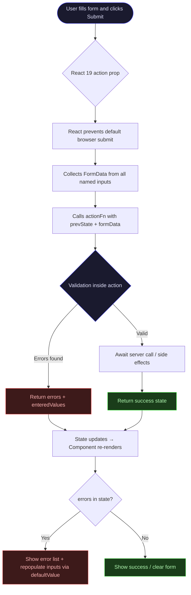
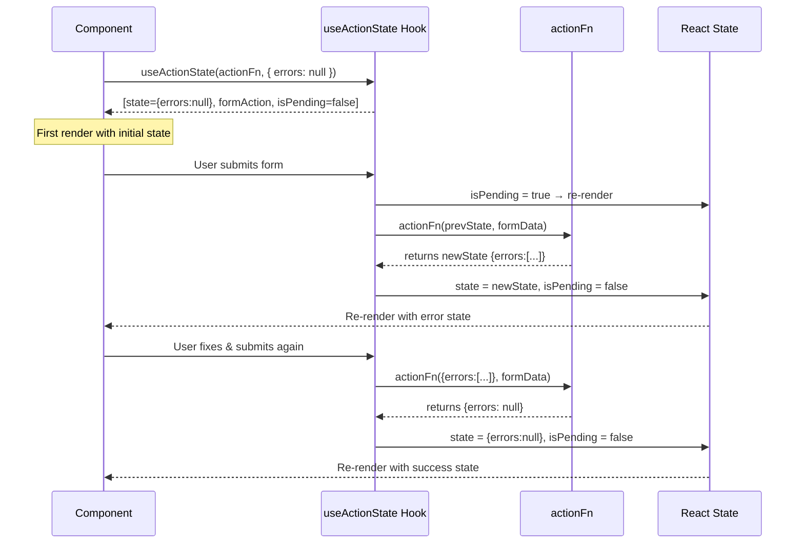
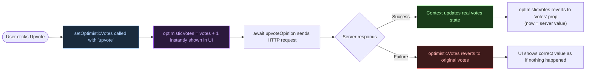
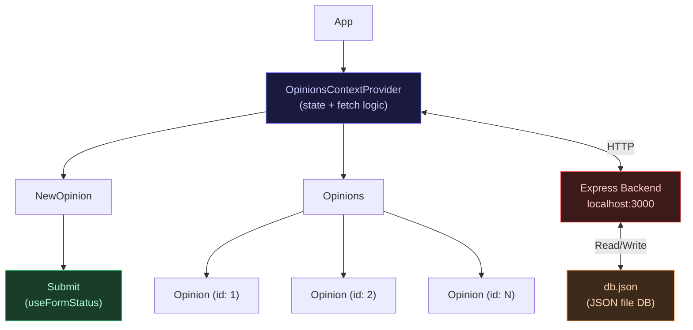

# ⚛️ React 19 — Forms & Actions: Master Revision Guide

> **Section 18** | Udemy React Course  
> Covers: Form Actions, `useActionState`, `useFormStatus`, `useOptimistic`, the `use()` hook, and best practices for handling form submissions in React 19+.

---

## 📑 Table of Contents

1. [Background & Motivation](#1-background--motivation)
2. [Core Concepts](#2-core-concepts)
   - 2.1 [The Old Way: `onSubmit` + `useState`](#21-the-old-way-onsubmit--usestate)
   - 2.2 [The New Way: Form Actions (React 19)](#22-the-new-way-form-actions-react-19)
   - 2.3 [`useActionState` — The Workhorse Hook](#23-useactionstate--the-workhorse-hook)
   - 2.4 [`useFormStatus` — Pending Indicator](#24-useformstatus--pending-indicator)
   - 2.5 [`useOptimistic` — Optimistic UI Updates](#25-useoptimistic--optimistic-ui-updates)
   - 2.6 [`use()` Hook — Consuming Context & Promises](#26-use-hook--consuming-context--promises)
   - 2.7 [Reset Strategy: `formKey` Bump](#27-reset-strategy-formkey-bump)
3. [Project 1 — Signup Form](#3-project-1--signup-form)
   - 3.1 [Form Action Function Pattern](#31-form-action-function-pattern)
   - 3.2 [Validation Utilities](#32-validation-utilities)
   - 3.3 [Persisting User Values on Error](#33-persisting-user-values-on-error)
   - 3.4 [Rendering Validation Errors](#34-rendering-validation-errors)
4. [Project 2 — Opinions App (Advanced)](#4-project-2--opinions-app-advanced)
   - 4.1 [Context Architecture for Server Calls](#41-context-architecture-for-server-calls)
   - 4.2 [Async Form Action + Server Communication](#42-async-form-action--server-communication)
   - 4.3 [Per-Button `formAction` Pattern](#43-per-button-formaction-pattern)
   - 4.4 [Optimistic Voting](#44-optimistic-voting)
   - 4.5 [The Backend (Express + JSON DB)](#45-the-backend-express--json-db)
5. [Visual Diagrams](#5-visual-diagrams)
   - 5.1 [Form Submission Flow (React 19)](#51-form-submission-flow-react-19)
   - 5.2 [useActionState Lifecycle](#52-useactionstate-lifecycle)
   - 5.3 [useOptimistic Flow](#53-useoptimistic-flow)
   - 5.4 [Component Architecture — Opinions App](#54-component-architecture--opinions-app)
6. [Key Takeaways & Quick-Reference Cheatsheet](#6-key-takeaways--quick-reference-cheatsheet)

---

## 1. Background & Motivation

### The Problem with the Old Approach

Before React 19, handling forms required **a lot of boilerplate**:

```jsx
// ❌ Old way: manual state tracking + preventing default + event parsing
function OldForm() {
  const [email, setEmail] = useState('');
  const [error, setError] = useState('');

  function handleSubmit(event) {
    event.preventDefault();           // must prevent browser default
    const data = new FormData(event.target);
    const email = data.get('email');
    if (!email.includes('@')) {
      setError('Invalid email');
      return;
    }
    // ... submit logic
  }

  return <form onSubmit={handleSubmit}>...</form>;
}
```

**Issues:**
- Must call `event.preventDefault()` manually.
- State management for every field value.
- Tricky to persist values after failed validation.
- No built-in loading/pending state.

### The React 19 Solution

React 19 brings **native form `action` support**, directly inspired by how HTML has always worked, but supercharged with React's state system.

```jsx
// ✅ New way: action function receives formData automatically
function action(prevState, formData) {
  const email = formData.get('email');  // no event.preventDefault() needed!
  // validate and return new state
}
```

> 💡 **Key Insight:** The `action` prop on `<form>` is a React 19 feature. When you pass a *function* (not a URL string), React intercepts the submission, prevents the default behavior automatically, and passes a `FormData` object to your action function.

---

## 2. Core Concepts

### 2.1 The Old Way: `onSubmit` + `useState`

| Feature | Old (`onSubmit`) | New (`action`) |
|---|---|---|
| Prevent default | Manual (`event.preventDefault()`) | Automatic |
| Get field values | `event.target.elements` or controlled state | `formData.get('name')` |
| Loading state | Manual `useState` | `useFormStatus` / 3rd value from `useActionState` |
| Return value | N/A | Becomes new state for next render |
| Works with `<button formAction>` | No | Yes |

---

### 2.2 The New Way: Form Actions (React 19)

A **form action** is simply a function you pass to `<form action={...}>`.

```
<form action={myActionFunction}>
```

The function signature is:
```js
function myAction(prevState, formData) {
  // prevState: the current state (initial or last returned)
  // formData: a FormData object with all named inputs
  return newState; // this replaces state
}
```

**Rules of form actions:**
- They can be `async` (for server calls).
- They receive `(prevState, formData)`.
- Whatever they `return` becomes the new state that triggers a re-render.
- The browser's form reset still happens after a successful submit (you may need to handle this).

---

### 2.3 `useActionState` — The Workhorse Hook

```jsx
import { useActionState } from 'react';

const [state, formAction, isPending] = useActionState(actionFn, initialState);
```

| Return Value | Description |
|---|---|
| `state` | Current state. Starts as `initialState`. Updates on each action call. |
| `formAction` | A wrapped version of your `actionFn` — pass this to `<form action={formAction}>` |
| `isPending` | (3rd value) `true` while an async action is running |

> **Why `prevState`?** Because form actions replace `setState` calls. The hook needs the previous value to give it to your action function on each submission — just like a `useReducer` pattern.

```jsx
// Full pattern
const [state, formAction] = useActionState(
  function myAction(prevState, formData) {
    const email = formData.get('email');
    if (!email.includes('@')) {
      return { errors: ['Invalid email'], enteredValues: { email } };
    }
    return { errors: null }; // success
  },
  { errors: null } // initial state
);

return <form action={formAction}>...</form>;
```

---

### 2.4 `useFormStatus` — Pending Indicator

This hook lives in **`react-dom`**, not `react`. It can only be used in a component that is a **child** of a `<form>`.

```jsx
import { useFormStatus } from 'react-dom';

export function Submit() {
  const { pending } = useFormStatus();
  return (
    <button type="submit" disabled={pending}>
      {pending ? 'Submitting...' : 'Submit'}
    </button>
  );
}
```

> **Why a separate component?** `useFormStatus` reads context from the nearest parent `<form>`. If you call it **inside** the same component that renders the form, it won't work — the form hasn't subscribed to it yet. Always extract the submit button into its own child component.

---

### 2.5 `useOptimistic` — Optimistic UI Updates

Optimistic UI means **updating the display immediately** before the server confirms the change, then syncing when the server responds.

```jsx
import { useOptimistic } from 'react';

const [optimisticVotes, setOptimisticVotes] = useOptimistic(
  votes,                                          // real value (source of truth)
  (prevVotes, mode) =>                            // update function
    mode === 'upvote' ? prevVotes + 1 : prevVotes - 1
);
```

```jsx
async function handleUpvote() {
  setOptimisticVotes('upvote');   // instantly shows +1 in UI
  await upvoteOpinion(id);        // waits for server (1 second delay in this app)
  // after server responds → optimisticVotes automatically reverts to real `votes`
}
```

**Key Rule:** `setOptimisticVotes` only works inside `async` transitions (actions, form actions, `startTransition`). If the server call fails, React automatically reverts the optimistic value.

---

### 2.6 `use()` Hook — Consuming Context & Promises

`use()` is a new React 19 hook that replaces `useContext()` and can also unwrap Promises.

```jsx
import { use } from 'react';

// Old way:
const { opinions } = useContext(OpinionsContext);

// New React 19 way:
const { opinions } = use(OpinionsContext);
```

> **Why use `use()` vs `useContext()`?** `use()` is more flexible — it works inside conditionals and loops (unlike regular hooks). Also, for Promises, it enables the Suspense pattern. For now in this section, it's used as a clean replacement for `useContext`.

---

### 2.7 Reset Strategy: `formKey` Bump

The native `<button type="reset">` only resets DOM values — it does **not** reset `useActionState`. The trick used here is to bump a `key` prop on the form component, causing React to fully **unmount and remount** it, which resets all state.

```jsx
export default function Signup() {
  const [formKey, setFormKey] = useState(0);

  // Passing `key` to SignupForm forces remount on reset
  return <SignupForm key={formKey} onReset={() => setFormKey((k) => k + 1)} />;
}

function SignupForm({ onReset }) {
  const [state, formAction] = useActionState(signUpAction, { errors: null });

  return (
    <form action={formAction}>
      {/* ... inputs ... */}
      {/* type="button" prevents form submission; just triggers onReset */}
      <button type="button" onClick={onReset}>Reset</button>
      <button>Sign up</button>
    </form>
  );
}
```

**Why `type="button"` not `type="reset"`?**
- `type="reset"` only clears DOM input values — it doesn't touch React state.
- `type="button"` avoids triggering the form's `action` and lets us call `onReset` to bump the key.
- Bumping `formKey` causes React to create a fresh `SignupForm` instance with `useActionState` starting at `{ errors: null }` again.

---

## 3. Project 1 — Signup Form

**File:** `01-starting-project/src/components/Signup.jsx`  
A signup form demonstrating `useActionState` for validation, error display, and value persistence.

---

### 3.1 Form Action Function Pattern

```jsx
// Defined OUTSIDE the component (no closures on component state needed)
function signUpAction(prevState, formData) {
  // Step 1: Extract every named field from the FormData object
  const email = formData.get("email");
  const password = formData.get("password");
  const confirmPassword = formData.get("confirm-password");
  const firstName = formData.get("first-name");
  const lastName = formData.get("last-name");
  const role = formData.get("role");

  // formData.getAll() is needed for multi-value fields (checkboxes with same name)
  const acquisition = formData.getAll("acquisition"); // returns an array!
  const terms = formData.get("terms");               // returns "on" | null

  // Step 2: Accumulate validation errors
  let errors = [];
  if (!isEmail(email))         errors.push("Invalid email");
  if (!isNotEmpty(password) || !hasMinLength(password, 6))
                               errors.push("Password must be ≥ 6 chars");
  if (!isEqualToOtherValue(password, confirmPassword))
                               errors.push("Passwords do not match");
  if (!isNotEmpty(firstName))  errors.push("First name is required");
  if (!isNotEmpty(lastName))   errors.push("Last name is required");
  if (!isNotEmpty(role))       errors.push("Role is required");
  if (!terms)                  errors.push("Must agree to terms");
  if (acquisition.length === 0) errors.push("Select at least one channel");

  // Step 3: Return new state
  if (errors.length > 0) {
    // Return errors AND the original values so the form can repopulate
    return {
      errors,
      enteredValues: { email, password, confirmPassword, firstName, lastName, role, acquisition, terms }
    };
  }

  return { errors: null }; // success — no errors
}
```

**Key Insights:**
- `formData.get(name)` — gets a single value (text inputs, selects, single checkbox).
- `formData.getAll(name)` — gets **all** values sharing the same `name` attribute (groups of checkboxes).
- Returning an object from the action directly replaces the `state` in `useActionState`.
- Returning `{ errors: null }` signals success — the form can then navigate or clear.

---

### 3.2 Validation Utilities

```js
// util/validation.js — Pure, reusable functions. No React dependencies.
export function isEmail(value) {
  return value.includes('@');           // simple check; real apps use regex
}

export function isNotEmpty(value) {
  return value.trim() !== '';           // .trim() catches whitespace-only inputs
}

export function hasMinLength(value, minLength) {
  return value.length >= minLength;
}

export function isEqualToOtherValue(value, otherValue) {
  return value === otherValue;          // strict equality for password match
}
```

> **Best Practice:** Keep validation logic in pure utility functions (`util/validation.js`). They're easy to test in isolation and can be reused across multiple forms.

---

### 3.3 Persisting User Values on Error

When validation fails, the form should **not** clear the user's input — that's frustrating UX.

**Strategy:** Return `enteredValues` in the action state, and use `defaultValue` on inputs.

```jsx
// In the action, return the user's values:
return {
  errors: [...],
  enteredValues: { email, password, firstName, ... }
};

// In JSX, use defaultValue bound to state:
<input
  name="email"
  type="email"
  defaultValue={state.enteredValues?.email}  // ?. = optional chaining (safe if undefined)
/>

// For select:
<select name="role" defaultValue={state.enteredValues?.role}>
  <option value="student">Student</option>
  ...
</select>

// For checkboxes:
<input
  type="checkbox"
  name="acquisition"
  value="google"
  defaultChecked={state.enteredValues?.acquisition?.includes("google")}
/>
```

> **`defaultValue` vs `value`:** `defaultValue` is for **uncontrolled** inputs — React sets the initial DOM value but doesn't own subsequent changes. This is fine for form-action patterns where React doesn't need to track every keystroke. `value` (controlled) would require `onChange` too.

---

### 3.4 Rendering Validation Errors

```jsx
{/* Short-circuit: only render if state.errors is truthy (non-empty array) */}
{state.errors && (
  <ul className="error">
    {state.errors.map((error) => (
      <li key={error}>{error}</li>  // error string as key (fine if errors are unique)
    ))}
  </ul>
)}
```

---

## 4. Project 2 — Opinions App (Advanced)

**Files:** `06-adv-starting-project/src/`  
A full-stack opinions sharing app with async actions, optimistic UI, voting, and a real Express backend.

---

### 4.1 Context Architecture for Server Calls

All HTTP calls are centralised in a **React Context**, keeping components clean.

```jsx
// store/opinions-context.jsx

// 1. Create the context with default shape (helps IDE autocomplete)
export const OpinionsContext = createContext({
  opinions: null,
  addOpinion: (opinion) => {},
  upvoteOpinion: (id) => {},
  downvoteOpinion: (id) => {},
});

export function OpinionsContextProvider({ children }) {
  const [opinions, setOpinions] = useState();

  // Load opinions once on mount
  useEffect(() => {
    async function loadOpinions() {
      const response = await fetch('http://localhost:3000/opinions');
      const opinions = await response.json();
      setOpinions(opinions);
    }
    loadOpinions();
  }, []);  // [] means "run only once after first render"

  async function addOpinion(enteredOpinionData) {
    const response = await fetch('http://localhost:3000/opinions', {
      method: 'POST',
      headers: { 'Content-Type': 'application/json' },
      body: JSON.stringify(enteredOpinionData),
    });
    if (!response.ok) return;

    const savedOpinion = await response.json();
    // Prepend new opinion to the list (newest first)
    setOpinions((prev) => [savedOpinion, ...prev]);
  }

  // ... upvoteOpinion, downvoteOpinion similar pattern

  return (
    // React 19 JSX usage: <Context value={...}> instead of <Context.Provider value={...}>
    <OpinionsContext value={{ opinions, addOpinion, upvoteOpinion, downvoteOpinion }}>
      {children}
    </OpinionsContext>
  );
}
```

> **React 19 Syntax Change:** You can now write `<OpinionsContext value={...}>` directly instead of `<OpinionsContext.Provider value={...}>`. Both work; the new syntax is shorter.

---

### 4.2 Async Form Action + Server Communication

```jsx
// NewOpinion.jsx
export function NewOpinion() {
  // use() replaces useContext() in React 19
  const { addOpinion } = use(OpinionsContext);

  // Action is defined INSIDE the component because it needs `addOpinion` from context
  async function shareOpinionAction(prevState, formData) {
    const title = formData.get("title");
    const body = formData.get("body");
    const userName = formData.get("userName");

    // Client-side validation first (avoid unnecessary network calls)
    let errors = [];
    if (title.trim().length < 5)                   errors.push("Title ≥ 5 chars");
    if (body.trim().length < 10 || body.trim().length > 500)
                                                   errors.push("Body: 10–500 chars");
    if (!userName.trim().length)                   errors.push("Name is required");

    if (errors.length > 0) {
      return { errors, enteredValues: { title, body, userName } };
    }

    // Server call — because this is async and awaited, useFormStatus shows pending=true
    await addOpinion({ title, body, userName });

    return { errors: null }; // success
  }

  const [formState, formAction] = useActionState(shareOpinionAction, { errors: null });

  return (
    <form action={formAction}>
      <input name="userName" defaultValue={formState.enteredValues?.userName} />
      <input name="title" defaultValue={formState.enteredValues?.title} />
      <textarea name="body" defaultValue={formState.enteredValues?.body} />
      {formState.errors && (
        <ul className="errors">
          {formState.errors.map((e) => <li key={e}>{e}</li>)}
        </ul>
      )}
      <Submit />  {/* useFormStatus lives here */}
    </form>
  );
}
```

---

### 4.3 Per-Button `formAction` Pattern

A single `<form>` can have **multiple buttons with different actions** using the `formAction` prop on `<button>`.

```jsx
// Opinion.jsx — voting form
const [upvoteState, upvoteAction, upvotePending] = useActionState(handleUpvote, null);
const [downvoteState, downvoteAction, downvotePending] = useActionState(handleDownvote, null);

return (
  <form className="votes">
    {/* Each button triggers a DIFFERENT action function */}
    <button
      formAction={upvoteAction}
      disabled={upvotePending || downvotePending}  // disable both during any pending action
    >
      ↑
    </button>

    <span>{optimisticVotes}</span>

    <button
      formAction={downvoteAction}
      disabled={upvotePending || downvotePending}
    >
      ↓
    </button>
  </form>
);
```

> **Why `formAction` on `<button>`?** The `formAction` attribute on a button overrides the form's `action` for that specific button. This is standard HTML, but React 19 makes it work with function references too, not just URL strings.

---

### 4.4 Optimistic Voting

```jsx
// Opinion.jsx — full optimistic voting implementation

export function Opinion({ opinion: { id, title, body, userName, votes } }) {
  const { upvoteOpinion, downvoteOpinion } = use(OpinionsContext);

  // useOptimistic: local "shadow" state for instant feedback
  const [optimisticVotes, setOptimisticVotes] = useOptimistic(
    votes,                                              // real server value
    (prevVotes, mode) =>                                // how to calculate optimistic value
      mode === 'upvote' ? prevVotes + 1 : prevVotes - 1
  );

  // These are the action functions used in useActionState
  async function handleUpvote() {
    setOptimisticVotes('upvote');    // 1. UPDATE UI INSTANTLY
    await upvoteOpinion(id);         // 2. Wait for server (may take 1 second per backend)
    // After server reply → optimisticVotes auto-resets to real `votes` from context
  }

  async function handleDownvote() {
    setOptimisticVotes('downvote');
    await downvoteOpinion(id);
  }

  // Wrapping async handlers in useActionState to get pending state
  const [, upvoteAction, upvotePending] = useActionState(handleUpvote, null);
  const [, downvoteAction, downvotePending] = useActionState(handleDownvote, null);

  return (
    <article>
      <header>
        <h3>{title}</h3>
        <p>Shared by {userName}</p>
      </header>
      <p>{body}</p>
      <form className="votes">
        <button formAction={upvoteAction} disabled={upvotePending || downvotePending}>↑</button>
        <span>{optimisticVotes}</span>   {/* Shows optimistic value immediately */}
        <button formAction={downvoteAction} disabled={upvotePending || downvotePending}>↓</button>
      </form>
    </article>
  );
}
```

---

### 4.5 The Backend (Express + JSON DB)

The backend is a simple Express REST API that persists to a `db.json` file.

```js
// backend/app.js — key patterns

// Simulate real-world network latency for testing optimistic UI
await new Promise((resolve) => setTimeout(resolve, 1000));

// POST /opinions — creates a new opinion
app.post('/opinions', async (req, res) => {
  const { userName, title, body } = req.body;
  const newOpinion = await saveOpinion({ userName, title, body });
  res.status(201).json(newOpinion);
});

// POST /opinions/:id/upvote — increments vote count
app.post('/opinions/:id/upvote', async (req, res) => {
  const { id } = req.params;
  const opinion = await upvoteOpinion(Number(id));  // id comes as string, needs Number()
  res.json(opinion);
});
```

**ID generation:** `id: new Date().getTime()` — uses Unix timestamp (milliseconds) as a unique ID.

---

## 5. Visual Diagrams

### 5.1 Form Submission Flow (React 19)



---

### 5.2 `useActionState` Lifecycle



---

### 5.3 `useOptimistic` Flow



---

### 5.4 Component Architecture — Opinions App



---

## 6. Key Takeaways & Quick-Reference Cheatsheet

### 🔑 The Big Ideas

| Concept | One-Line Summary |
|---|---|
| **Form Actions** | Pass a function to `<form action={fn}>` — React calls it with `(prevState, formData)` |
| **`useActionState`** | Hook that links action function → state → re-render. Returns `[state, formAction, isPending]` |
| **`useFormStatus`** | Reads pending status from parent `<form>`. Must be in a **child** component |
| **`useOptimistic`** | Show an instant fake update in UI; auto-reverts to real value after async completes |
| **`use()`** | New React 19 hook; replaces `useContext()`. Also works with Promises |
| **`formData.get()`** | Gets a single input value by its `name` attribute |
| **`formData.getAll()`** | Gets all values for inputs sharing a `name` (e.g., checkbox groups) |
| **`defaultValue`** | Populates uncontrolled inputs on re-render (used to persist values after errors) |
| **Key bump reset** | Remount a component by changing its `key` prop — resets all internal React state |
| **`formAction` on button** | A `<button formAction={fn}>` overrides the form's action for that specific button only |

---

### 🚦 When to Use What

```
Need to handle form submission?
└── useActionState(fn, initialState) + <form action={formAction}>

Need to show loading indicator during submission?
└── Extract <Submit /> child component → use useFormStatus() inside it

Need instant UI feedback before server confirms?
└── useOptimistic(realValue, updaterFn) → call setOptimisticValue() before await

Need to read context in React 19?
└── use(MyContext) instead of useContext(MyContext)

Need to reset form including React state?
└── Bump a key prop on the form component with useState(0)

Need multiple actions in one form (e.g., upvote/downvote)?
└── <button formAction={upvoteAction}> and <button formAction={downvoteAction}>
```

---

### 📦 Import Cheatsheet

```js
// From 'react'
import { useActionState, useOptimistic, use, useState, useEffect, createContext } from 'react';

// From 'react-dom'
import { useFormStatus } from 'react-dom';
```

---

### ⚠️ Common Pitfalls

1. **`useFormStatus` not working?** → Make sure it's called inside a **child component** of the form, not in the same component that renders `<form>`.

2. **Checkboxes returning nothing?** → Use `formData.getAll('name')`, not `formData.get('name')`. Single `get()` only gives one value.

3. **Form not resetting validation errors?** → `<button type="reset">` resets DOM, not React state. Use the `key` bump pattern.

4. **Optimistic update not showing?** → `setOptimisticVotes` must be called within an async React action/transition. Works inside `useActionState` action functions.

5. **`defaultChecked` vs `defaultValue`?** → Use `defaultChecked` for checkboxes/radio buttons, `defaultValue` for text inputs and `<select>`.

6. **Action function getting stale values?** → Actions defined outside the component can't close over component state. Define them **inside** the component if they need context values (like `addOpinion`).

---

*End of Revision Guide — Section 18: Forms & Actions*
